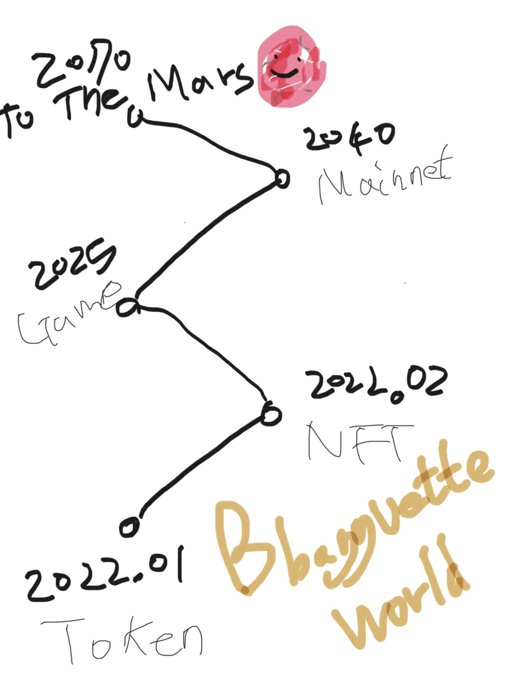
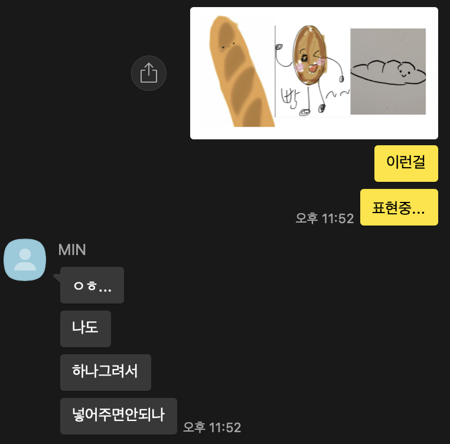
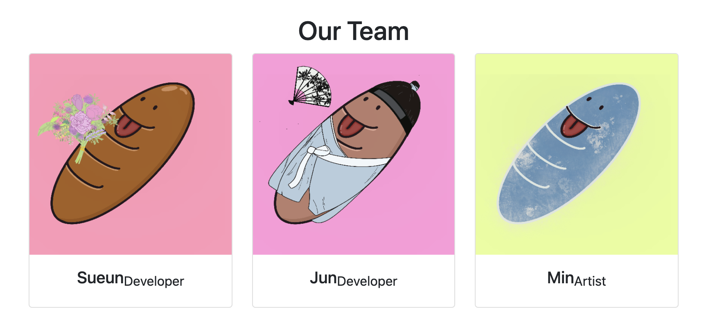
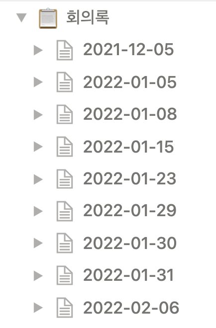
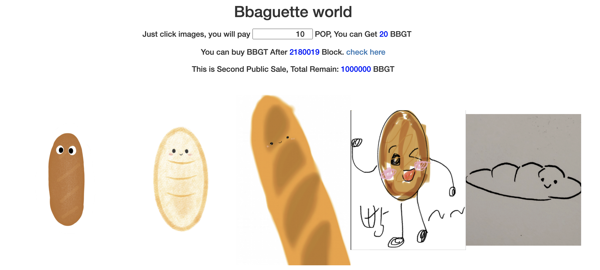
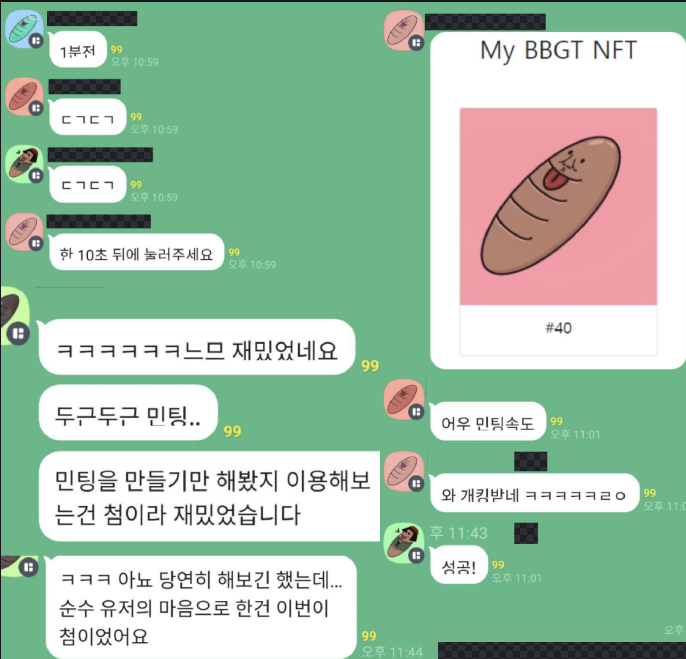
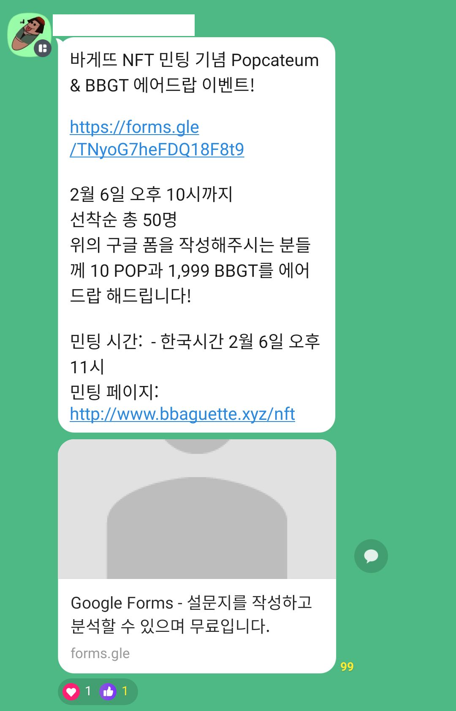
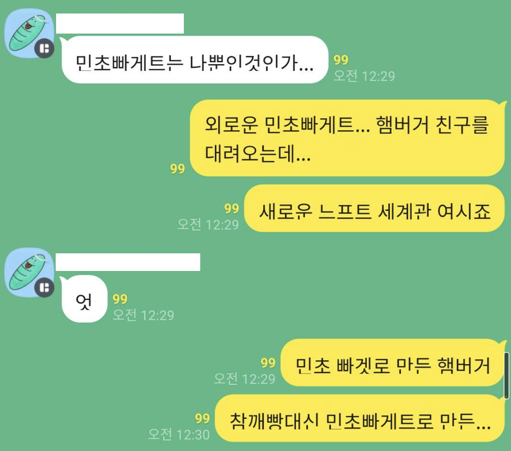
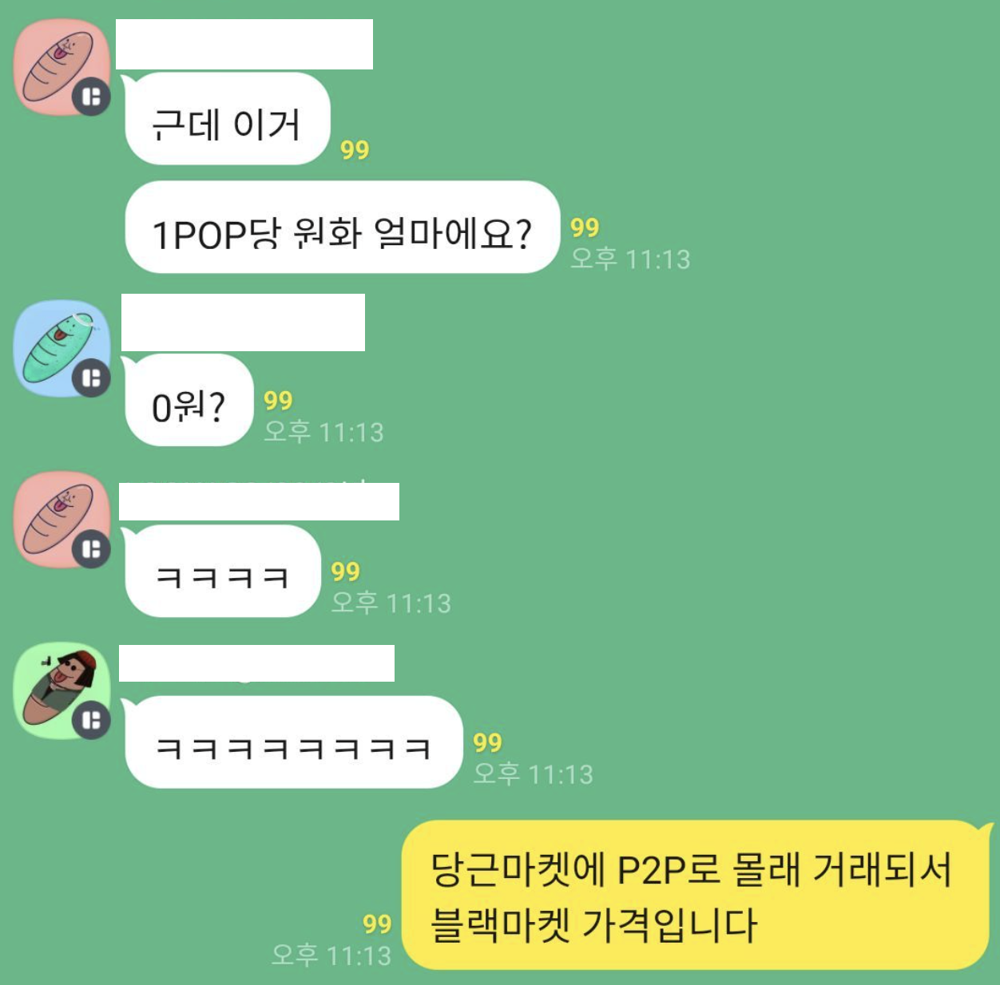

> www.bbaguette.xyz

### "Bring Bbaguette into the World"

<br/>

# 들어가며

사실 ERC20, ERC721 프로젝트를 할 생각이 아예 없었지만, 중고교 친구(마침 컴공과)랑 이야기 하다가 말이 나와 갑자기 빨려들어가며 시작하게된... 
> 사이드 플젝은 이렇게 적어야 국룰이라도 들었는데 맞나요? 뭐 대충 이런 스토리입니다



> NFT 아티스트도 그렇게 구했습니다. "대충 관심있는거 같으니, 너가 해!"


> 그렇게 만들어진 팀멤버

<br/>

뭐 그렇게 얼렁뚱땅 스페셜한(?) 언어 솔리디티 배우고, 잘 모르는 프론트엔드로 힘들어하고... 어찌저찌 총 두달 걸린 빠게트 프로젝트 '**중간**' 후기입니다. 
- 아직 로드맵상으로 갈 길이 멀기 때문에 '중간'입니다.
- 참고로 로드맵을 잘 준수해서, 다음 스텝인 2025년까지 '아무것도' 하지 않을 예정입니다
- To The Mars!!!

<br/>
<br/>


> 대충 주말에 고생했다는 사진

정말 재밌었습니다. 

# 프로젝트 개발기(?)

사실 뭘 소개할게 있나 싶군요... 개발을 한장의 사진으로 요약하면 아래와 같습니다


<br/>

그래도 조금 더 자세히 설명하자면... 

[Bbaguette-World Github](https://github.com/bbaguette-world)
- [bbaguette-v1](https://github.com/bbaguette-world/bbaguette-v1): ERC20 & Sale, ERC721 & Sale Contract
- [homepage](https://github.com/bbaguette-world/bbaguette-homepage): 홈페이지 전체 소스코드(www.bbaguette.xyz)
- [bbgt-nft-metadata-api](https://github.com/bbaguette-world/bbgt-nft-metadata-api): 랜덤 뽑기의 순수함을 지키기 위한 프로젝트 (README 참고)

## Bbaguette Contract

ERC20, ERC721, Sale Contract 정말 모든걸 [clonesnerverdie](https://github.com/clonesneverdie/CND-contracts)를 참고(=복붙)했습니다!

<br/>


그리고 매번 도와주신 스폐숄 어드바이저분들 너무나 감사합니다 🙇‍♂️🙇‍♂️🙇‍♂️

<br/>

가장 재미있었던(?) 기능은 "ERC20 토큰을 통해 ERC721을 민트하는 기능"이였습니다.
- [Sale Contract](https://github.com/bbaguette-world/bbaguette-v1/blob/main/src/contracts/NFT/Sale/BBGTv1Sale.sol#L49) 소스코드입니다.
- BBGT는 ERC20, ERC721 토큰 Symbol입니다.

```solidity
contract NFTSale {
  modifier mintRoleByBBGT(uint256 numberOfTokens) {
    // ERC20 allowance 체크
    uint256 allowanced = BBGTTokenContract.allowance(
      _msgSender(),
      address(this)
    );
    require(
      PRICE_PER_BBGT.mul(numberOfTokens) <= allowanced,
      "Not enough allowanced"
    );
    _;
  }

  constructor(
    address nft,
    address token,
  ) {
    BBGTNFTContract = IBBGTv1(nft);
    BBGTTokenContract = IERC20(token);
  }

  // 실제 mint 함수
  function mintByBBGT(uint256 numberOfTokens)
    public
    mintRole(numberOfTokens)
    mintRoleByBBGT(numberOfTokens) // 위 allowance 체크
  {
    for (uint256 i = 0; i < numberOfTokens; i++) {
      if (BBGTNFTContract.totalSupply() < MAX_SUPPLY) {
        BBGTTokenContract.transferFrom(
          _msgSender(),
          address(this),
          PRICE_PER_BBGT
        );
        BBGTNFTContract.mint(_msgSender());
      }
    }
  }
}
```

## Bbaguette Homepage

요약하자면 백엔드 Node.js 프론트엔드 html, css, js 이용했습니다. (다른건 몰라~)

<br/>

백엔드는 특별한거 없습니다 그냥 HTML 내려주는 기능이 전부입니다!

참고로 렌더링(?) 엔진으로 hbs 사용했는데... 
- 헤더, 푸터 나누고 합치는 기능이 안되길래 정말 "아무 기능도 안썻습니다" 
- How to do? I don't know. 
- 그래서 매 파일에 헤더, 푸터 소스코드가 "그대로 똑같이" 들어가있습니다 (서프라이즈🎉)

<br/>

프론트는 vanilla(순정) javascript 사용했고, 'web3.js'와 'bignumber.js' 써서 열심히 코딩했씁니다! ('ethers.js' 쓸껄 그랬나 싶네요)

모바일이고 뭐고 잘 몰라서 부트스트랩5 넣고 아무렇게나 만들었습니다 (정말로...)

<br/>

그 외에 Popcateum LevelDB State에 존재하는 모든 Account에 에어드랍을 하는 코드같은걸 만들고 싶었는데, 시간 관계상 패스했습니다

<br/>

다시 한번 반복하지만 모든건 다 [clonesnerverdie](https://github.com/clonesneverdie/CND-contracts)와 스페셜 어드바이저분들 덕분입니다! (감동하는 표정 이모지)

# 즐거움


> BBGT ERC20 2차 Public Sale, 1차는 5시간만에 완판!


> NFT는 무려 1분 컷


> 에초에 민팅 완판을 생각못해서 'Transfer' 기능을 만들 생각을 못했다...


> 많은 사람이 민팅에 참여할 수 있게 '에어드랍'까지 도와주신 스페셜 어드바이저님 최고!!

# 마치며

<br/>

멋있게 'NFT의 가치', '커뮤니티의 가치' 아니면 '메타버스란 무엇인가' 말하고 싶지만, 사실 잘 모르겠고...

"2달동안 프로젝트 같이 하면서 매우 재밌게 즐겼다"입니다! 

특히 사람들이 재밌어하니까 너무 뿌듯하네요!


> To be continue...

##  그래서 얼마를 벌었나요? 


<br/>

### 0원 벌었습니다! (진짜)

<br/>

아예 없는건 아니고, [팝캣](https://popcateum.org/) 40만개정도 정도 벌었습니다. (이정도면 고래는 아니고 새우튀김정도? 🍤)
- 1 POP = 0 KRW
- 1 POP = 1 POP

<br/>



