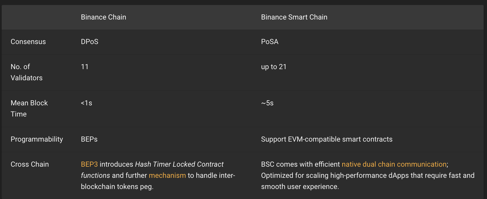

당분간 BSC(바이낸스 스마트 체인) [Document](https://docs.binance.org/index.html)를 읽고 글로 작성해볼려고 합니다.

## 요약

 
- [from](https://docs.binance.org/smart-chain/guides/general.html)

`Binance chain`은 BNB 코인을 기반으로 하여 빠른 자금 전송(Send)와 DEX Trading에 최적화되어 있다.

주요 기능은 BNB 전송, Token 관련 기능, DEX Trading 등이다. 가장 중요한 것은 **Smart Contract를 지원하지 않는다**!!!

하지만 `Binance Smart chain`의 경우 **Smart Contract를 지원**한다!

## Binance Chain (=BC)

[참고: BC FAQ](https://docs.binance.org/faq/faq.html)

##### Q. `Binance DEX`가 무엇인가?

`Binance DEX`는 `Binance Chain` 위에 구현된 탈중앙 거래 모듈이다.

##### Q. `Binance Chain`은 무엇을 할 수 있나요? (=주요 기능은?)

\- BNB 전송 
\- 새로운 Token 등록 (그외 send, recevie, burn/mint, freeze/unfreeze) 
\- DEX 관련: 두 개의 다른 토큰에 대한 trading 생성 
\- DEX 관련: BC 위에서 order를 통해 자산을 사고 파는 주문 가능

##### Order 주문 시나리오

\- `symbol, side(buy or sell), price, amount...` 등 정보를 포함한 Order message를 네트워크로 `Send` 
\- 주문 취소 등이 가능하며, Match 작업 후 Order 가 완료되며, 해당 자산이 구매자 주소로 이동된다 

##### Q. `Binance Chain`은 스마트 컨트랙트를 지원하나요?

아니요. 필요한것이 있다면, 기본 기능을 이용해 구현해주세요.

##### Q. 수수료에 대해서

네트워크 공격 방지등을 위해 수수료를 부과하고, Validators에게 공유(reward)됩니다.  
\- `transfer, new order, cancel...` 등 `transaction`에 수수료가 부과된다.  
\- `new order`의 경우, 네트워크 성장을 위해 수수료가 부과되지 않습니다  
\- 현재 수수료는 고정된 상태이며, 투표를 통해 변경됩니다.

## Binance Smart Chain (=BSC)

[참고: BSC FAQ](https://docs.binance.org/faq/bsc/bsc.html)

##### 특징

- 21명의 Validator 가 PosA 합의를 통해 낮은 수수료로 짧은 시간에 블록을 생성합니다.
- EVM에 호환됩니다
- `Binance Chain`과의 cross chain communication이 내장 설계되어 있습니다.

##### Q. BSC와 BC가 별도인 이유는?

스마트 계약 실행은 exchange를 느리게하고, 거래 결정(deterministic)을 늦추는 요인이 됩니다.

## 그래서 무슨 차이인거지?

이더리움의 사례를 보면 알 수 있듯, DApp(=Smart Contract의 실행)은 네트워크의 부담을 줍니다. 

여기서 부담이란 네트워크 지연, 점점 높아지는 수수료 등을 의미합니다.

BC와 BSC를 목적에 맞게 분리함으로 이러한 문제를 해결하고, 크로스체인을 통해 두 체인을 연결했습니다.