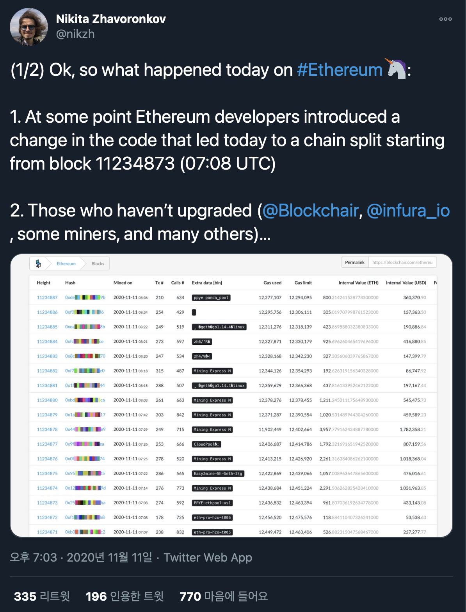

 
[Twitter @nikzh](https://twitter.com/nikzh/status/1326465592841351168)

### 요약

일부 이더리움 Node 프로그램이 구버전이였습니다. 

다른 Node들간의 Consensus(합의)가 깨진 상태였습니다. 

그 후, Minning이 이어졌고 `11234873` 블럭에서 `chain split`이 발생했습니다.

- 예를들어 `Etherscan`에서 11234873 블럭의 해시는 `1e...`였을때, `Blockchair`에서는 `2a...`였습니다.

결론적으로는 모든 이더리움 Node의 버전이 동일하게 업데이트되었다면 발생하지 않았을 문제입니다.

 

### 왜 발생했는가?

각각의 블록체인 Node들은 서로의 블록을 전파하고, 검증합니다.

그러나 Consensus Rule의 변화로 인해, Update된 Node에서는 '이것은 올바르지 못한 블럭이다'라며 받아들이게 됩니다.

이러한 문제로 인해 Geth(Node 프로그램)의 다른 버전 클라이언트간의 `chain split`가 발생했습니다.

\* 문제가 발생한 특정 프로그램의 이름은 `Geth`입니다

 

### 그렇다면 왜 Node들은 버전을 업데이트하지 않았는가?

먼저, Node 프로그램의 버전 업은 간단히 말해, Major/Minor로 나뉘어집니다.

`chain split`을 유발할 수 있는 업데이트의 경우, Major에 해당할 것이고, 그 외에 간단한 bug fix, 기능추가 등은 Minor에 해당할 것입니다.

업데이트가 될때, 대다수의 참여자(Node)가 동의하고 업데이트를 진행한다면, 이더리움 네트워크에는 아무 문제가 없을 것입니다.
- 물런 이러한 참여자의 동의가 실패한다면 때때로, 하드포크가 발생하기도 합니다.

`however, we were not aware of a consensus issue with Geth v1.9.9 and v1.9.13. - Infura`

결론적으로, 불운하게도 Geth의 개발진과 Node가 해당 `Consensus issue`에 대해 인지하지 못했습니다.

\* `Infura`는 문제가 발생한 Node입니다

 

### 어째서 큰 문제가 되었는가?

모든 Node들이 동시에 버전이 업데이트 될 수는 없습니다. 일정 시간까지 점차 업데이트됩니다.

일부 Node가 합의 규칙이 달라, `chain split`가 발생할때, 두 Node그룹의 네트워크는 분리됩니다.

대다수의 Node는 다시, 업데이트 완료한 다수의 네트워크에 참여하기 위해 본인의 프로그램을 업데이트 합니다.

 

하지만 이번 사건의 경우 

1. 문제가 발생한 Node들이 Issue를 인지하지 못했다
2. 여러 이더리움 서비스 제공자가, 외부 Node(Infura)에 의존하며 서비스를 제공하고 있었다.
3. 위 이유로, 체인 스플릿이 발생하자 거래소등은 서비스를 일시 중단하기 시작했다. 

 

2번에 대해 좀 더 자세히 설명해보겠습니다.

서비스제공자라고 하면 대표적으로 블록 탐색기, 거래소등이 있는데 이들이 자체적인 Node를 운영하는것이 아니라 
다른 외부 Node에 의존하여 서비스를 제공했습니다. 예를들어, A거래소가 Infura에 의존해 서비스를 제공하고 있는 경우를 생각해보면 됩니다.

 

3번은 간단합니다.

이더리움 Node를 업데이트해서 잘 사용하고 있었으나, 네트워크에 문제가 발생하자 서비스를 일시 중단한 겁니다. 
특히 거래소의 경우 이러한 문제가 치명적이기에, 독자적 네트워크를 운영하는것과 상관없이 입/출금 서비스가 일시 중단됩니다.
추가로 원인이 파악되기전에는, 본인의 체인이 옳은 체인인지 확신할 수 없었습니다.

위 3가지 이유로 이더리움 네트워크에 문제가 발생했습니다.

 

### 결론

결과적으로 우리는 블록체인에 핵심 가치인 분산 네트워크가 외부에 의존적인 여러 서비스들에 의해 손상을 입을 수 있다는 것을 알았습니다.

### 참고

- [컨센선스란 무엇인가?](https://steemit.com/kr/@donekim/consensus-pow-pos-dpos)
- [Geth v1.9.17 Post Mortem](https://gist.github.com/karalabe/e1891c8a99fdc16c4e60d9713c35401f)
- [Infura Mainnet Outage Post-Mortem 2020-11-11](https://blog.infura.io/infura-mainnet-outage-post-mortem-2020-11-11/?fbclid=IwAR1kQUxmCIuRnWPB9x5BjfiWe0G1DgYQIE8y4Q73yAJ8tkCpwtNJOI6hRR0)

