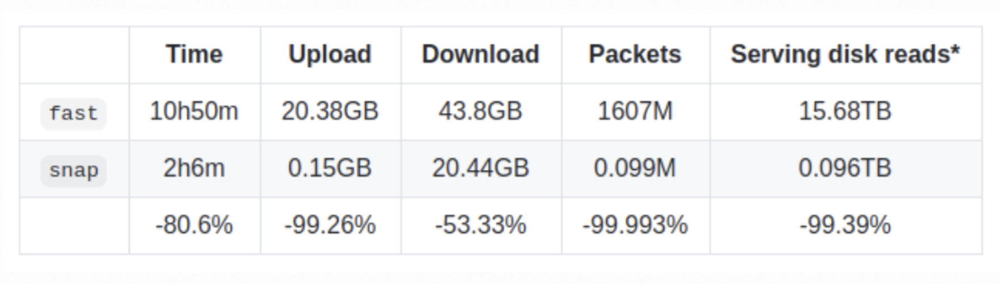
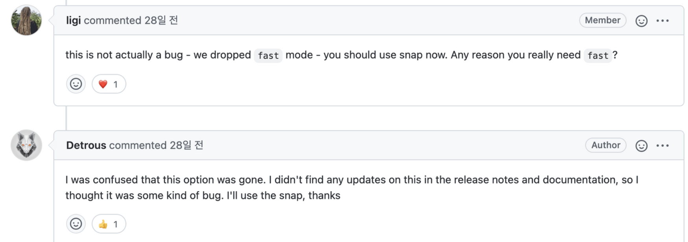

먼저 문서에 오류가 있을 수 있음을 밝힙니다. 수정 요청 부탁드립니다! 

두번째로, 이 문서는 여러 출처의 글을 정리한 글입니다. Geth 코드 레벨 이해를 담고 있지 않습니다.

## 목차

1. [이더리움 상태(State)란 무엇일까?](/blockchain/ethereum-state/)
2. [Geth는 어떻게 동기화(Sync)할까?](/blockchain/geth-sync-mode) 
3. Geth의 Snapshot과 Snap Sync


## 스냅샷 가속 구조란? (Snapshot acceleration)

스냅샷 은 이더리움 State 위에 있는 가속 데이터 구조로, Account와 Storage를 훨씬 더 빠르게 읽을 수 있게 합니다. O(log N)로 계정에 액세스하는 비용을 O(1) 으로 줄입니다.
- 약 1억 4천만개의 계정이 있는 이더리움에서 이는 엄청난 성능 향상입니다. 하지만 결국 이러한 스냅샷 구조를 유지하기 위한 Trade-Off(새로운 오버헤드)가 있습니다.  

<br>

스냅샷은 한 블록내에 존재하는 “이더리움 글로벌 상태”에 대한 완전한 복사본입니다. 추상적 구현체는, 모든 account와 storage의 dump입니다. (**flat key-value store**)

따라서 7-8 단계 깊이의 tire를 조회하는게 아니라, 1단계 조회가 가능합니다. 또한 snapshot을 업데이트하는것에 큰 비용이 들지 않습니다. 즉 계정에 액세스하는 비용을 O(log N)에서 O(1) 으로 줄입니다.

## Devil’s in the details

단순히 매 블록 업데이트때마다 스냅샷을 업데이트 하면 안됩니다. 
- 새로 찾은 블록이 엉클 블록이 되는 경우, 특정 Dapp이 3 블록 이전 State 를 찾는 등

<br/>

이런 문제점을 극복하기 위해, Geth의 snapshot은 두 엔티티로 구성됩니다. 

- 오래된 블록(예: HEAD-128)의 완전한 스냅샷인 “영구 디스크 계층”
- 매번 top에 write되는 “in-memory diff 계층”

<br/>

새 블록이 생성될 때마다 디스크 계층에 직접 병합하지 않고, 오히려 변경사항을 메모리내에 diff 계층으로 만듭니다. 만약 인메모리 diff 레이어가 충분히 쌓였다면, 잴 아래 레이어가 디스크에 푸쉬(=병합)됩니다.  만약 특정 Account의 State를 조회한다면 최상위 diff 레이어에서 시작해서, 찾을때까지 내려갑니다 (즉 디스크 레이어까지 내려갑니다) 

<br/>

인메모리의 diff 계층이 Tree 구조로 조합되기 때문에(Since the in-memory diff layers are assembled into a tree) 128 블록보다 더 낮은 레벨의 reorg는 단순히 diff layer 하나를 선택 후, 거기서부터 다시 시작하면 됩니다.

<br/>
 
> 128블록이 언급되는 이유는 무엇일까? '추측'하기로는 128개 블록에 대한 State를 In-memory diff layer로 구성하고 있기 때문이 아닐까요? Geth 코드를 통해 더 명확히 이해 가능할 듯 합니다
    
<br/>

(최대) 128개의 Diff 레이어를 조회하는 Map lookup 비용은 증가하지만, 8번의 Disk Read가 필요한 LevelDB에 비해 4~5배 빠릅니다.

<br/>

### 문제점
- 스냅샷은 MPT leaf node에 이미 포함된 raw account state의 중복 복사본입니다. 따라서 현재 스냅샷을 메인넷에서 사용하면 약 20-25GB의 추가 디스크 오버 헤드를 수반합니다.
- 영구 디스크 계층보다 더 깊은 reorg가 있는 경우 스냅샷을 완전히 삭제하고 재생성해야 합니다. 매우 비싼 작업입니다.
- 종료시 메모리 내의 Diff 계층이 모두 저장되고 다시 로드되어야 합니다. 그렇지 않으면 스냅샷을 이용할 수 없습니다.
- 동일한 디스크 레이어에 반복적으로 액세스할때, 디스크 계층에 대해 읽기 캐시를 할당합니다.
- 키는 raw data(address, storage key)가 아니라, 이들의 해시입니다. 스냅샷이 MPT와 동일한 순서를 갖도록 보장합니다.
- 영구 디스크 레이어에 기록하는 작업은 State Pruning보다 오래걸림으로, 이 과정중에도 체인을 잘 따라가야합니다.

<br/>

이러한 스냅샷 가속 구조는 읽기 복잡성을 약 10배정도 줄입니다.

그렇다면 gasLimit을 10배 늘릴 수 있을까요? 그건 아닙니다. 읽기(=스냅샷)은 10배의 성능을 제공하지만, EVM 실행단의 write 작업은 아닙니다. 

다만 저렴한 Read opcode 위주의 DoS 공격에 장기적으로 효과적입니다. 또한 storage call에 효과적입니다. 특히 개인 노드가 아니라, 여러 사용자를 위해 운영되는 엔터프라이즈 레벨 노드에서 10배는 엄청난 성능 향상입니다.

## Fast Sync의 문제점: 대기시간

Snap Sync을 알아보기전에, Fast sync의 문제점에 대해 알아보겠습니다.

<br/>

지금까지 동기화 과정은 크게 두가지 방법이 있었습니다.

- full sync mode: 블록헤더를 다운받고 직접 트랜잭션을 실행 (8 ~ 10일  소요)
- fast sync mode: 블록헤더를 다운 받고 PoW 검증 후, 최근 블록에 연결된 State를 다운로드 (약 8 ~ 10시간 소요)
    - CPU 및 Disk I/O를 Network bandwidth 및 latency로 대체.
    - 특히, 이더리움 메인넷은 현재 약 6억 8천만개의 State Trie Node를 포함하고 있습니다.

<br/>

fast sync의 “예상치 못한 병목 현상”은 이더리움 데이터 모델로 인해 발생하는 “대기 시간”입니다. 트리의 루트(블록 헤더에 포함된 해시)에서 동기화를 시작해서 모든 노드를 다운로드하는 유일한 방법은 트리의 각 노드를 **하나씩** 요청하는 것 입니다. 다운로드할 노드가 6억 7500만 개이므로 384개 요청을 일괄 처리하더라도 175만 번 엑세스해야 합니다. 

### 1. 네트워크 지연

10개의 서빙 피어에 매우 관대대하게 50ms RTT(Round Trip Time, 왕복시간)를 가정하면 Fast Sync는 기본적으로 데이터가 도착할 때까지 150분 이상을 기다립니다.

### 2. Serving 지연 (디스크 I/O)

서빙 피어는 동기화 노드에 요청을 받으면 디스크에서 해당 정보를 검색해야 합니다. 트리 의 노드는 해시로 키가 지정되므로 일괄적으로 저장/검색하는 효과적인 방법이 없으며 각각 고유한 데이터베이스 읽기가 필요합니다. 설상가상으로 Geth에서 사용하는 LevelDB는 데이터를 7단계로 저장하므로 Random 읽기는 많은 파일을 건드릴 것입니다.

### 3. 대역폭 지연

각 트리 노드를 개별적으로 요청한다는 것은 실제로 많은 해시를 원격 피어에 업로드하여 서비스를 제공하는 것을 의미합니다. 다운로드할 노드가 6억 7,500만 개이므로 업로드할 해시는 6억 7,500만 개 또는 675 * 32바이트 = 21GB입니다. (전 세계 평균 97Mbps)

요약하면 Fast Sync는 데이터를 기다리며 아무것도 하지 않고 대략 6시간을 소비합니다. (문서에 따르면...)

- 가정: 평균 이상의 네트워크, 서빙 노드가 많고, 그 서빙노드들이 내 요청만 처리할 때 (즉 성능이 좋을때)

## Snap Sync

Snap Sync는 위 3가지 문제점을 모두 해결하게 디자인 되었습니다. 핵심 아이디어는 매우 간단합니다. 

Trie의 노드를 각각 다운로드 하는게 아니라, **State flat data**(= snapshot)의 연속 chunk를 다운로드하고 그 데이터로 부터 Trie를 로컬에서 다시 구성합니다.

- Merkle trie의 중간 노드를 다운로드하지 않고 State 데이터를 연속, 대량으로 가져올 수 있어 네트워크 지연으로 인한 지연을 제거할 수 있습니다.
- Merkle 노드를 다운로드하지 않으면 다운스트림 데이터가 절반으로 감소하고, 각 트리 노드 데이터를 개별적으로 처리하지 않으면 upstream data가 가벼워지고 대역폭에 의한 지연이 제거됩니다.
- 랜덤한 키로 저장된 데이터를 요청하지 않고, 연속적인 디스크 읽기를 통해 디스크 I/O 지연을 제거합니다. 다만 서빙 노드가 이미 적합한 flat format 으로 데이터(= 스냅샷)를 가지고 있어야 합니다.

<br/>

스냅 동기화는 패리티의 `warp sync`와 상당히 유사하며, 실제로 많은 설계 아이디어를 가져왔습니다. (개선하며)

- Warp Sync는 3만 블록마다 생성되는 [Static Snapshot](https://openethereum.github.io/Warp-Sync-Snapshot-Format)(전체 state에 대한)에 의존합니다. 이는 매 3만 블록마다 스냅샷을 재생성해야함을 의미하지만, 전체 State Trie를 반복(iterating)하는 것은 생각보다 오래걸립니다. 즉 지속가능하지 않습니다. 반대로 Snap Sync는 (처음 생성될때는 매우 느리지만) 단 한번만 생성되는 dynamic snapshot을 기반으로하며, 이 스냅샷은 계속 최신 상태로 유지됩니다.
- Warp Sync의 스냅샷 format은 Merkle Trie의 레이아웃을 따르지 않는다. 따라서 Wrap-Data는 개별적으로 증명(proven)할 수 없다. 동기화 노드는 전체 20GB의 데이터를 다운로드 한 후에야 검증 가능하다. (만약 이상한 데이터라면?... 😿) **하지만 Snap Sync의 Snapshot format은 순차적인 머클 리프에 불과**하여, 증명이 가능하며 올바르지 못한 데이터를 즉시 검출할 수 있습니다.

<br/>

### Snap vs Fast Sync mode 
- block과 receipts 데이터는 무시하고 비교한 결과입니다.

 

Snap Sync는 Geth v1.10.0 에서 비활성화 상태입니다.
- 스냅 동기화를 서비스할려면 스냅샷 가속 구조를 생성해야 하는데, v1.10.0에 처음 나온 기능이라 아직 아무도 스냅샷을 생성하지 않았습니다. 따라서 `--syncmode snap` 을 통해 스냅동기화를 활성화해도, 당분간 적절한 서빙 노드를 찾지 못할것입니다. 만약 네트워크에 적절한 서빙 노드가 많아졌다고 판단되면 default 기능으로 변경할 것입니다.

<br/>

 
> https://github.com/ethereum/go-ethereum/issues/24155

그리고 v1.10.14 `--syncmode fast`가 삭제됬습니다. fast syncmode로 실행할 경우 오류가 발생합니다. (왜 릴리즈노트에 언급이 없었는지... 🙀)

<br/>

### [Q. 그렇다면 LevelDB에 저장된 MPT는 Snapshot으로 대체되나요?](https://github.com/ethereum/go-ethereum/issues/24272)

- 아니요. MPT와 스냅샷 모두 유지됩니다.
- 스냅샷은 가속 구조로 사용되고, 다른 노드에게 제공됩니다.
- MPT는 블록의 루트 해시를 계산하고 확인하는데 필요합니다.

### Q. [스냅샷 생성에 오랜 시간이 걸리고, 동기화도 느려집니다.](https://github.com/ethereum/go-ethereum/issues/23873)

실행 환경: `syncmode=full, gcmode=full`

- 스냅샷 생성 속도를 높이기 위해 적용할 수 있는 방법을 알려드립니다.
- (1) `syncmode=snap` 을 이용하여 Geth를 동기화
- (2) 또는 `geth db export ...` 명령어로 동기화된 노드에서 스냅샷 데이터 export 후, `geth db import ...` 명령어로 import 합니다. 그 후 스냅샷이 rebuilt 됩니다.

### [Q. Full Sync Mode가 이렇게 오래걸리면 네트워크에는 Fast/Snap Sync Mode만 남아서, 완전한 Archive State가 없어지는거 아닌가요?](https://github.com/ethereum/go-ethereum/issues/23873#issuecomment-964280977)

- 상관없다. 누구든지 트랜잭션을 다시 실행하여 온전한 Archive State를 만들 수 있다. (다만 몇일이 걸릴 뿐이다.)
  
### Q. [Geth alwyas ~ 100 blocks behind - knownStates alwyas 0](https://github.com/ethereum/go-ethereum/issues/23553)

```solidity
> eth.syncing
{
  currentBlock: 13188285,
  highestBlock: 13188389,
  knownStates: 0,
  pulledStates: 0,
  startingBlock: 13186299
}

몇시간 후 동기화 완료
> eth.syncing
false
```

- Geth는 여전히 동기화를 하는 중입니다. 스냅 싱크를 한다면 먼저, snapshot을 통해 대부분의 state 데이터를 다운로드 합니다. 또한 다운로드를 하며 네트워크의 변경사항을 적용해야합니다.
- 이 단계에서 네트워크에서 얼마나 많은 변경이 있었는지 모르기 때문에 ETA(도착 예정 시간)을 보여줄 수 없습니다.
- 한번 동기화가 완료되면 이미 완성된 snapshot 가속 구조를 백그라운드에서 수정하며, 노드를 사용할 수 있습니다.
- `eth.syncing` 은 스냅 동기화에 필요한 정보를 채우지 못합니다 (개선해야합니다)

### [Improve “eth.syncing” RPC call](https://ethereum-magicians.org/t/improve-syncing-rpc-call/6994)
- `eth.syncing` 명령어는, 동기화 완료(synced) 상태라면 `eth.syncing` 은 `false` 를 리턴한다.
- 하지만 더 많은 정보가 필요하다. (아직 [RPC 표준](https://github.com/ethereum/execution-apis/blob/main/src/schemas/client.json)이 아니다. 개선하자)
- 특히 스냅 동기화 정보가 존재하지 않는다 (아래 질문에서...)

[SyncProgress](https://pkg.go.dev/github.com/ethereum/go-ethereum#SyncProgress)

```go
type SyncProgress struct {
	StartingBlock uint64 // Block number where sync began
	CurrentBlock  uint64 // Current block number where sync is at
	HighestBlock  uint64 // Highest alleged block number in the chain

	// "fast sync" fields. These used to be sent by geth, but are no longer used
	// since version v1.10.
	PulledStates uint64 // Number of state trie entries already downloaded
	KnownStates  uint64 // Total number of state trie entries known about

	// "snap sync" fields.
	SyncedAccounts      uint64 // Number of accounts downloaded
	SyncedAccountBytes  uint64 // Number of account trie bytes persisted to disk
	SyncedBytecodes     uint64 // Number of bytecodes downloaded
	SyncedBytecodeBytes uint64 // Number of bytecode bytes downloaded
	SyncedStorage       uint64 // Number of storage slots downloaded
	SyncedStorageBytes  uint64 // Number of storage trie bytes persisted to disk

	HealedTrienodes     uint64 // Number of state trie nodes downloaded
	HealedTrienodeBytes uint64 // Number of state trie bytes persisted to disk
	HealedBytecodes     uint64 // Number of bytecodes downloaded
	HealedBytecodeBytes uint64 // Number of bytecodes persisted to disk

	HealingTrienodes uint64 // Number of state trie nodes pending
	HealingBytecode  uint64 // Number of bytecodes pending
}
```


<br/>


모든 내용은 요약되었기 때문에, 아래 링크를 통해 자세한 내용을 읽어보는 것을 추천합니다. 

<br/>

### 출처

- [Ethereum Under the Hood: Algorithms And Data Structures](https://youtu.be/OxofT39TJgg)