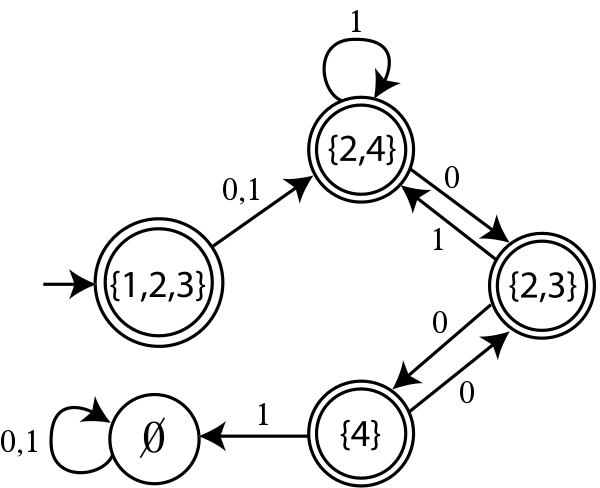
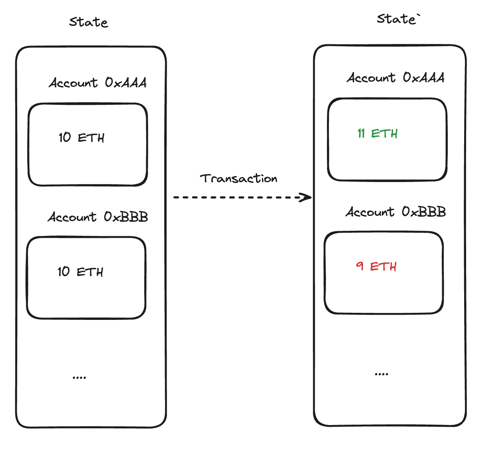
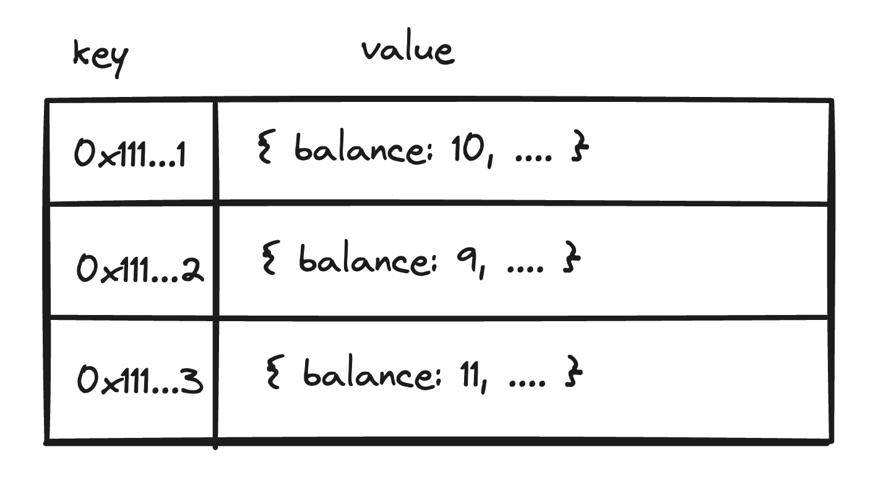
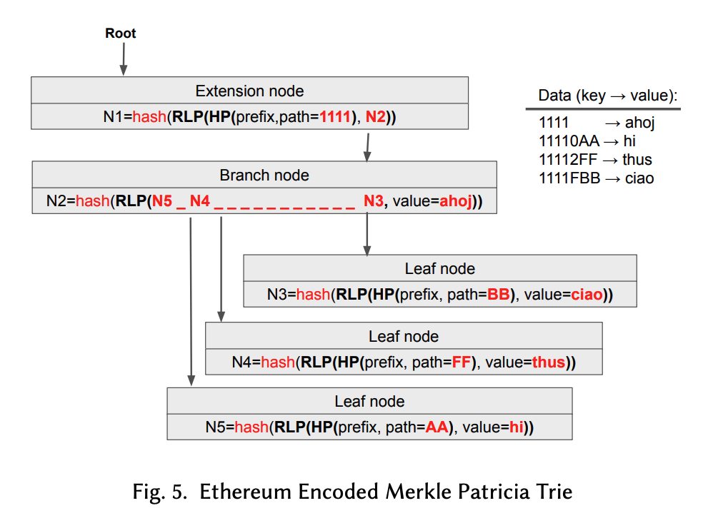
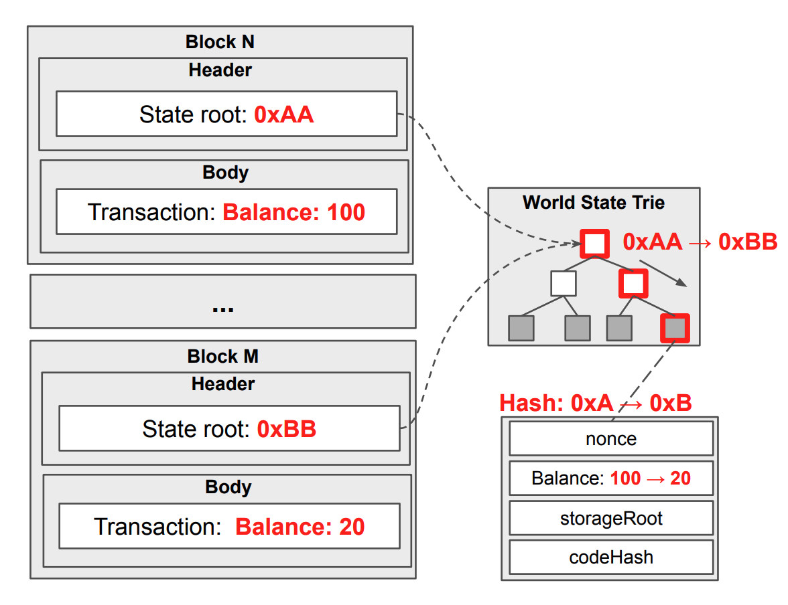
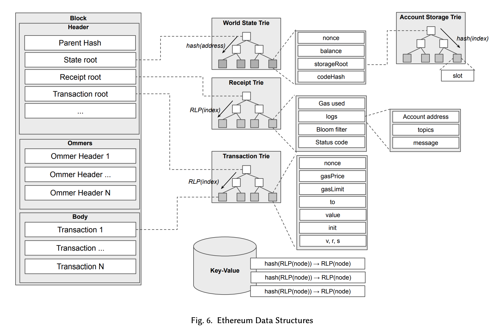

# 시리즈

먼저 문서에 오류가 있을 수 있음을 밝힙니다. 수정 요청 부탁드립니다! 

두번째로, 이 문서는 여러 출처의 글을 정리한 글입니다. Geth 코드 레벨 이해를 담고 있지 않습니다.

> 해당 글은 이더리움과 Tree 자료 구조에 대한 기본적 이해를 요구합니다.

1. 이더리움 상태(State)란 무엇일까?
2. [Geth는 어떻게 동기화(Sync)할까?](/blockchain/geth-sync-mode) 
3. [Geth의 Snapshot과 Snap Sync](/blockchain/ethereum-geth-snapshot)

# 목차

1. State
2. Merkle Patricia Trie
3. World State Trie

# 1. State

## 컴퓨터 공학에서 State?


 

> [유한 상태 기계](https://ko.wikipedia.org/wiki/%EC%9C%A0%ED%95%9C_%EC%83%81%ED%83%9C_%EA%B8%B0%EA%B3%84)


'상태(state)'는 특정 시점에서 시스템이 가지고 있는 정보의 집합을 말합니다. 이 정보는 프로그램의 변수 값, 사용자 인터페이스의 상태, 메모리의 내용 등 다양한 형태를 가질 수 있습니다.

'상태 전이(transition)'는 이러한 상태가 다른 상태로 변화하는 과정을 의미하며, 사용자의 입력, 시간의 경과, 외부 이벤트 발생 등에 의해 이루어질 수 있습니다.

## 이더리움의 State?

 

> 트랜잭션에 의한 상태 전이를 확인 가능합니다.

이더리움의 상태(State)는 네트워크에 존재하는 모든 Account의 State의 집합입니다.

하나의 Account State는 `Balance, Nonce, ContractCode, ContractDataStorage`를 포함합니다. 

트랜잭션이 처리될 때마다 각각의 상태가 전이되며, 블록체인에 영구적으로 기록됩니다.

다시 말해, 이더리움에서 상태란 네트워크에 존재하는 모든 Account 상태 집합입니다.

> 이더리움의 상태를 `World State` 라고 부른다.

## Key Value DB

각 계정의 상태 정보를 저장하는 가장 간단한 구조는 Key-Value 저장소입니다. 이 구조에서는 각 계정의 32 byte address를 고유한 키로 사용하고, 상태 객체를 값으로 저장합니다. 

 
> `32 byte address`를 Key로, State Object를 값으로 가집니다.

그러나 이 간단한 구현에는 문제점이 존재합니다. 2024년 4월 기준 Ethereum의 Account는 [2억 6천만개](https://etherscan.io/chart/address)입니다. 간단한 Key Value 구조는 이러한 대규모 데이터를 처리하는데 느린 탐색 속도를 보여줍니다. 특히, 네트워크의 규모가 계속해서 확장됨에 따라, 이런 문제는 더욱 심화됩니다. 느린 탐색 시간은 트랜잭션 처리 속도를 저하시키고, 이는 전체 네트워크의 성능 저하로 이어집니다. 따라서, 이더리움 네트워크는 이러한 문제를 해결하기 위해 더 효율적인 데이터 구조와 알고리즘을 사용합니다. 


이더리움은 복잡한 데이터 구조인 Merkle Patricia Trie (MPT)를 사용합니다. MPT는 Key-Value 쌍을 효율적으로 저장하고 검색할 수 있게 만들며 여러 문제를 해결합니다. 앞으로 MPT에 대해서 설명하겠습니다.


# 2. Merkle Patricia Trie

## Tree

 

> [wikipedia](https://en.wikipedia.org/wiki/Tree_(data_structure))

탐색 트리는 데이터를 효과적으로 검색하는 표준적인 방법 중 하나입니다. 이 구조는 다양한 형태로 존재하며, 그 중 이진 탐색 트리는 가장 흔한 형태 중 하나입니다.

## Trie

 

> [boardinfinity](https://www.boardinfinity.com/blog/trie-data-structure/)

트라이는 키가 문자열(`address`)인 경우 효율적인 검색을 제공하는 트리 기반의 데이터 구조입니다. 트라이에서는 각 노드가 키의 한 문자를 표현하며, 루트에서 노드까지의 경로가 전체 키를 나타냅니다. 


## Patricia Trie

 

> [ethereum-stack](https://ethereum.stackexchange.com/questions/6415/eli5-how-does-a-merkle-patricia-trie-tree-work)

패트리샤 트라이는 트라이의 메모리 효율을 개선한 데이터 구조로, '경로 압축(Path Compression)'을 통해 메모리 사용량을 줄입니다. 이미지와 같이 공통 접두사를 가진 키들이 한 노드에서 표현될 수 있습니다.

트라이와 비교했을 때, 패트리샤 트라이는 키의 **공통 접두사**를 공유하는 데이터를 효율적으로 관리할 수 있습니다. 트라이의 단점인 메모리 사용량을 크게 줄이면서도 트라이의 장점인 효율적인 검색 속도를 유지합니다.

 

> 2억 6천만개의 address는 매우 많은 공통 접두사를 포함합니다 

## Merkle Tree


이번엔 목적이 다른 데이터 구조를 소개합니다. 지금까지는 효율적인 저장과 처리를 목적으로하는 자료구조를 소개했다면, Merkle Tree를 사용하는 목적은 '데이터 위변조 방지'입니다.

블록체인과 같은 분산 환경에서는 모든 참여자가 데이터 일관성을 유지하는 것이 매우 중요합니다. 특히 동기화 과정중에서 노드간 동일한 정보를 공유하고 있음을 빠르게 검증할 수 있는 메커니즘이 필수적입니다. 이러한 문제를 해결하기 위해 Merkle Tree가 사용됩니다.


> [coinmonks](https://medium.com/coinmonks/merkle-trees-concepts-and-use-cases-5da873702318)

Merkle Tree는 각 리프 노드가 데이터의 해시를 포함하고, 노드가 자식 노드의 해시를 합친 값의 해시를 저장하는 트리 구조입니다.

#### 라이트 노드 사례

예를 들어, 라이트 노드는 특정 트랜잭션이 유효하며 블록에 포함되었는지를 검증하고자 할 때 전체 블록 데이터를 다운로드하지 않고도 이를 수행할 수 있습니다. 라이트 노드는 블록 데이터의 일부만을 다운로드하고, 루트 해시에 이르는 경로를 확인하여 데이터가 변경되지 않았음을 검증할 수 있습니다.

> 악의적 노드가 해당 Merkle Tree Root에 존재하지 않는 Transaction을 위조하여 생성하고자 한다면, 정확히 같은 Root를 뽑아내는 Data를 찾아내야 한다.


## Merkle Patricia Trie




Patricia Trie는 키의 공통 접두사를 기반으로 데이터를 효율적으로 저장하고 검색할 수 있는 데이터 구조입니다. Merkle Tree는 데이터 무결성 검증에 유용한 구조이지만, 키 기반의 검색과 데이터 저장 효율성 측면에서는 Patricia Trie만큼 효율적이지 않습니다.

MPT는 이 두 구조의 장점을 합친 것으로, Patricia Trie의 효율적인 키 관리 및 검색 능력과 Merkle Tree의 강력한 데이터 무결성 검증 기능을 결합합니다. 

이를 통해, 이더리움은 분산 환경에서도 빠르고 안정적으로 데이터를 관리할 수 있게 되었습니다. 

> 즉 이더리움 코어 개발팀은 분산 환경에서 직면한 주요 문제들을 해결하기 위해 MPT를 도입했습니다. 


# 3. World State Trie

처음에 설명했듯 이더리움의 World State는 모든 계정의 잔액, 스토리지 상태, 그리고 스마트 컨트랙트 코드 데이터를 포함합니다. 

World State는 Merkle Patricia Trie로써, 데이터의 추가, 수정, 삭제 작업이 발생할 때마다 루트 해시가 변경됩니다. 이 루트 해시는 각 블록 헤더에 저장되어, 네트워크의 모든 노드가 같은 'State'를 공유하고 있음을 보증합니다.

```shell
> eth.getBlock(1)
{
  ...

  stateRoot: "0xe7db9b40c2d12997cfca8f52c22c3e799513d47bce745ae66ac37494c7ca69d2",
  receiptsRoot: "0x56e81f171bcc55a6ff8345e692c0f86e5b48e01b996cadc001622fb5e363b421",
  transactionsRoot: x"0x56e81f171bcc55a6ff8345e692c0f86e5b48e01b996cadc001622fb5e363b421",
}
```

> `stateRoot`가 World State Trie의 RootHash 값이다

<br/>


한 블록의 World State를 표현한 그림이다.
- 좌측 상단을 보면 `stateRoot`를 확인 가능하다.
- 리프노드는 각 Account의 State Object를 Value로 가진다 (이미지에서는 Balance만 표현한다)

<br/>



위 이미지에서 Transaction의 실행 이후 State Root가 변경되는 모습을 확인 가능하다.

<br/>


위 이미지를 보면 State Trie가 변경될때마다 다시 생성하는게 아니라, 새로운 리프노드와의 연결을 통해 이어나가는 것을 알 수 있습니다. 

이는 저장공간을 효율적으로 사용하지만, 만약 Disk 절약등을 목적으로 사용하지 않는 리프노드를 정리하고자하면 아무도 '참조'하지 않는 노드를 찾아내야 하기 때문에 복잡한 작업이 됩니다. 이 작업을 `Pruning` (State 정리)이라고 합니다 (아직까지 효율적인 상태정리 알고리즘이 없습니다)

> [Klaytn Geth](https://github.com/klaytn/klaytn/blob/dev/storage/database/db_manager.go#L1992C29-L1992C46) 코드에서는 `WritePruningMarks` 라는 함수를 찾을 수 있다. Pruning 가능한 노드를 표시하는 작업입니다.

<br/>



위 이미지에서 보듯, 이더리움에서는 World State 뿐만 아니라 Account Storage, Transaction, Receipt에도 MPT 구조를 사용해 데이터를 관리합니다.

## Geth KeyValue DB

이더리움 (실행 레이어) 클라이언트 중 하나인 Geth는 이러한 MPT 구조를 Key-Value 데이터베이스를 통해 구현합니다.

> Secure Trie 키워드를 통해 더 학습 가능합니다

<br/>

### Q. MPT구조가 아닌 다른 구조로 State를 구현하면 어떻게 되나요?

- 만약 이 변경때문에 RootHash가 달라지면 하드포크하는것과 마찬가지입니다. 
- 다시말해 RootHash가 동일하다면 어떠한 구현체를 사용해도 문제 없습니다.

<br/>

---

<br/>

모든 내용은 요약되었기 때문에, 아래 링크를 통해 자세한 내용을 읽어보는 것을 추천합니다. 

<br/>

### 출처

- [K. Jezek, "Ethereum Data Structures"](https://arxiv.org/pdf/2108.05513/1000.pdf) (중요)
- [Ethereum Under the Hood: Algorithms And Data Structures](https://youtu.be/OxofT39TJgg)
- [이더리움 스토리지 성능 최적화 이야기](https://medium.com/curg/merklized-lsm-%EC%9D%B4%EB%8D%94%EB%A6%AC%EC%9B%80-%EC%8A%A4%ED%86%A0%EB%A6%AC%EC%A7%80-%EC%84%B1%EB%8A%A5-%EC%B5%9C%EC%A0%81%ED%99%94-%EC%9D%B4%EC%95%BC%EA%B8%B0-5c77acbbe2b0)
- [Ask about Geth: Snapshot acceleration](https://blog.ethereum.org/2020/07/17/ask-about-geth-snapshot-acceleration/) (초반)

추가 학습

- [Ethanos - 이더리움 용량을 줄여보자](https://medium.com/curg/ethanos-%EC%9D%B4%EB%8D%94%EB%A6%AC%EC%9B%80-%EC%9A%A9%EB%9F%89%EC%9D%84-%EC%A4%84%EC%97%AC%EB%B3%B4%EC%9E%90-dfdc20c6cc3f)
- [비트코인과 이더리움에는 범위 탐색 기능이 없다](https://medium.com/curg/%EB%B9%84%ED%8A%B8%EC%BD%94%EC%9D%B8%EA%B3%BC-%EC%9D%B4%EB%8D%94%EB%A6%AC%EC%9B%80%EC%97%90%EB%8A%94-%EB%8D%B0%EC%9D%B4%ED%84%B0-%EB%B2%94%EC%9C%84-%ED%83%90%EC%83%89-%EA%B8%B0%EB%8A%A5%EC%9D%B4-%EC%97%86%EB%8B%A4-7a8182e8c9f2)
- [NVMe SSD의 등장이 키-밸류 데이터베이스 성능에 미칠 영향에 관하여](https://medium.com/curg/nvme-ssd%EC%9D%98-%EB%93%B1%EC%9E%A5%EC%9D%B4-%ED%82%A4-%EB%B0%B8%EB%A5%98-%EB%8D%B0%EC%9D%B4%ED%84%B0%EB%B2%A0%EC%9D%B4%EC%8A%A4-%EC%84%B1%EB%8A%A5%EC%97%90-%EB%AF%B8%EC%B9%A0-%EC%98%81%ED%96%A5%EC%97%90-%EA%B4%80%ED%95%98%EC%97%AC-f94f2e952d27)
- [이더리움 Level DB를 까보자](https://steemit.com/ethereum/@sigmoid/level-db-1)
