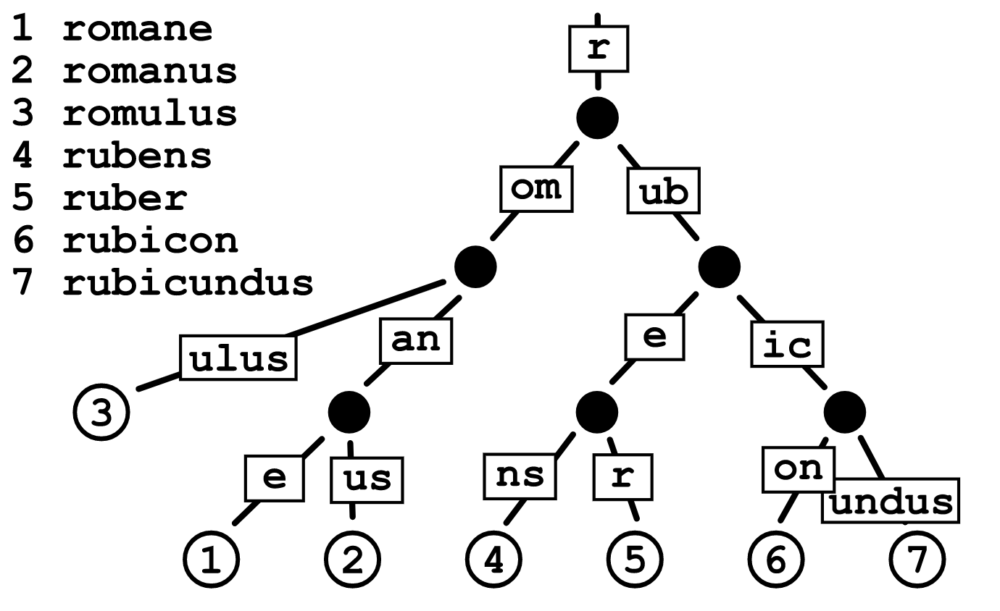
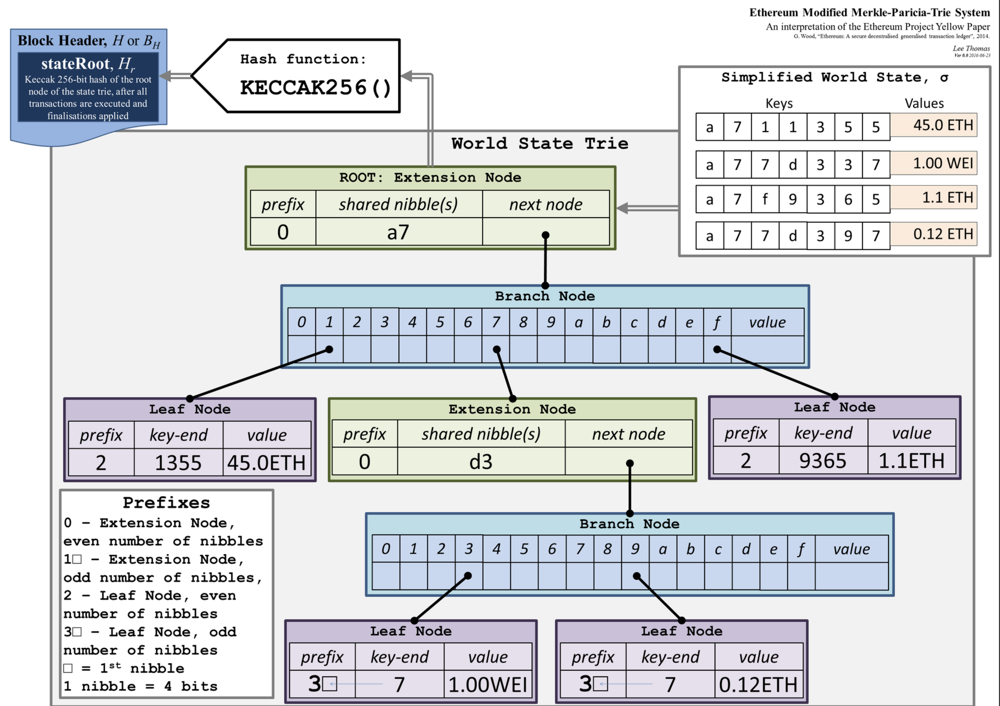
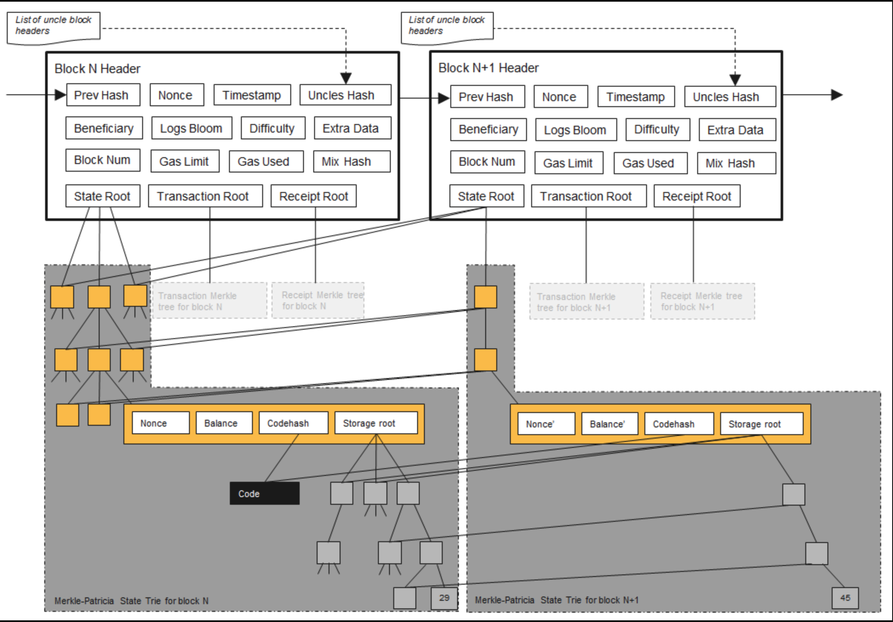

먼저 문서에 오류가 있을 수 있음을 밝힙니다. 수정 요청 부탁드립니다! 

두번째로, 이 문서는 여러 출처의 글을 정리한 글입니다. Geth 코드 레벨 이해를 담고 있지 않습니다.

## 목차

1. 이더리움 상태(State)란 무엇일까?
2. [Geth는 어떻게 동기화(Sync)할까?](/blockchain/geth-sync-mode) 
3. [Geth의 Snapshot과 Snap Sync](/blockchain/ethereum-geth-snapshot)

## 이더리움의 상태란?

이더리움은 Account-based 블록체인입니다. 

이더리움에서 상태란 Account의 상태입니다. 각 Account는 Balance, Nonce 그리고 Smart Contract의 Data Store를 상태값으로 가집니다. (”배포된” 스마트 컨트랙트도 Account 입니다) 

 

정리해서 Account의 상태란 Balance, Nonce, DataStore (+ Code)를 말합니다. 그리고 이러한 Account State가 모두 모여 거대한 `Global State`를 형성합니다.  이런 Global State를 저장하는 가장 이상적인 데이터 구조는 간단한 **Key-Value 저장소**입니다. `32 byte address`를 Key로, 상태 객체를 값으로 가집니다.

 

간단한 Key-Value Store의 문제점
- 그러나 현재 Ethereum의 Account는 [1억 8천만개](https://etherscan.io/chart/address)입니다. Hash는 Input이 1비트만 달라져도 다시 해싱(계산)해야 합니다. 매번 1억 8천만개를 합쳐서(sum) 해싱해야한다면, 어떻게 모든 State를 BlockHash에 포함시킬 수 있을까요?

 

이를 해결하기 위해 `Merkle Tree` 를 도입합니다.

## Merkle Tree

요약하면 작은 변경사항 때문에 전체 데이터를 매번 다시 계산하는게 아니라, 각 Account State를 Leaf Node로 두고, 루트까지의 경로만을 다시 해싱하여 "일정한 실행 시간"이 보장되게 만듭니다. 또한 이러한 “State Root Hash”를 블록헤더에 포함시킵니다. (이제 Merkle Proof가 가능합니다)

 

그러나 아직 계산에 많은 복잡함이 필요합니다. 이미 존재하는 leaf node(Account)의 수정을 통해 Root Hash변경하는것은 비교적 쉬운 일이지만, 새로운 node를 추가하거나 삭제하는 일은 트리의 정렬을 다시 계산하는 복잡한 작업입니다. (즉 지금까지 만들어진 모든 Hash를 다시 계산해야합니다) 이를 해결하기 위해 `Patricia Tree` 를 도입합니다.

 

블록체인에서 Merkle Proof 예시
- 트랜잭션이 블록에 포함되어 실행되었다는것을 어떻게 검증할 수 있을까? 
- 내가 찾고자 하는 트랜잭션 Hash가 존재하는 경로를 Merkle Tree에서 탐색하면 가능하다. 
- 악의적 노드가 해당 Merkle Tree Root에 존재하지 않는 Transaction을 위조하여 생성하고자 한다면, 정확히 같은 Root를 뽑아내는 Data를 찾아야할 것이다 (새로운 PoW 작업). 
- 이를 통해 블록과 트랜잭션의 결합이 증명된다. 
- 또한 현재 블록과 블록체인의 결합은 PoW 검증을 통해 확인 가능합니다. (이는 이전 블록의 해시가 현재 블록 헤더에 포함됨을 의미합니다)

## Patricia Tree

위 문제점을 개선하기 위해, address의 공통 prefix를 바탕으로 트리를 구성할 수 있습니다.  여전히 Account Data는 leaf node에 존재하지만 내부 노드는 좀 더 복잡한 구조를 가집니다. (이는 Trade-off 관계입니다) 이렇게 하면 삽입과 삭제 작업을 진행할때 모든 노드를 이동하지 않고 leaf node에서 root node까지의 경로(Path)만을 변경합니다

 

그리고 이 두가지를 합쳐 `Merkle Patricia Tree`(MPT)가 완성됩니다. (안정된 생성,수정,삭제,조회 = 검증 시간을 가집니다) 이더리움은 MPT 구조를 사용해, 원하는 작업을 빠르게 사용합니다 (Trade-off)

그러나 이러한 MPT 구조일때도 역시 단계가 깊어지는 문제가 발생합니다. 이는 (getBalance, writeNonce)마다 여러번의 디스크를 읽어야한다는 것을 의미합니다. 또 이는 지속적으로 깊어집니다.  (물런 메모리에 저장하긴 하지만 생략하겠습니다) 이러한 문제를 해결하기 위해  `Modified Merkle Patricia Tree`를 사용합니다.

## Modified Merkle Patricia Tree

아래 사진을 보면 알 수 있듯, 각 노드를 Extension Node, Branch Node, Leaf Node로 구분합니다. 가장 큰 목적은 경로를 압축하는 것이라 생각됩니다. 이러한 지속적인 자료구조의 개선을 통해 안정된 연산시간을 가지게 됩니다. (여전히 Leaf Node는 Account입니다)

> 좌측 상단을 보면 BlockHeader의 StateRoot가 보인다. 이는 State Trie의 Root Node의 KECCAK256 해시 값이다. 그리고 그 아래로 State Trie 구조가 보이며 Leaf Node는 Account의 State이다. (이는 추상화된 이미지이다)

## State Trie

아래는 (위 자료구조를 사용한) 이더리움의 State Trie를 추상화한 모습입니다.  

Leaf Node의 Account가, 블록헤더에 State Root(Hash)가 포함되어 있는것이 확인 가능합니다.

그 옆에 Transactions Root Hash, Receipts Root Hash도 포함되어 있습니다.

 

이미지를 보면 매 블록마다 모든 State Trie를 다시 생성하는게 아니라, 이어나가는 것을 알 수 있습니다. 

저장공간 사용에는 효율적이나 만약 Disk 절약을 위해 과거 State를 정리하고자하면 매우 복잡한 작업입니다. 왜냐하면 정리 알고리즘을 통해 필요 없어진 State를 확인해야 하는데, 이건 모든 Depth를 뒤지며 찾아내야 하기 때문입니다. 이 작업을 `Pruning` (State 정리)이라고 합니다 (아직까지 효율적인 상태정리 알고리즘이 없습니다)

## Geth LevelDB

이러한 이미지는 추상화된 이미지이고, Geth는 LevelDB를 통해 해당 구조를 구현, 저장합니다.

 

### Q. MPT구조가 아닌 다른 구조로 Gloabal State를 구성하면 어떻게 되나요?

- (의견) 이더리움 백서에 정의되지 않은 구현체를 만들 수 는 없겠지만, 만약 이 변경때문에 RootHash가 달라지면, 하드포크하는것과 마찬가지라고 생각합니다.

 

---

 

모든 내용은 요약되었기 때문에, 아래 링크를 통해 자세한 내용을 읽어보는 것을 추천합니다. 

 

### 출처

- [Ethereum Under the Hood: Algorithms And Data Structures](https://youtu.be/OxofT39TJgg)
- [이더리움 스토리지 성능 최적화 이야기](https://medium.com/curg/merklized-lsm-%EC%9D%B4%EB%8D%94%EB%A6%AC%EC%9B%80-%EC%8A%A4%ED%86%A0%EB%A6%AC%EC%A7%80-%EC%84%B1%EB%8A%A5-%EC%B5%9C%EC%A0%81%ED%99%94-%EC%9D%B4%EC%95%BC%EA%B8%B0-5c77acbbe2b0)
- [Ask about Geth: Snapshot acceleration](https://blog.ethereum.org/2020/07/17/ask-about-geth-snapshot-acceleration/) (초반)

추가 학습

- [Ethanos - 이더리움 용량을 줄여보자](https://medium.com/curg/ethanos-%EC%9D%B4%EB%8D%94%EB%A6%AC%EC%9B%80-%EC%9A%A9%EB%9F%89%EC%9D%84-%EC%A4%84%EC%97%AC%EB%B3%B4%EC%9E%90-dfdc20c6cc3f)
- [비트코인과 이더리움에는 범위 탐색 기능이 없다](https://medium.com/curg/%EB%B9%84%ED%8A%B8%EC%BD%94%EC%9D%B8%EA%B3%BC-%EC%9D%B4%EB%8D%94%EB%A6%AC%EC%9B%80%EC%97%90%EB%8A%94-%EB%8D%B0%EC%9D%B4%ED%84%B0-%EB%B2%94%EC%9C%84-%ED%83%90%EC%83%89-%EA%B8%B0%EB%8A%A5%EC%9D%B4-%EC%97%86%EB%8B%A4-7a8182e8c9f2)
- [NVMe SSD의 등장이 키-밸류 데이터베이스 성능에 미칠 영향에 관하여](https://medium.com/curg/nvme-ssd%EC%9D%98-%EB%93%B1%EC%9E%A5%EC%9D%B4-%ED%82%A4-%EB%B0%B8%EB%A5%98-%EB%8D%B0%EC%9D%B4%ED%84%B0%EB%B2%A0%EC%9D%B4%EC%8A%A4-%EC%84%B1%EB%8A%A5%EC%97%90-%EB%AF%B8%EC%B9%A0-%EC%98%81%ED%96%A5%EC%97%90-%EA%B4%80%ED%95%98%EC%97%AC-f94f2e952d27)
- [이더리움 Level DB를 까보자](https://steemit.com/ethereum/@sigmoid/level-db-1)