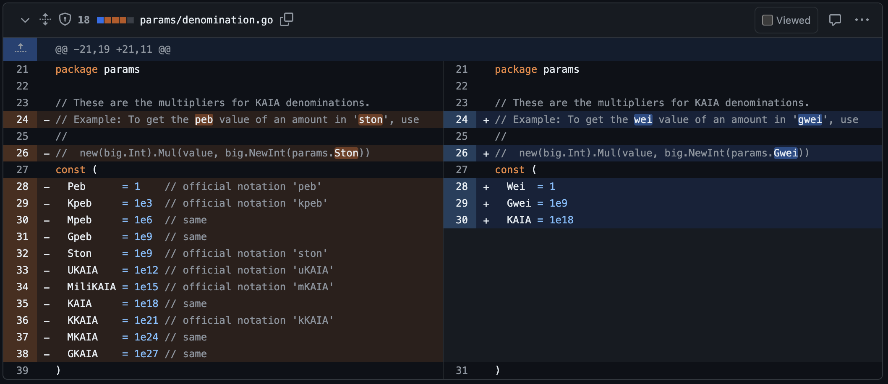
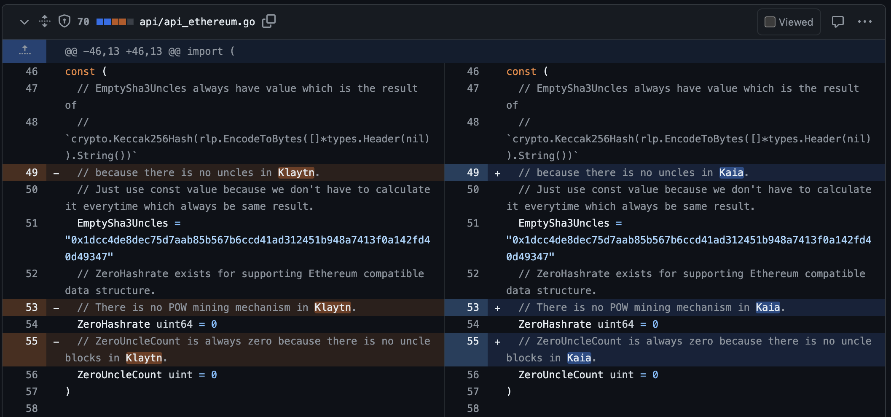
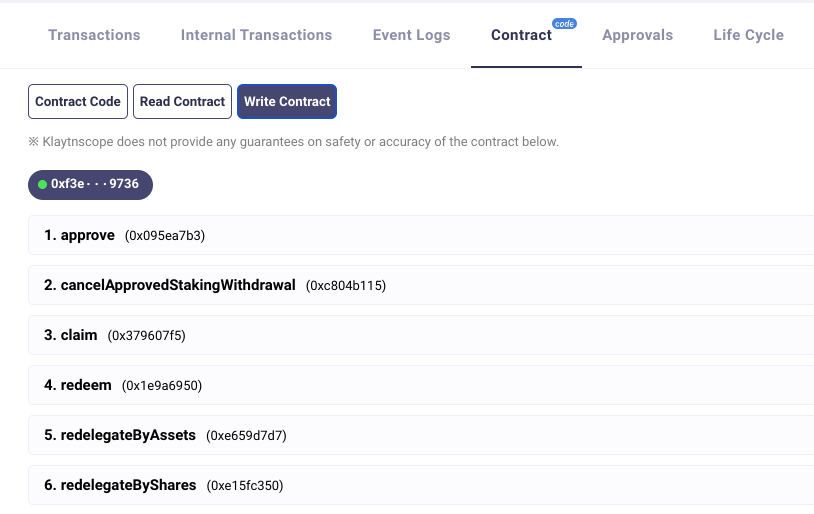
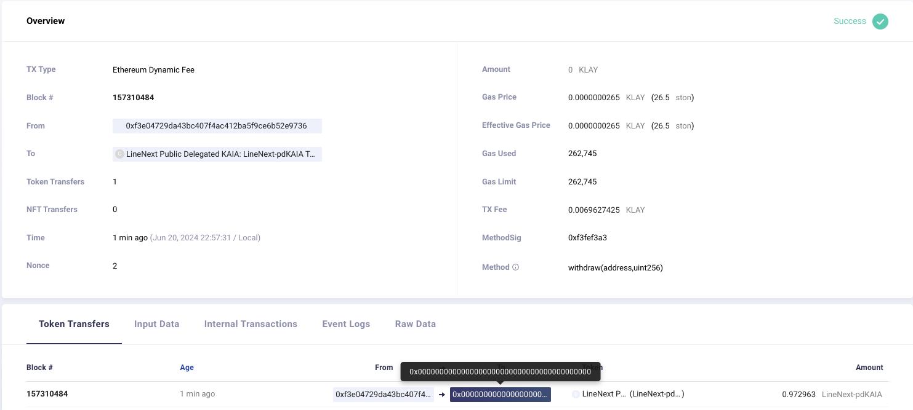
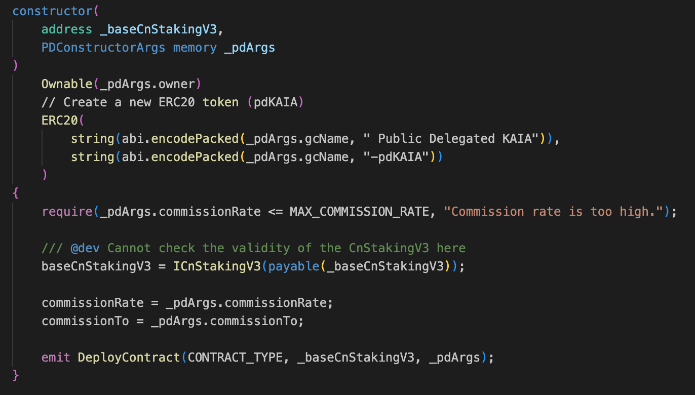
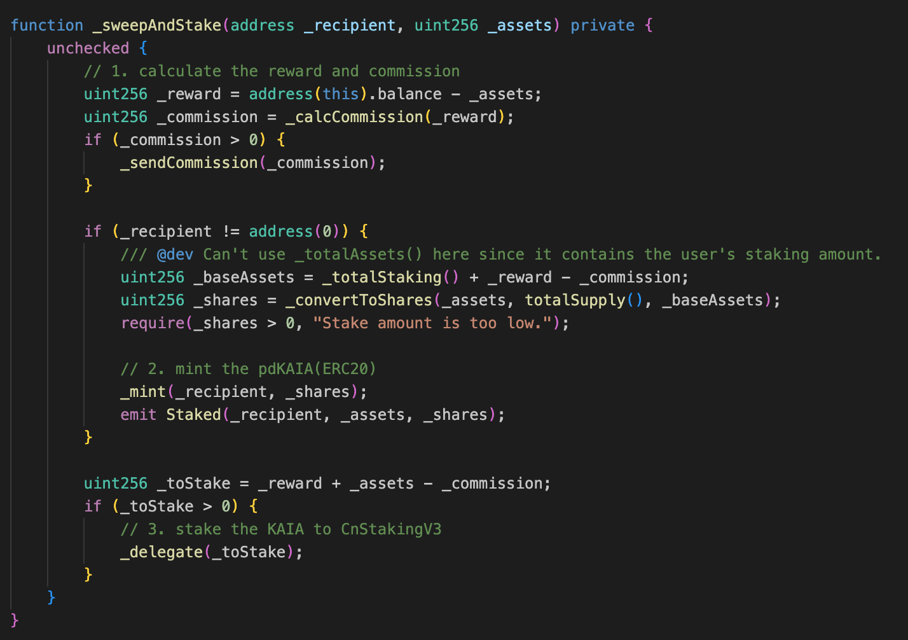
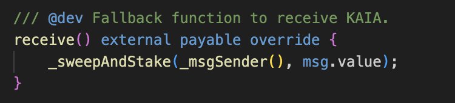
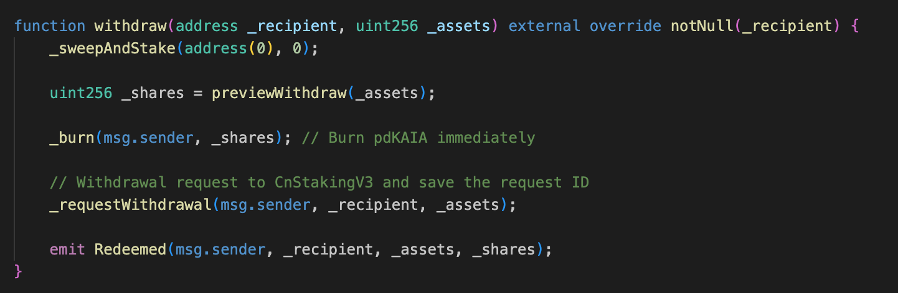
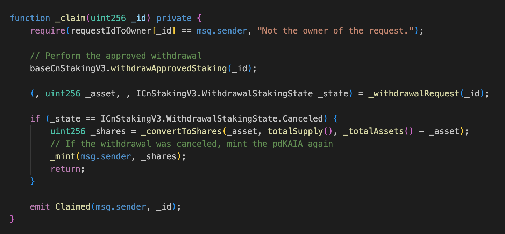
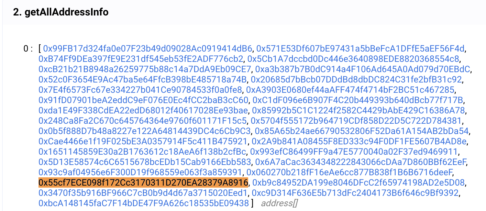

# Introduction

> This article is written for developers with prior knowledge of Klaytn.

Kaia v1.0.0 testnet 'Kairos' has been released. In this article, we'll take a look at the new features added to Kaia.

> "From a technical point of view, the Kaia chain works on top of the Klaytn network." - [Token Swap Guide](https://klaytn.foundation/kr/%ec%8b%a0%ea%b7%9c-kaia-%ec%b2%b4%ec%9d%b8-%eb%9f%b0%ec%b9%ad%ec%97%90-%eb%94%b0%eb%a5%b8-%ed%86%a0%ed%81%b0-%ec%8a%a4%ec%99%91-%ec%95%88%eb%82%b4/)

As mentioned above, the existing Klaytn network will be switched to the Kaia network in the form of a "hard fork" based on a specific block number, i.e., the Klaytn chaindata will be maintained.

 

 
> [PR: Klay -> Kaia in RPC](https://github.com/klaytn/klaytn/pull/2159/files#diff-68088b8f4e5024ba6ee02b67cd1b979f738ba03c3da03912f29d3a377dc7cc27)

 
> [PR: Klaytn -> Kaia in comments](https://github.com/klaytn/klaytn/pull/2152)

From the above screenshots, you can see that the new Kaia network is built on top of the existing Klaytn source code.

In the following, I will introduce the three new features of Kaia.

# Priority tip 

In short, `EIP-1559` fully implements this feature on the Kaia network.

Previously, Klaytn only offered the baseFee feature and the TIP was fixed at 0.
> This was introduced to prevent spam transactions.

Kaia now allows you to create Type:2 transactions, which is the same as `EIP-1559`, and the pending transactions are sorted by TIP.

> For existing legacy tx or klaytn type tx, the gasPrice field is still applied as effectiveGasPrice. 
> So tip = gasPrice - baseFee.

# getTotalSupply(blockNumber)

> This is implemented via the [Add klay_getTotalSupply API](https://github.com/klaytn/klaytn/pull/2148) PR

> For reference, Geth has a similar feature called [Supply delta live tracer](https://github.com/ethereum/go-ethereum/pull/29347).

Previously, you could get the information through the following API, but it was a feature provided by GroundX itself as part of the API of KAS service.

```shell
$ curl https://klay-api.klaytnapi.com/v1/total-supply
5964547725.012343
```

We can now query the KAIA supply at a specific block time via JSON-RPC.

```shell
> klay.getTotalSupply('latest')
{
  burntFee: "0x28ee933736fa159f39364",
  deadBurn: "0x40bea489f3f8944d93efbd",
  kip103Burn: "0x111d0449fb2a238eca3b1720",
  kip160Burn: "0x0",
  totalBurnt: "0x116051d7b8918bc471c29a41",
  totalMinted: "0x24971a118ccfd6cbe4800000",
  totalSupply: "0x1336c839d43e4b0772bd65bf",
  zeroBurn: "0x0"
}
```

```go
type SupplyManager interface {
	Start()
	Stop()
	GetTotalSupply(num uint64) (*TotalSupply, error)
}

type TotalSupply struct {
	TotalSupply *big.Int // The total supply of the native token. i.e. Minted - Burnt.
	TotalMinted *big.Int // Total minted amount.
	TotalBurnt  *big.Int // Total burnt amount. Sum of all burnt amounts below.
	BurntFee    *big.Int // from tx fee burn. ReadAccReward(num).BurntFee.
	ZeroBurn    *big.Int // balance of 0x0 (zero) address.
	DeadBurn    *big.Int // balance of 0xdead (dead) address.
	Kip103Burn  *big.Int // by KIP103 fork. Read from its memo.
	Kip160Burn  *big.Int // by KIP160 fork. Read from its memo.
}
```
> You can see the above structures in the PR.


```go
for lastAccRewardBlockNumber < CurrentBlock {
  // calculation logic...
}
logger.Info("Total supply big step catchup done")

sm.chainHeadSub = sm.chain.SubscribeChainHeadEvent(sm.chainHeadChan)
for {
  select {
  case <-sm.quitCh:
    return
  case head := <-sm.chainHeadChan:
    // calculation logic...

  }
}
```
> You can also see the calculation logic.


# Public Delegation

In the previous Klaytn, non-GC users had to use third-party features such as [SKlay](https://medium.com/orbit-chain/sklay-%ED%81%B4%EB%A0%88%EC%9D%B4%ED%8A%BC-%EA%B8%B0%EB%B0%98-defi%EC%9D%98-%ED%83%84%EC%83%9D-6d7aeeb9801c) to participate in Klaytn's consensus.


Kaia supports PublicDeligation. You can also check out [Kaia progress and feature updates](https://klaytn.foundation/kaia-progress-update/).


## 1. Trying PublicDeligation

> The Baobab testnet has been switched to the 'Kairos' testnet from the [156660000](https://baobab.klaytnscope.com/block/156660000) block via a hard fork. - [NOTE](https://klaytn.foundation/kaia-testnet-kairos-launch/)


 

By accessing [LineNext Public Delegated KAIA](https://baobab.klaytnscope.com/account/0x5bb2b2977A29AD85994f601f45802F514BB5E2A1?tabId=contractCode), you can interact with the PublicDelegation Contract of the current testnet. Let's run a cycle of PublicDelegation through the above UI


### Staking


 

 
> [klaytnscope](https://baobab.klaytnscope.com/tx/0x112cc21c302977cdde7f8a65254a4352b5a92b91c8fe4dc8cb0f2ccf02bf6104)

I staked `1 KAIA` and received `0.986389 LineNext-pdKAIA`.


### Reward

```shell
> maxWithdraw(address)
1000000183872229967

> maxWithdraw(address)
1000000220280861781
```
> It can be called through the Scope UI.

By calling the `maxWithdraw` function, you can check the amount of reward KAIA you can receive. Each time the function is called, the result is increasing. This means that the exchange rate of KAIA is increasing for a fixed amount of pdKAIA tokens.

### Withdraw

 

 
> [klaytnscope](https://baobab.klaytnscope.com/tx/0x02022781030d817f724b82968d70d8fdd3e90a90356c655544955773e9c0cc67)

As soon as the withdrawal request is made, pdKAIA is immediately destroyed and the amount of KAIA to be withdrawn is confirmed.


It is important to note that the `withdraw()` function is not an actual 'KAIA withdrawal'.
- Requesting a withdrawal via the `withdraw()` function (pdKaia is immediately burned)
- Withdrawal of real assets via `claim()` after 7 days (D+7)
- However, the request will expire after a further 7 days (D+14).

> 'Withdrawal Request' will be mentioned again in the CnStakingV3 section below.


## 2. Contract at a glance

Let's take a moment to introduce the contents of [PublicDelegation.md](https://github.com/kaiachain/kaia/blob/dev/contracts/docs/PublicDelegation.md)

> Public Delegation is a non-transferable ERC-4626 based contract that allows a General User to delegate or redelegate their own KAIA to the Kaia Governance Council (GC). The GC uses CnStakingV3MultiSig (CnSV3) and enables Public Delegation.

> The Contract issues tokenised shares called pdKAIA to delegators. pdKAIA is a non-transferable, interest-bearing token that represents the delegator's share of all delegated KAIA. As rewards compound, the exchange ratio of pdKAIA to KAIA increases. Delegators can burn their pdKAIA to get their KAIA back.


 


### PublicDelegation.constructor()


> You can see the pdKAIA token being generated.

### PublicDelegation.stake()


> You can see it in the comments. (The commission rate is stored in the commissionRate variable)


 
> By submitting a value transfer transaction to the Public Delegation function, you can verify that staking is working.


### PublicDelegation.withdraw()



### PublicDelegation.claim()


> If the withdrawal fails because of the time limit, a pdKAIA will be issued and you will have to wait 7 days before applying again.


### CnStakingV3

Let's take a look at [CnStakingV3.md](https://github.com/kaiachain/kaia/blob/dev/contracts/docs/CnStakingV3.md).

> Members of the Kaia Governance Council (GC) are required to own at least one CnStaking Contract. There are three versions of CnStaking to date.
> - [deprecated] legacy/CnStakingContract (CnSV1): Used since the start of Klaytn Mainnet
> - CnStakingV2 (CnSV2): An upgraded version of CnSV1 that includes all the interfaces of V1 and adds new governance-related features.
> - CnStakingV3MultiSig (CnSV3): An upgraded version of CnSV2 that includes all the features of V2 and adds the new PublicDelegation feature.

> CnSV3 contracts have two operation modes :
> - Disable PublicDelegation: In this mode, it works the same as CnSV2.
> - Enable PublicDelegation: This mode allows regular users to delegate KAIA to CnSV3.

<br/>

 

From the above, it can be understood that the contract with the actual KAIA staked is a CnStakingV3 contract, and the logic of "7 to 14 days limit after withdrawal request" is implemented in CnStakingV3. (PublicDelegation Contract has no related logic)


# Conclusion


KAIA GCs such as [Bughole](https://baobab.klaytnscope.com/account/0xf708a34dfae166043d45eb91ad76ad13204cb1b6?tabId=txList), [LineNext](https://baobab.klaytnscope.com/account/0x5bb2b2977A29AD85994f601f45802F514BB5E2A1?tabId=contractCode) are now available on the testnet.


The list of GCs is available via the [AddressBook](https://baobab.klaytnscope.com/account/0x0000000000000000000000000000000000000400?tabId=contractCode) contract.
> See [abook.md](https://github.com/kaiachain/kaia/blob/dev/contracts/docs/abook.md)



For example, you can get the address of a LineNext GC as shown above.