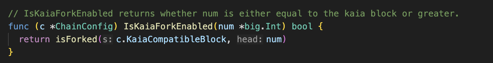
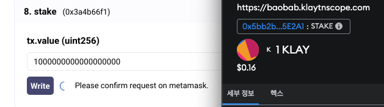
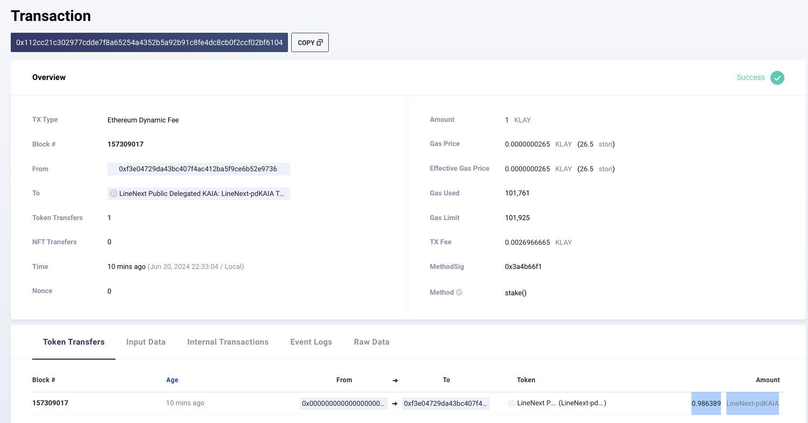
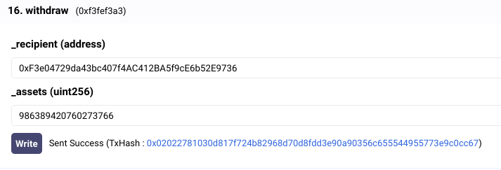
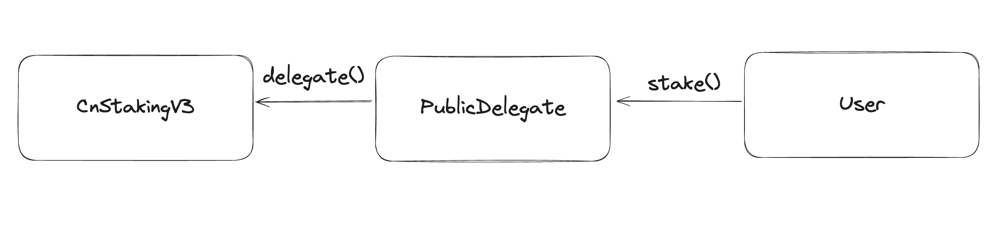
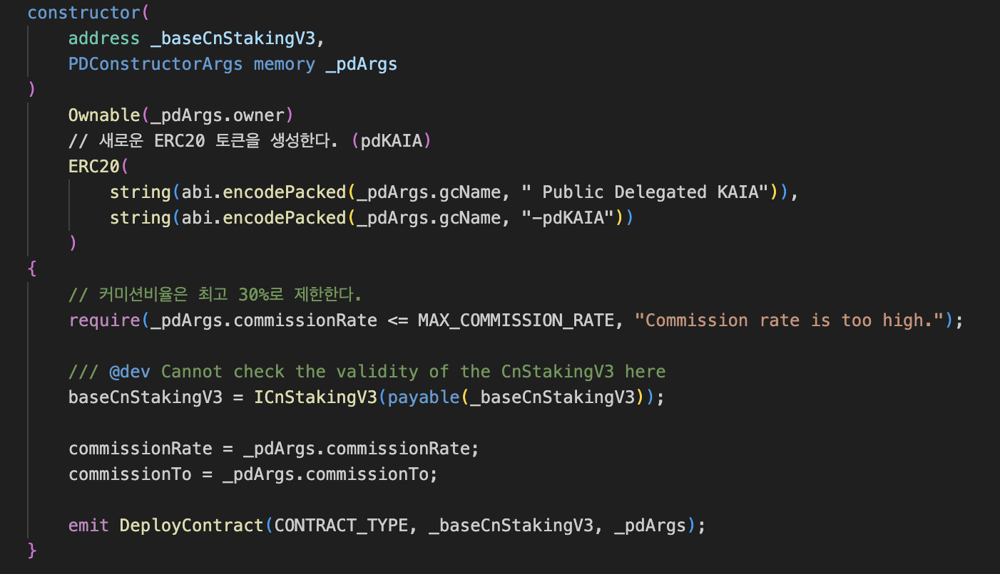
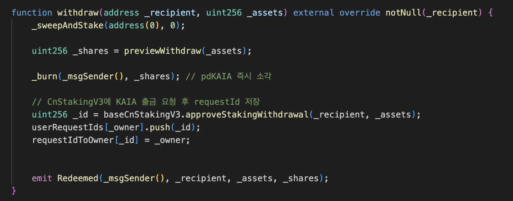
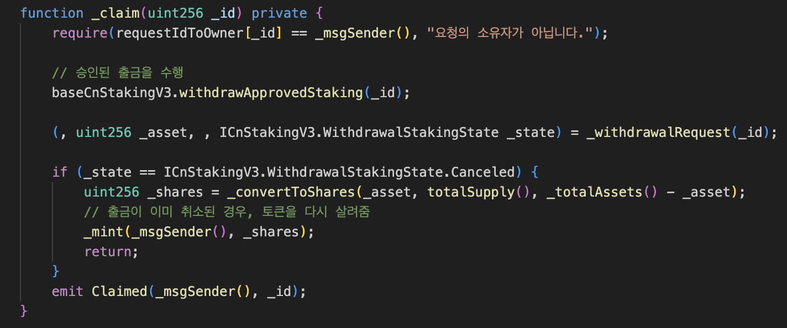

# 들어가며

> 이 글은 Klaytn에 대해 사전 지식이 있는 개발자를 대상으로 작성하였습니다.

Kaia v1.0.0 테스트넷 ‘Kairos’가 출시되었다. 이 글에서는 Klaytn과 Kaia의 기술적 및 인터페이스 차이점을 살펴본다.

아래 언급된 것처럼, 기존 Klaytn 네트워크에서 특정 블록넘버를 기준으로 '하드포크'하는 형태로 Kaia 네트워크로 전환된다. 

> "기술적인 관점에서는 Klaytn 네트워크를 기반으로 Kaia 체인이 작동하는 형태." - [토큰 스왑 안내](https://klaytn.foundation/kr/%ec%8b%a0%ea%b7%9c-kaia-%ec%b2%b4%ec%9d%b8-%eb%9f%b0%ec%b9%ad%ec%97%90-%eb%94%b0%eb%a5%b8-%ed%86%a0%ed%81%b0-%ec%8a%a4%ec%99%91-%ec%95%88%eb%82%b4/)

즉, Klaytn chaindata는 유지된다. 이러한 내용은 아래 스크린샷을 통해 확인 가능하다.

 

 
> [PR: Klay -> Kaia in RPC](https://github.com/klaytn/klaytn/pull/2159/files#diff-68088b8f4e5024ba6ee02b67cd1b979f738ba03c3da03912f29d3a377dc7cc27)

 
> [PR: Klaytn -> Kaia in comments](https://github.com/klaytn/klaytn/pull/2152)

이제부터 Kaia에 새롭게 추가된 3개의 기능에 대해 알아본다.

# Priority tip 

해당 기능은 간단히 말해 `EIP-1559`가 카이아 네트워크에 완전히 구현한 것이다.

기존 클레이튼에는 baseFee 기능만 제공하고, TIP은 0으로 고정되어 있었다.
> 스팸 Transaction을 막기 위한 목적으로 도입되었다

이제 카이아에서는 `EIP-1559`와 동일한 Type:2 트랜잭션을 만들 수 있으며 Tip순으로 펜딩 트랜잭션이 정렬된다.

# `getTotalSupply(blockNumber)`

해당 기능은 [Add klay_getTotalSupply API](https://github.com/klaytn/klaytn/pull/2148) PR을 통해 구현되었다. 

> 참고로 Geth에도 [Supply delta live tracer](https://github.com/ethereum/go-ethereum/pull/29347) 비슷한 기능이 추가되었다. 

기존에는 아래와 같은 API를 통해 정보를 얻을 수 있었으나, 이는 KAS 서비스의 API 일부로써 GroundX에 의해 자체적으로 제공되는 기능이었다.

```shell
$ curl https://klay-api.klaytnapi.com/v1/total-supply
5964547725.012343
```

현재 네트워크의 KAIA 물량에 관한 정보를 얻을 수 있는 Node가 제공하는 JSON-RPC API. 

특정 블록 시점의 총 공급량을 조회할 수 있다.

```shell
> klay.getTotalSupply('latest')
{
  burntFee: "0x28ee933736fa159f39364",
  deadBurn: "0x40bea489f3f8944d93efbd",
  kip103Burn: "0x111d0449fb2a238eca3b1720",
  kip160Burn: "0x0",
  totalBurnt: "0x116051d7b8918bc471c29a41",
  totalMinted: "0x24971a118ccfd6cbe4800000",
  totalSupply: "0x1336c839d43e4b0772bd65bf",
  zeroBurn: "0x0"
}
```

```go
type SupplyManager interface {
	Start()
	Stop()
	GetTotalSupply(num uint64) (*TotalSupply, error)
}

type TotalSupply struct {
	TotalSupply *big.Int // The total supply of the native token. i.e. Minted - Burnt.
	TotalMinted *big.Int // Total minted amount.
	TotalBurnt  *big.Int // Total burnt amount. Sum of all burnt amounts below.
	BurntFee    *big.Int // from tx fee burn. ReadAccReward(num).BurntFee.
	ZeroBurn    *big.Int // balance of 0x0 (zero) address.
	DeadBurn    *big.Int // balance of 0xdead (dead) address.
	Kip103Burn  *big.Int // by KIP103 fork. Read from its memo.
	Kip160Burn  *big.Int // by KIP160 fork. Read from its memo.
}
```
> PR에서 위 구조체를 확인 가능하다.


```go
for lastAccRewardBlockNumber < CurrentBlock {
  // 누적 작업
}
logger.Info("Total supply big step catchup done")

sm.chainHeadSub = sm.chain.SubscribeChainHeadEvent(sm.chainHeadChan)
for {
  select {
  case <-sm.quitCh:
    return
  case head := <-sm.chainHeadChan:
    // 누적 작업

  }
}
```
> 계산 로직도 확인 가능하다.


# Public Delegation

GC가 아닌 사용자가 클레이튼의 컨센서스에 참여하기 위해서는 [SKlay](https://medium.com/orbit-chain/sklay-%ED%81%B4%EB%A0%88%EC%9D%B4%ED%8A%BC-%EA%B8%B0%EB%B0%98-defi%EC%9D%98-%ED%83%84%EC%83%9D-6d7aeeb9801c)  등의 서드파티 기능을 사용해야 했다. 

하지만 카이아에서는 PublicDeligation을 지원한다. [Kaia 진행 상황 및 기능 업데이트](https://klaytn.foundation/kr/kaia-%ec%a7%84%ed%96%89-%ec%83%81%ed%99%a9-%eb%b0%8f-%ea%b8%b0%eb%8a%a5-%ec%97%85%eb%8d%b0%ec%9d%b4%ed%8a%b8/) 글을 보면 확인 가능하다.


## 1. PublicDeligation 직접 해보기

> 하드포크를 통해 [156660000](https://baobab.klaytnscope.com/block/156660000) 블록부터 Baobab 테스트넷이 'Kairos' 테스트넷으로 전환되었다. - [참고](https://klaytn.foundation/kr/kaia-testnet-launch/)


 

[LineNext Public Delegated KAIA](https://baobab.klaytnscope.com/account/0x5bb2b2977A29AD85994f601f45802F514BB5E2A1?tabId=contractCode)를 접속하면 현재 테스트넷의 PublicDeligation Contract와 상호작용이 가능하다. 

위 UI를 통해 PublicDeligation의 한 사이클을 진행해보자


### Staking


 

 
> [klaytnscope](https://baobab.klaytnscope.com/tx/0x112cc21c302977cdde7f8a65254a4352b5a92b91c8fe4dc8cb0f2ccf02bf6104)

`1 KAIA`를 스테이킹하고 `0.986389 LineNext-pdKAIA`를 받았다.

### Reward

```shell
> maxWithdraw(address)
1000000183872229967

> maxWithdraw(address)
1000000220280861781
```
> Scope UI를 통해 호출 가능하다.

`maxWithdraw` 함수를 호출하면 받을 수 있는 보상 KAIA의 수량을 확인 가능하다. 함수를 호출할 때마다 결과가 증가하고 있다. 이는 고정된 KAIA 토큰에 대해 리워드의 교환비율이 증가하는 구조임을 의미한다.

### Withdraw

 

 
> [klaytnscope](https://baobab.klaytnscope.com/tx/0x02022781030d817f724b82968d70d8fdd3e90a90356c655544955773e9c0cc67)

withdraw 함수를 통해 '출금 신청'이 가능하며, 7일 후 실제 출금 가능하다.

출금신청(withdraw)과 동시에 즉시 pdKAIA는 소각되고, 리워드 수량은 확정된다.

> '출금', '출금신청'에 대해서는 아래 로직설명에서 자세히 살펴본다.


## 2. Contract 간단히 살펴보기 

[PublicDelegation.md](https://github.com/kaiachain/kaia/blob/dev/contracts/docs/PublicDelegation.md) 내용을 잠시 소개하겠다.

> Public Delegation은 General User가 자신이 소유한 KAIA를 Kaia Governance Council(GC)에 delegate 하거나 redelegate 할 수 있는 non-transferable ERC-4626 기반의 Contract입니다. GC는 CnStakingV3MultiSig(CnSV3)를 사용하며 Public Delegation을 활성화합니다. 

> Contract는 delegator에게 pdKAIA라는 토큰화된 주식(shares)을 발행합니다. pdKAIA는 위임된 모든 KAIA에서 delegator의 몫을 나타내는 비양도성 이자 지급 토큰입니다. 보상이 복리로 누적됨에 따라 pdKAIA와 KAIA의 교환 비율이 증가합니다. 위임자는 pdKAIA를 소각하여 KAIA를 다시 받을 수 있습니다. 


 


### PublicDelegation.constructor()


> pdKAIA 토큰을 생성하는것을 확인 가능하다.

### PublicDelegation.stake()

 
> 주석을 통해 확인 가능하다. (커미션 비율은 commissionRate 변수에 저장되어있다)


 
> Public Delegation 함수에 value transfer 트랜잭션을 제출해도, 스테이킹이 동작한다는 것을 확인 가능하다.

### PublicDelegation.withdraw()



### PublicDelegation.claim()


> 기간 초과 등으로 출금 실패할 경우 다시 pdKAIA를 발행한다.

### CnStakingV3

[CnStakingV3.md](https://github.com/kaiachain/kaia/blob/dev/contracts/docs/CnStakingV3.md) 내용을 살펴보자.

> Kaia 거버넌스 위원회(GC)의 구성원은 최소한 하나 이상의 CnStaking Contract를 소유해야 합니다. 현재까지 세 가지 버전의 CnStaking이 있습니다.
> - [deprecated] legacy/CnStakingContract (CnSV1): Klaytn 메인넷이 시작된 이후로 사용됨
> - CnStakingV2 (CnSV2): V1의 모든 인터페이스를 포함하고, 새로운 거버넌스 관련 기능이 추가된 CnSV1의 업그레이드 버전입니다.
> - CnStakingV3MultiSig (CnSV3): V2의 모든 기능과 새로운 PublicDelegation 기능이 추가된 CnSV2의 업그레이드 버전입니다.

> CnSV3 Contract에는 두 가지 Operation Mode가 있습니다:
> - PublicDelegation 비활성화: 이 모드에서는 CnSV2와 동일하게 작동합니다.
> - PublicDelegation 활성화: 일반 사용자가 KAIA를 CnSV3에 위임할 수 있습니다.

지금까지 소개한 내용들을 통해 실제 KAIA가 있는 컨트랙트는 CnStakingV3 컨트랙트라는것을 이해 가능하며, "출금 신청 후 7일 ~ 14일 제한" 로직은 CnStakingV3에 구현된 로직이라는 것 또한 이해 가능하다. (PublicDelegation Contract에는 관련된 로직이 없다)

# 마치며


현재 테스트넷에서 [Bughole](https://baobab.klaytnscope.com/account/0xf708a34dfae166043d45eb91ad76ad13204cb1b6?tabId=txList), [LineNext](https://baobab.klaytnscope.com/account/0x5bb2b2977A29AD85994f601f45802F514BB5E2A1?tabId=contractCode) 와 같은 KAIA의 새로운 GC들을 확인 가능하다. 

GC 목록은 [AddressBook](https://baobab.klaytnscope.com/account/0x0000000000000000000000000000000000000400?tabId=contractCode) 컨트랙트를 통해 확인 가능하다.
> [abook.md](https://github.com/kaiachain/kaia/blob/dev/contracts/docs/abook.md) 참고


예를 들어 위와 같이 LineNext GC의 Address를 조회 가능하다.
