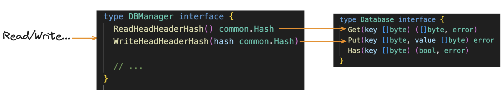
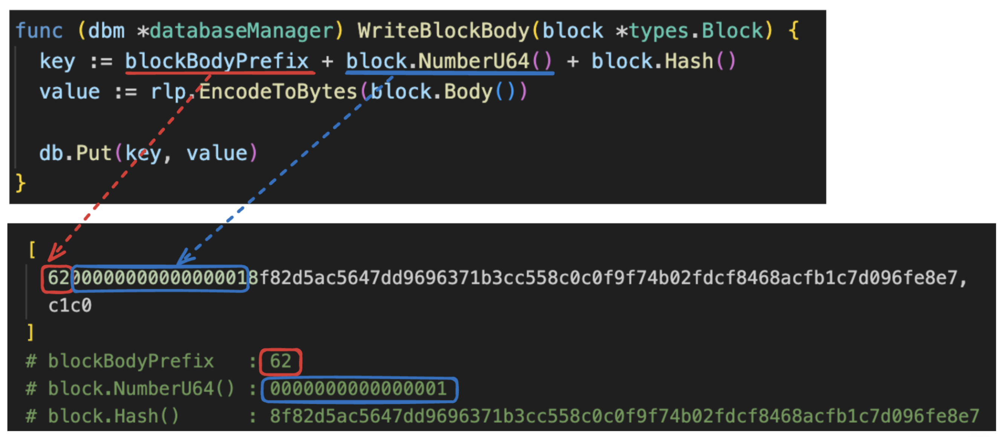
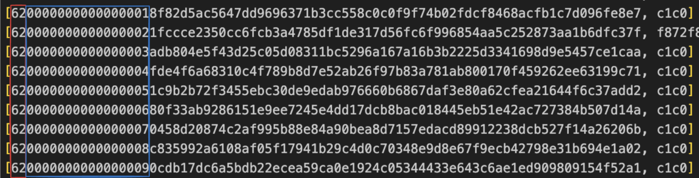
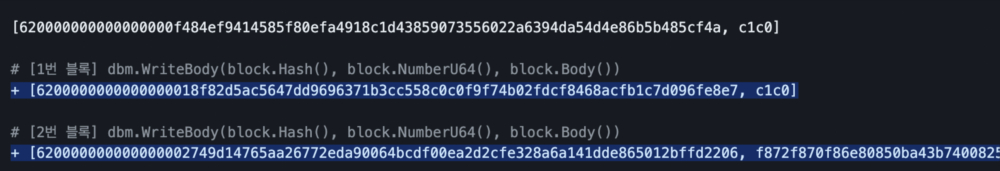
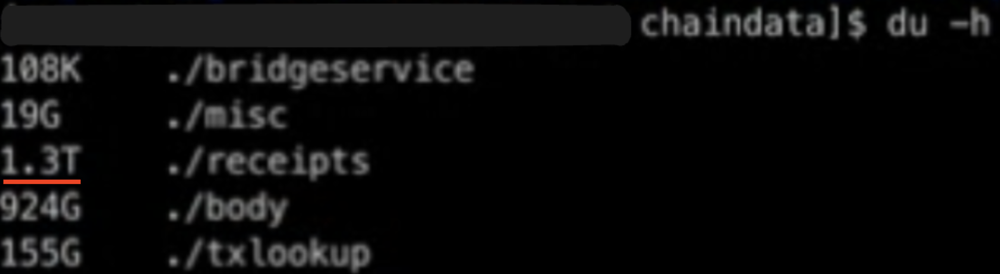
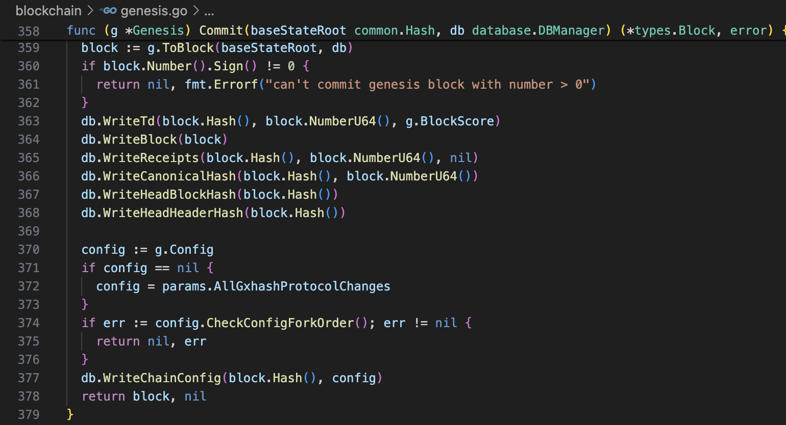
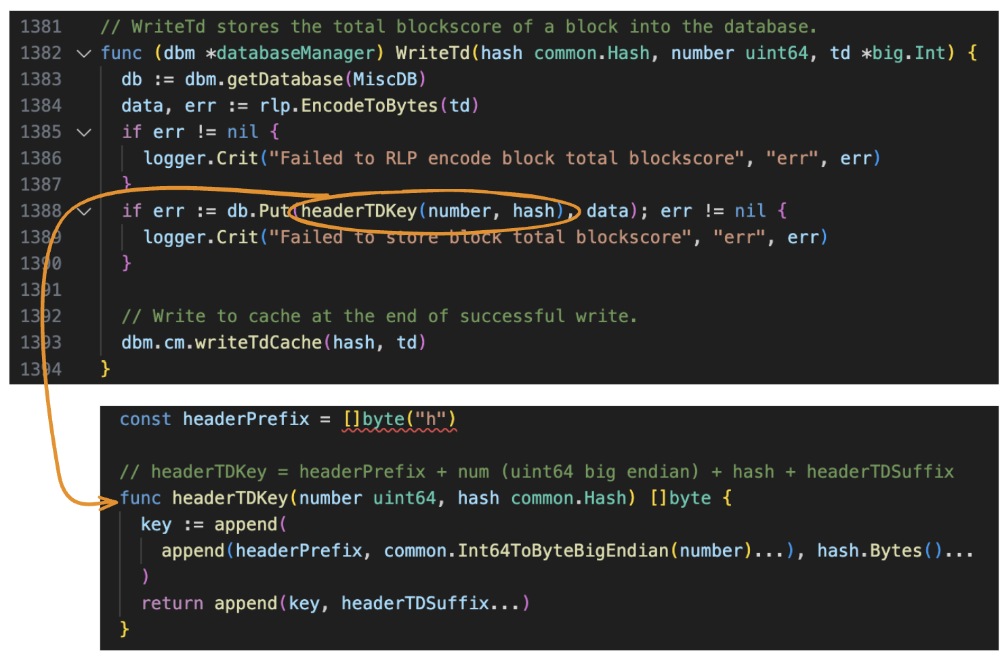
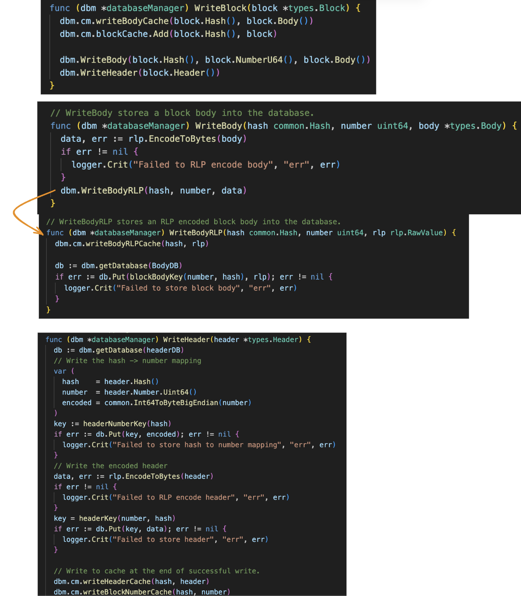

# 시리즈

#### 기본
1. [이더리움 상태(State)란 무엇일까?](/blockchain/ethereum-state/)

#### Geth 동기화
1. [Geth는 어떻게 동기화(Sync)할까?](/blockchain/geth-sync-mode) 
2. [Geth의 Snapshot과 Snap Sync](/blockchain/ethereum-geth-snapshot)

#### Geth DB
> 해당 시리즈는 Geth DB 시리즈는 [Klaytn Dev Ambassador](https://medium.com/klaytn-kr/klaytn%EC%9D%98-%EC%83%88%EB%A1%9C%EC%9B%8C%EC%A7%84-klaytn-ambassador-%ED%94%84%EB%A1%9C%EA%B7%B8%EB%9E%A8%EC%9D%84-%EC%86%8C%EA%B0%9C%ED%95%A9%EB%8B%88%EB%8B%A4-f654df403123) Core Development Project 과정 학습 내용을 공유하기 위한 목적으로 작성하였습니다. 

1. [클레이튼맛 Geth의 데이터베이스 얕게 훑어보기](/blockchain/klaytn-geth-db-manager/)
2. [클레이튼맛 Geth의 데이터 살펴보기](/blockchain/klaytn-geth-db-data/)

# 목차
- 들어가며
- 가장 간단하게 살펴보기
- Genesis Setup Data 분석
- Transaction Broadcast Data 분석
- 마치며

# 들어가며 

```
[key, value]
```

이전 글에서 Klaytn Geth의 데이터는 위와 같은 구조의 반복이라고 설명했다. 

해당 글을 통해 실제 저장된 데이터를 살펴보겠다.

모든 과정은 [klaytn-geth-db-analysis](https://github.com/junha-ahn/klaytn-geth-db-analysis)를 통해 재현 가능하다.

# 가장 간단하게 살펴보기

 

다시 이전 글에서 살펴봤던 기본 구조를 참고하자.

결국, 어떠한 Key Value가 Disk에 저장된다.

그렇다면 어떤 데이터가 저장될까?

<br/>

 

> 해당 코드는 [db_manager.go](https://github.com/klaytn/klaytn/blob/dev/storage/database/db_manager.go)에서 확인 가능하다

이러한 Key Value 구조는 전체 chaindata에서 반복된다.

 

위 이미지에서, 파란색 영역의 마지막 숫자(Block Number)가 계속 증가하는 것을 확인 가능하다.

<br/>

 

 

즉 위와 같은 구조의 데이터가 블록이 생길때마다, 트랜잭션이 생길때마다, 계속 쌓인다.

<br/>

 

다시 코드 구조를 살펴보자. 
- Prefix를 붙여서 Key를 만든다
- Block, Tx와 같은 복잡한 데이터는 RLP Encoding을 사용해서 저장한다.

# Genesis Setup Data 분석
> [db_extract/0_genesis_setup](https://github.com/junha-ahn/klaytn-geth-db-analysis/blob/main/extract/0_genesis_setup.txt)


이젠 조금 더 복잡하게 코드를 통해 데이터가 어떻게 쌓이는지 분석해본다. 

> 지금부터 내용은 코드 한줄 한줄을 분석했기 때문에 읽기 힘들다. 필요가 없다면 읽지 않는 것을 추천한다.

 

Genesis 블록은 위 로직을 통해 만들어진다.

<br/>

### `eth.getBlock(0)`

```shell
> eth.getBlock(0)
{
 
  hash: "0xf484ef9414585f80efa4918c1d43859073556022a6394da54d4e86b5b485cf4a",
  difficulty: "0x1",
  receiptsRoot: "0x56e81f171bcc55a6ff8345e692c0f86e5b48e01b996cadc001622fb5e363b421",
  
  ...

  transactions: [],
  transactionsRoot: "0x56e81f171bcc55a6ff8345e692c0f86e5b48e01b996cadc001622fb5e363b421",
}
```

### 359. `g.ToBlock(baseStateRoot, db)`

```go
block := g.ToBlock(baseStateRoot, db)
``` 

위 함수를 통해 `chaindata/statetrie`가 생성된다.

### 363. `db.WriteTd(block.Hash(), block.NumberU64(), g.BlockScore)`

 
> [storage/database/schema.go](https://github.com/klaytn/klaytn/blob/dev/storage/database/schema.go)

> Key에 Prefix를 붙인다. (이와 같은 Prefix 방식은 계속 반복)

```shell
[
  680000000000000000f484ef9414585f80efa4918c1d43859073556022a6394da54d4e86b5b485cf4a74, 
  01
]

headerPrefix:  68
blockNum: 0000000000000000
blockHash: f484ef9414585f80efa4918c1d43859073556022a6394da54d4e86b5b485cf4a74
```

### 364. `db.WriteBlock(block)`

 

```go
[620000000000000000f484ef9414585f80efa4918c1d43859073556022a6394da54d4e86b5b485cf4a, c1c0]

db.WriteBlock(block)
- dbm.WriteBody(block.Hash(), block.NumberU64(), block.Body())
  - [key] blockBodyKey(blockNum, common.HexToHash(genesisBlockHash))
  - [value] rlp.EncodeToBytes(types.Body{Transactions: []*types.Transaction{}})


[48f484ef9414585f80efa4918c1d43859073556022a6394da54d4e86b5b485cf4a, 0000000000000000]

db.WriteBlock(block)
- dbm.WriteHeader(block.Header())
  - db.Put(headerNumberKey(header.hash), common.Int64ToByteBigEndian(header.Number.Uint64()))


[680000000000000000f484ef9414585f80efa4918c1d43859073556022a6394da54d4e86b5b485cf4a, f90474a00000000000000000000000000000000000000000000000000000000000000000940000000000000000000000000000000000000000a0e7db9b40c2d12997cfca8f52c22c3e799513d47bce745ae66ac37494c7ca69d2a056e81f171bcc55a6ff8345e692c0f86e5b48e01b996cadc001622fb5e363b421a056e81f171bcc55a6ff8345e692c0f86e5b48e01b996cadc001622fb5e363b421b90100000000000000000000000000000000000000000000000000000000000000000000000000000000000000000000000000000000000000000000000000000000000000000000000000000000000000000000000000000000000000000000000000000000000000000000000000000000000000000000000000000000000000000000000000000000000000000000000000000000000000000000000000000000000000000000000000000000000000000000000000000000000000000000000000000000000000000000000000000000000000000000000000000000000000000000000000000000000000000000000000000000000000000000000000000000000180808466095a1e80b87c0000000000000000000000000000000000000000000000000000000000000000f85ad594b11659c1d3fba6c9191dae770e61faf0ec4e8072b8410000000000000000000000000000000000000000000000000000000000000000000000000000000000000000000000000000000000000000000000000000000000c0b901c4b901c17b22676f7665726e616e63652e646572697665736861696d706c223a302c22676f7665726e616e63652e676f7665726e616e63656d6f6465223a226e6f6e65222c22676f7665726e616e63652e676f7665726e696e676e6f6465223a22307830303030303030303030303030303030303030303030303030303030303030303030303030303030222c22676f7665726e616e63652e756e69747072696365223a302c22697374616e62756c2e636f6d6d697474656573697a65223a32312c22697374616e62756c2e65706f6368223a3630343830302c22697374616e62756c2e706f6c696379223a302c227265776172642e64656665727265647478666565223a66616c73652c227265776172642e6d696e696d756d7374616b65223a2232303030303030222c227265776172642e6d696e74696e67616d6f756e74223a2230222c227265776172642e70726f706f736572757064617465696e74657276616c223a333630302c227265776172642e726174696f223a223130302f302f30222c227265776172642e7374616b696e67757064617465696e74657276616c223a38363430302c227265776172642e75736567696e69636f656666223a66616c73657d808505d21dba00b860000000000000000000000000000000000000000000000000000000000000000000000000000000000000000000000000000000000000000000000000000000000000000000000000000000000000000000000000000000000000000000000000a00000000000000000000000000000000000000000000000000000000000000000]


db.WriteBlock(block)
- dbm.WriteHeader(block.Header())
  - db.Put(headerKey(number, hash), rlp.EncodeToBytes(header))
```
> Prefix Key 구조는 계속 반복된다. body, header 등의 복잡한 자료구조는 RLP Encoding을 사용한다.


# Transaction Broadcast Data 분석
> [db_extract/1_tx_broadcast](https://github.com/junha-ahn/klaytn-geth-db-analysis/blob/main/extract/1_tx_broadcast.txt)

```shell
> eth.getBlock(2)
{
  hash: "0x41d4ea0e80f6c91f8b6c8d26ee6937882c7bf88626d345a7b7864725ae010167",
  
  ...

  transactions: ["0x95a13a5e23b815e732416e7f94d9958e0d312f1c1da6f893f547540c3b79bf49"],
  transactionsRoot: "0x571ddd2c39d6bb99f4c0057e1cabffb967c0c387c23072d2778a67d2dc4c6daf",
  uncles: []
}
> eth.getBlock(3)
null
```
> 2번 블록은 `0x95a13a5e23b815e732416e7f94d9958e0d312f1c1da6f893f547540c3b79bf49` Transaction이 포함되어 있다.

### DB Entry: Body

```diff
[620000000000000000f484ef9414585f80efa4918c1d43859073556022a6394da54d4e86b5b485cf4a, c1c0] 

# [1번 블록] dbm.WriteBody(block.Hash(), block.NumberU64(), block.Body())
+ [6200000000000000018f82d5ac5647dd9696371b3cc558c0c0f9f74b02fdcf8468acfb1c7d096fe8e7, c1c0]
# [2번 블록] dbm.WriteBody(block.Hash(), block.NumberU64(), block.Body())
+ [620000000000000002749d14765aa26772eda90064bcdf00ea2d2cfe328a6a141dde865012bffd2206, f872f870f86e80850ba43b7400825208948c53ffef58a4e677592354eba1f95b0ea777f96888016345785d8a0000808207f3a0b50e1b4cb415ad25430a92fbb4fdee0b67b3d461da64a91ef58ece34acd1e299a0118fc25940a88b993665613aaa52b3a67739a498e80362f05449ecdcf455c87b]
```

### DB Entry: Receipts

```diff
[720000000000000000f484ef9414585f80efa4918c1d43859073556022a6394da54d4e86b5b485cf4a, c0]

# [1번 블록] common.Bytes2Hex(blockReceiptsKey(blockNum, blockHash))
+ [7200000000000000018f82d5ac5647dd9696371b3cc558c0c0f9f74b02fdcf8468acfb1c7d096fe8e7, c0]
# [2번 블록] common.Bytes2Hex(blockReceiptsKey(blockNum, blockHash))
+ [720000000000000002749d14765aa26772eda90064bcdf00ea2d2cfe328a6a141dde865012bffd2206, f90141f9013e01b9010000000000000000000000000000000000000000000000000000000000000000000000000000000000000000000000000000000000000000000000000000000000000000000000000000000000000000000000000000000000000000000000000000000000000000000000000000000000000000000000000000000000000000000000000000000000000000000000000000000000000000000000000000000000000000000000000000000000000000000000000000000000000000000000000000000000000000000000000000000000000000000000000000000000000000000000000000000000000000000000000000000000000000000000000000000000a095a13a5e23b815e732416e7f94d9958e0d312f1c1da6f893f547540c3b79bf49940000000000000000000000000000000000000000c0825208]
```

### DB Entry: Txlookup

```diff
# db.Put(TxLookupKey(tx.Hash()), data);
+ [6c95a13a5e23b815e732416e7f94d9958e0d312f1c1da6f893f547540c3b79bf49, e3a0749d14765aa26772eda90064bcdf00ea2d2cfe328a6a141dde865012bffd22060280]
```

### DB Entry: Statetrie

트랜잭션이나 Block Reward로 인한, Statetrie의 변경사항은 매 블록마다 DB에 기록되는것이 아니라, In-Memory에 변경사항을 쌓고 blockInterval(=128 block)마다 주기적으로 DB에 Flush한다. 


```diff
+ [00a0106cfdd4eb1daee9fadc27bcb8504b9dbdcf4bae8877f242bc8e6d19f61c, f83ea03f3b91639cbb77c038e37d8967a68e36d9f3e0bc15b1bac249b2b51a8aa2cc859c01da0195446c3b15f9926687d2c40534fdb3fedd0b8bf430008001c0]
+ [2ffb37f17f34c9b54cd1882d31327570ea3c6b4acd880416a7ea5d81228ec7ef, f83ea03e5b33e27a71f3ac0bd42b16d1eef796f12a617bed91c4a2cf3ce386b91a6f6c9c01da8095446c3b15f9926687d2c40534fdb564eebe0b40e8008001c0]
+ [5f33454c77feb4342d275cda4bbe2bbc48390926707243a0fe00d8b9397a85e3, f8d180a0e8ae816088497c9d6c5cb8578b150dd58e705533999a11204b1fdf3543749be1a02ffb37f17f34c9b54cd1882d31327570ea3c6b4acd880416a7ea5d81228ec7ef808080a097fac60ef017377a7c40b138b0499e1ba5ff884e03c6a4d9525f3159bc7deb5ca05466a9cb1baf6a022bb7c79e4d2d49f71875626c9a2b19a8000246c4d90447e880a000a0106cfdd4eb1daee9fadc27bcb8504b9dbdcf4bae8877f242bc8e6d19f61c8080808080a0a37ed00e9b1ed642d9ec8bcf8d8b3ae078c71aee104337d756dd8b6c4746165280]
+ [7365637572652d6b65792df237bbd177e17e346d457ab92b5222a942017dbd345f28fb4aaa0a89ed4e2251, 8c53ffef58a4e677592354eba1f95b0ea777f968]
+ [a37ed00e9b1ed642d9ec8bcf8d8b3ae078c71aee104337d756dd8b6c47461652, f1a03237bbd177e17e346d457ab92b5222a942017dbd345f28fb4aaa0a89ed4e22518f01cd8088016345785d8a00008001c0]
```
> 위 변경사항은 다른 DB Entry처럼 매 블록마다 기록되는것이 아니라, 128 블록의 생성과 함께 DB에 기록되었다. 

> tx.toAddress(`8c53ffef58a4e677592354eba1f95b0ea777f968`)의 데이터(preImage)가 포함되어 있는것을 확인 가능하다.

# 마치며

해당 글에서는 Klaytn Data가 실제로 어떻게 저장되는지를 필요한 내용 중심으로 살펴보았습니다.

반복되는 내용은 생략했습니다. 더 자세한 내용은 [klaytn-geth-db-analysis](https://github.com/junha-ahn/klaytn-geth-db-analysis)를 참고해주세요.