# 들어가며 

> 해당 글은 [Klaytn Dev Ambassador](https://medium.com/klaytn-kr/klaytn%EC%9D%98-%EC%83%88%EB%A1%9C%EC%9B%8C%EC%A7%84-klaytn-ambassador-%ED%94%84%EB%A1%9C%EA%B7%B8%EB%9E%A8%EC%9D%84-%EC%86%8C%EA%B0%9C%ED%95%A9%EB%8B%88%EB%8B%A4-f654df403123) Core Development Project 중 학습 내용을 '팀원에게 공유'하기 위한 목적으로 작성하였습니다. 


이더리움(Geth)은 Key-Value DB를 사용한다. 그리고 이더리움을 포크하여 개발한 Klaytn, Binance Smart Chain, Ronnin 등의 모든 네트워크는 동일한 데이터 구조를 가진다. 


그 중 가장 자주 들어본 이야기는 'levelDB'라고 하는 구글에서 개발한 데이터베이스를 사용한다는 이야기일 것이다. 
> 물런 PebbleDB, RocksDB 등 더 다양한 DB가 존재하지만 LevelDB를 통해 글을 작성한다

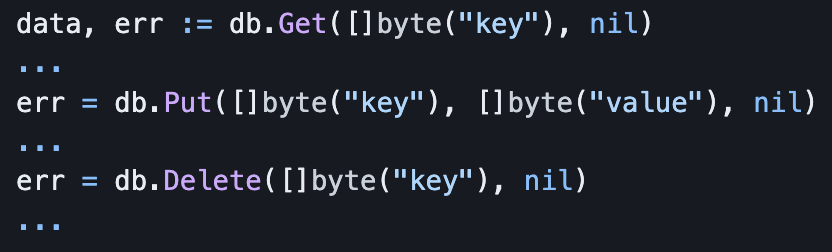 

[leveldb](https://github.com/syndtr/goleveldb)는 위와 같은 매우 간단한 인터페이스를 가지고 있다. 

자바스크립트로 구현한다면 아래와 같을 것이다.

```javascript
const data = await leveldb.Get(parseByte('key'));

await leveldb.Put(parseByte('key'), parseByte('value'));

await leveldb.Delete(parseByte('key'));
```

필자는 지금까지 어떻게 아래와 같은 복잡한 데이터 구조를 Key-Value 를 통해 구현했는지 감이 잡히지 않았다.

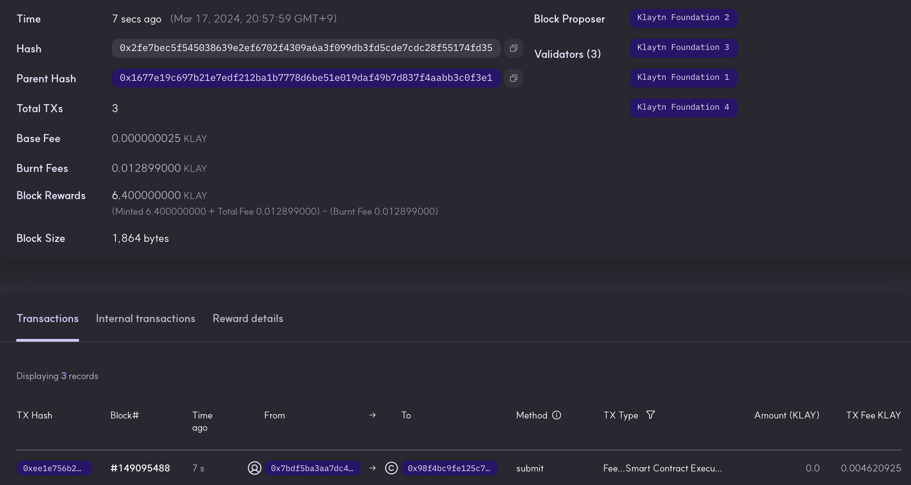 

# 코드 속으로 

해당 글은 Klaytn Core의 소스코드를 통해 어떻게 실제로 데이터를 저장하고 관리하는지를 얕게 훑어본다.
> 참고로 Klaytn은 Geth Fork로 부터 많은 시간이 흘렀기 때문에 현재는 일부 다른 구조를 가지고 있지만 해당 글에서는 다루지 않는다.

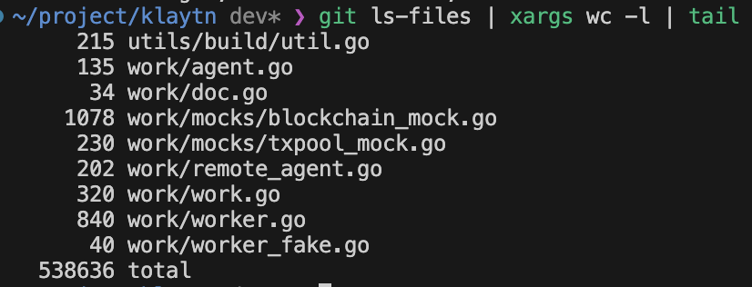 

모든 소스코드를 분석할 수는 없기에 [db_manager.go](https://github.com/klaytn/klaytn/blob/dev/storage/database/db_manager.go) 를 중심으로 살펴본다.

<br/>

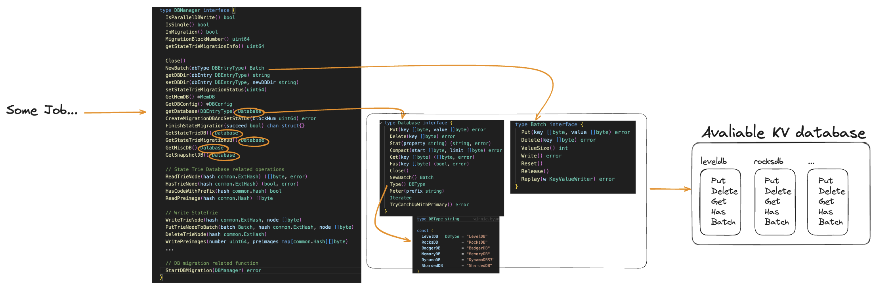 

기본적으로 알고 있으면 좋은 구조를 시각화했다. 
- 상위 레이어로부터 Some Job(Create, Read...)이 내려오면 최종적으로 LevelDB를 통해 Disk Read/Write

## Read 구조

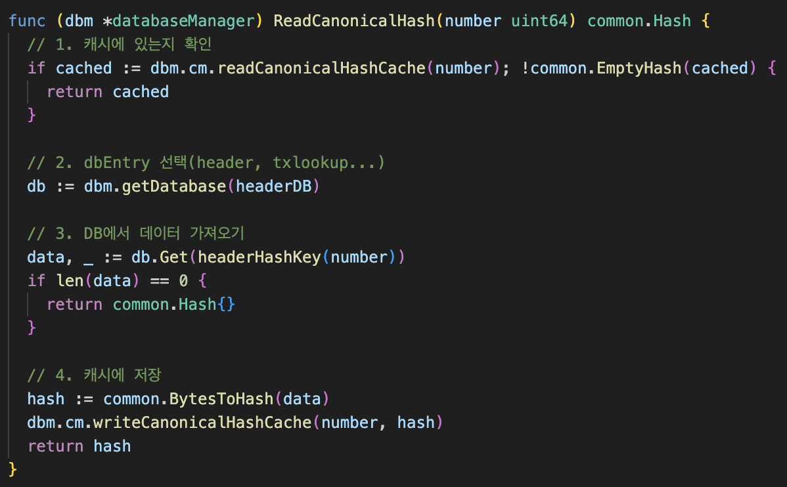 
> 주석을 통해 쉽게 이해 가능하다. 위와 같은 패턴이 대부분의 함수에서 반복된다.

#### Key는 어떻게 만들어질까?

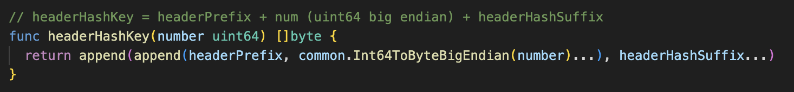 
> 생각했던것보다 단순한 것을 확인 가능하다 


#### dbEntry 선택이란? 

Geth는 데이터의 종류에 따라 실제 물리적으로 저장하는 디렉토리의 위치가 다르다. 

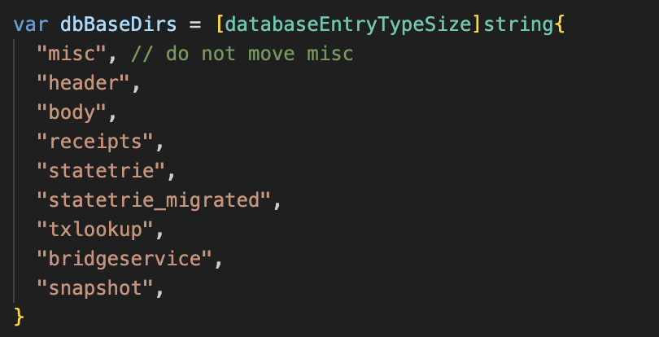 
> CanonicalHash는 `/header`에 저장된다.

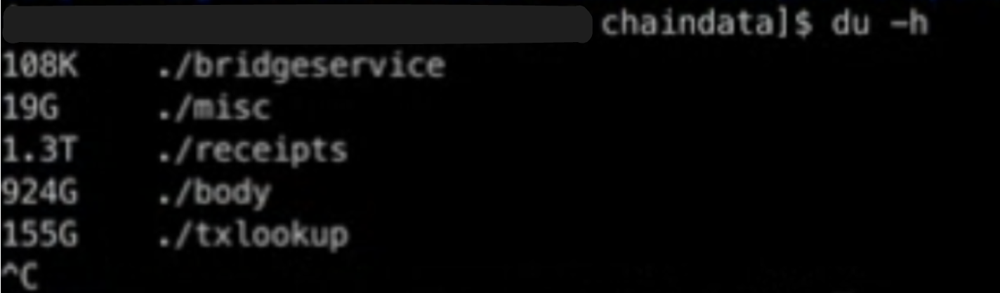 

참고로 각 dbEntry는 아래와 같은 방법으로 초기화된다.

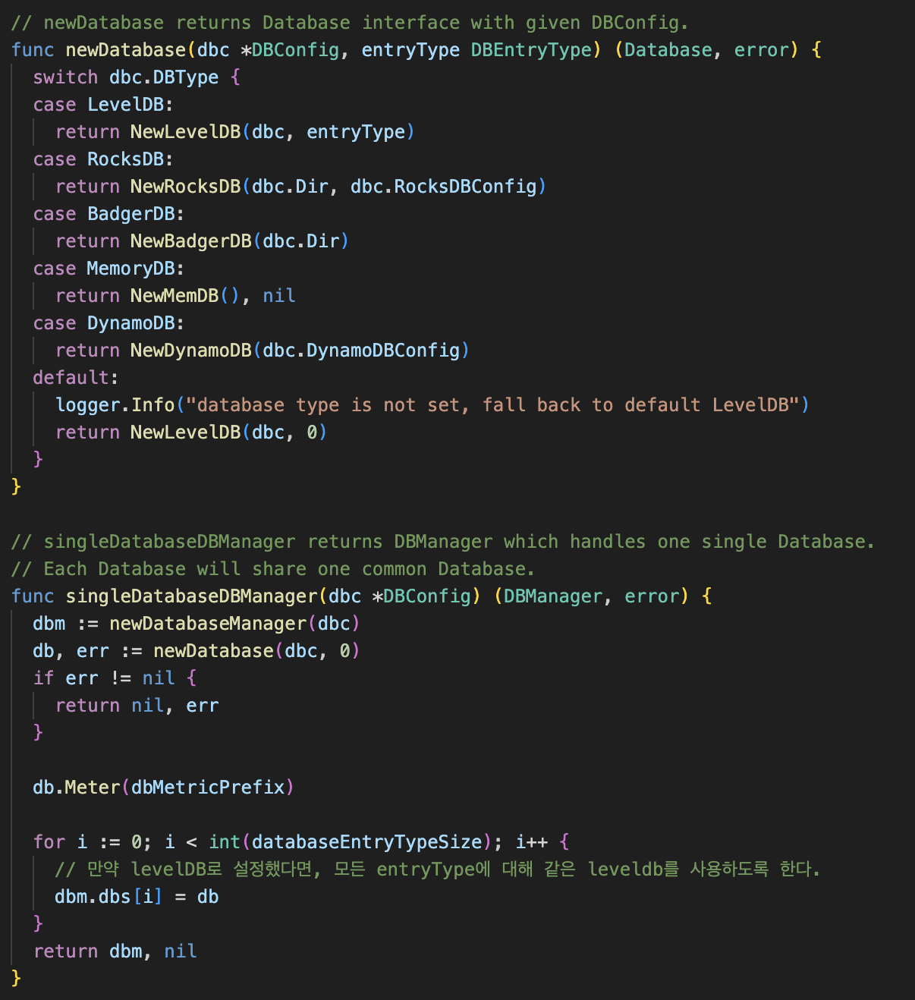 
> levelDB 하나만 사용하기로 설정한다면, 각 dbEntry가 모두 levelDB로 초기화된다.

## Write 구조

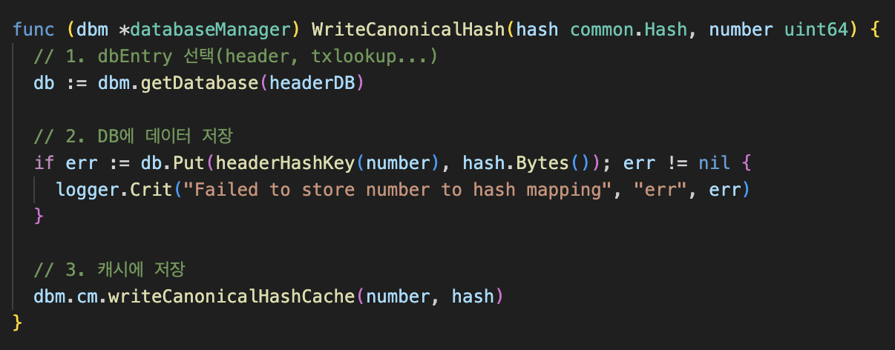 

결국 아래와 같은 데이터를 확인 가능하다. (Key-Value)

```txt
[0d9348243d7357c491e6a61f4b1305e77dc6acacdb8cc708e662f6a9bab6ca02, f8518080808080a018e3b46e84b35270116303fb2a33c853861d45d99da2d87117c2136f7edbd0b980a0717aef38e7ba4a0ae477856a6e7f6ba8d4ee764c57908e6f22643a558db737ff808080808080808080]
[18e3b46e84b35270116303fb2a33c853861d45d99da2d87117c2136f7edbd0b9, f871a036c093a349d905ad74b68851304d5dc5f111fbab2c24c4b4d02e96d2fc0727fdb84ef84c80880de0b6b3a7640000a056e81f171bcc55a6ff8345e692c0f86e5b48e01b996cadc001622fb5e363b421a0c5d2460186f7233c927e7db2dcc703c0e500b653ca82273b7bfad8045d85a470]
[337e249c268401079fc728c58142710845805285dbc90e7c71bb1b79b9d7a745, f872a120761d5c42184a02cc64585ed2ff339fc39a907e82731d70313c83d2212b2da36bb84ef84c80888ac7230489e80000a056e81f171bcc55a6ff8345e692c0f86e5b48e01b996cadc001622fb5e363b421a0c5d2460186f7233c927e7db2dcc703c0e500b653ca82273b7bfad8045d85a470]
[446174616261736556657273696f6e, ]
...
```
> 출처: [sigmoid 님의 Level DB를 까보자](https://steemit.com/ethereum/@sigmoid/level-db-3)

## ReadBlock, WriteBlock

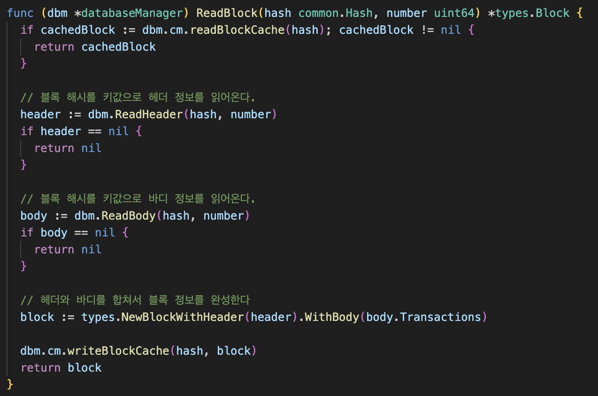 
> 위와 같은 패턴이 반복되고 있다

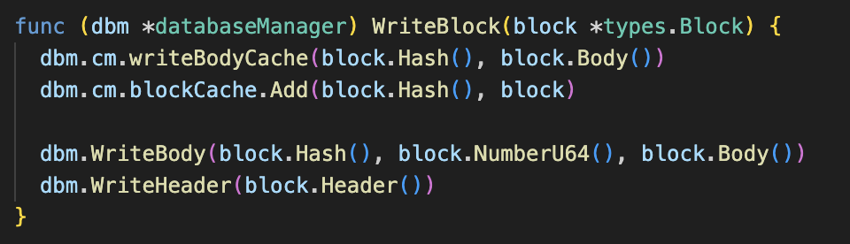 
> Write도 동일한 패턴이다

## RLPEncoding

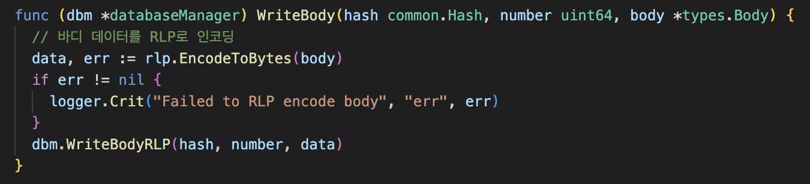  
> Body와 같은 데이터는 그 유명한 'RLP' 인코딩을 사용해 저장

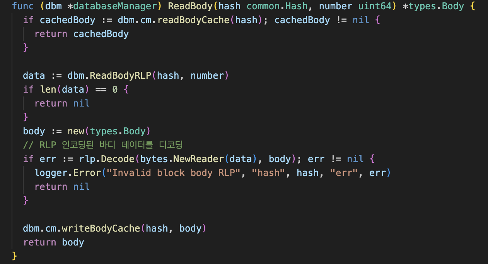 
> 읽어올때도 RLP 디코딩을 사용한다


## batch

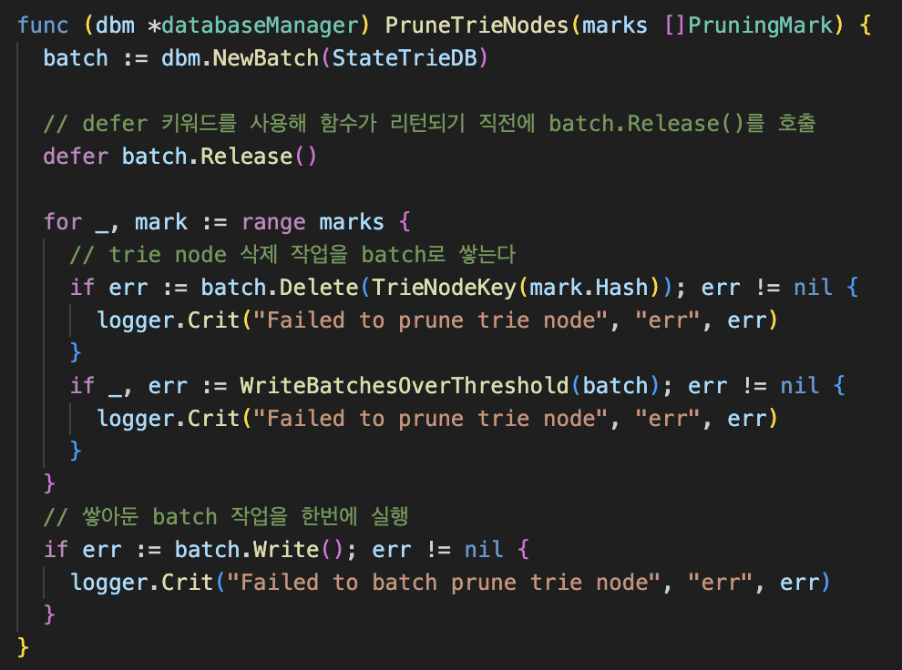 
> 연속적인 Write, Update 작업이 발생할때는 Batch를 사용한다. (levelDB, RocksDB 등 모두에 구현되어 있다)

## Flag 값 저장

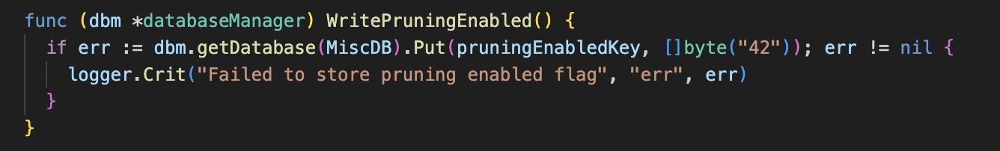 
> 단순한 Flag도 위와 같이 저장하기도 한다

## InMigration

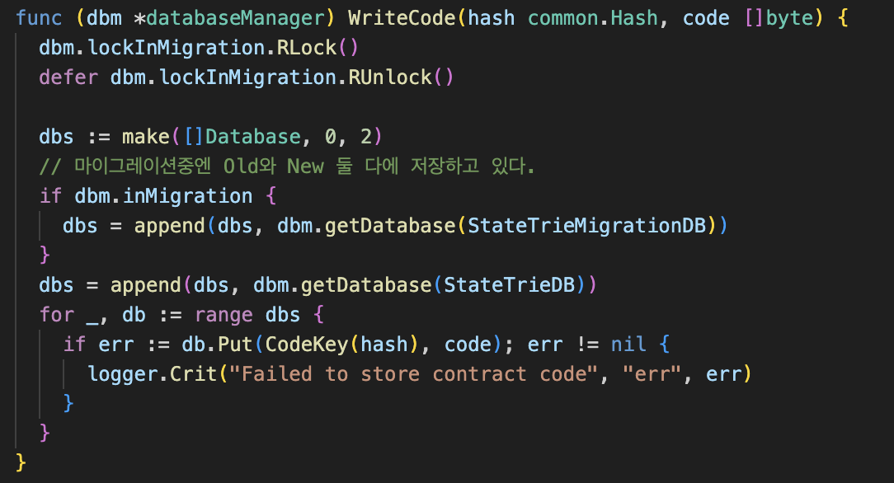 
> 읽을때는 역으로 Old, New 각각 DB에서 조회한다.

Migration은 Klaytn에만 존재하는 기능이다.

> State Migration은 Klaytn 블록체인 노드에서 특정 시점을 기준으로 과거 State Trie를 제거하고 새로운 State Trie만을 노드 스토리지에 저장함으로써 노드 스토리지 사용량을 최대 75% 절약하는 기능 - [Klaytn v1.5.0 State Migration: 노드 스토리지 절약하기](https://medium.com/klaytn/klaytn-v1-5-0-state-migration-%EB%85%B8%EB%93%9C-%EC%8A%A4%ED%86%A0%EB%A6%AC%EC%A7%80-%EC%A0%88%EC%95%BD%ED%95%98%EA%B8%B0-358dd77d9fd6)

## 결론


결국 Geth의 데이터는 목적에 따라 나눠진 디렉토리 구조를 가지며, 가장 하위 레이어는 아래와 같은 구조의 연속이다.

```
[key, value]
```


# 마치며


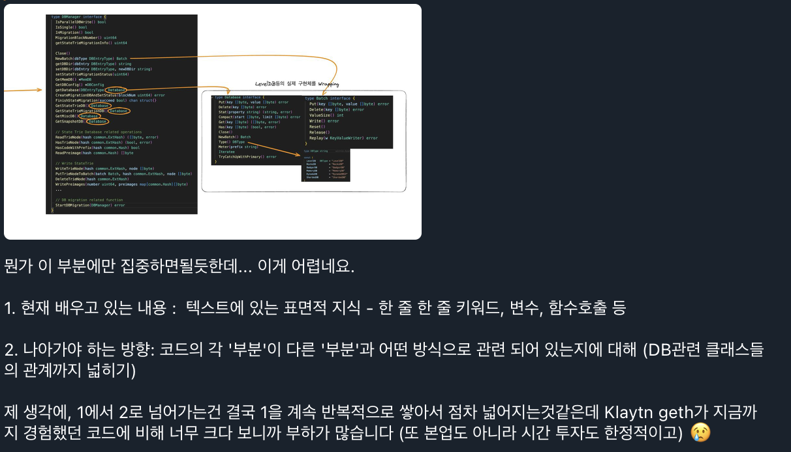 
> 팀 내부 채팅 中

Geth와 같은 방대한 양의 코드를 읽는것은 익숙치 않은 작업이라 인지부하를 많이 느꼈습니다. 학습 중 [프로그래머의 뇌](https://m.yes24.com/Goods/Detail/105911017)라는 책에서 많은 도움을 얻었고 아래와 같은 방법이 큰 도움된다는것을 느꼈습니다.
- 텍스트를 하향식으로 내려가면서 읽지 말고, 함수의 콜스택을 따라 읽자.
- 시각화, 인쇄, 하이라이팅, 요약, 메모 등의 전략을 사용하자.

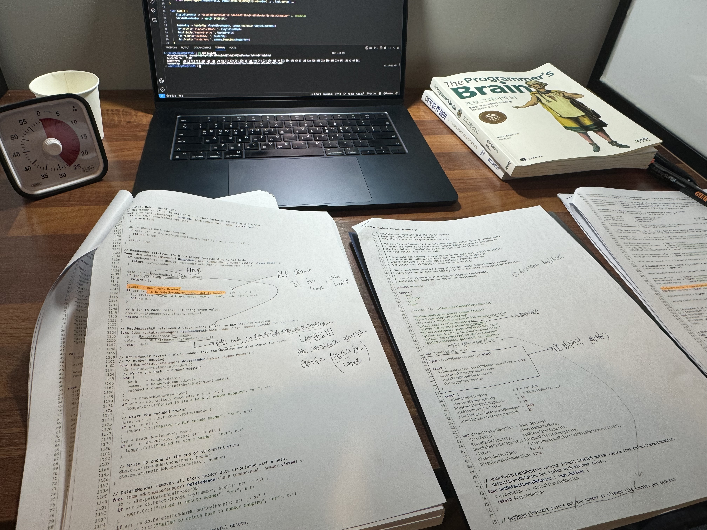 
> 다만 그럼에도 아직까지 '표면적 지식'에서 '계획 지식'까지 효과적으로 넘어가는 방법은 잘 모르겠습니다. 이런 경험을 반복하다 보면 더 발전할 것이라고 믿습니다.
