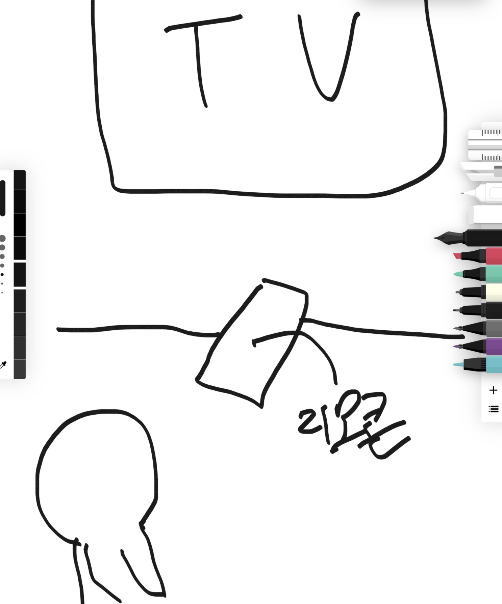

## 들어가며

사실 블록체인 노드를 운영하는 주체와 이유는 아래 외에도 다양합니다. 
- 합의를 위해서 (이더리움 2.0 벨리데이터, 마이닝 등)
- 학습이나 테스트를 위해서
- 어플리케이션을 위해서

 

필자는 그 중 "애플리케이션을 위해서" 노드를 운영한 경험이 있습니다. (모든 과정에 참여한 것도 아닙니다.)

뭐 많이 해 본 것도 아니고, 다 아는 것도 아닌데 글을 쓰는 이유는... 그냥 쓰고 싶어서입니다.

코드 레벨 이해이나, 개발에 대한 이야기가 아닌 순수하게 운영에 대한 이야기입니다.

## 블록체인 노드란 무엇일까?

[ethereum.org](https://ethereum.org/en/developers/docs/nodes-and-clients/)에서는 노드를 아래와 같이 설명합니다.

노드란 "실행 중"인 '클라이언트 소프트웨어'
- 탈중앙 블록체인 네트워크의 클라이언트 소프트웨어
- 또는 코어, 엔진이라고 부르기도 합니다.

## 어떤 것을 알아야 할까? 

사실 블록체인 노드 운영을 요약하면 아래와 같습니다.

1. 요구 성능 이해하기
2. 버튼(=인터페이스) 이해하기
3. 실행 하고 문제 없기를 기도🙏하기 

> 농담 같지만 그렇네요...

 

블록체인 노드는 보통 오픈소스로 공개되어 있고 다수의 개발자들이 개발합니다.
- 다양한 기술과 컨셉을 가지고 있는 노드를 모두 이해하기는 매우 힘들겁니다.

 

최소한, 운영자는 노드를 실행하고 앞으로 겪을 문제 상황을 해결 할 지식을 필요로 합니다.
- 사실 문제 생기면 성능 올리고 다시 시작하면 됩니다. (아마도...)
- 하지만 상용 서비스에 사용하는 노드라면 문제가 생기면 안되겠죠
- 특히 벨리데이터의 경우 잠깐의 중단이 큰 금액 손실로 이어질 수 있습니다. [참고](https://dsrv.tistory.com/m/2)

## 문제 상황은 어떤게 있을까요?

사실 너무 다양합니다. 설정을 비롯된 문제부터 성능 이슈... 

한번 생각해보자면 아래와 같습니다

 

성능편
- Disk I/O
- CPU usage
- Out of Memory
- Concurrency limit
- Network
- 비정상 종료 (데이터 복구 필요)
- 위 모든 이유로 비롯된 '동기화 느림' 등등

 

네트워크 이슈편
- [네트워크 중단](https://medium.com/klaytn-kr/cypress-mainnet-%EC%8B%A4%EC%8B%9C%EA%B0%84-%EC%83%81%ED%99%A9%EC%95%88%EB%82%B4-f099af6a016d)
- [체인스플릿](/blockchain/ethereum-chain-split-11-11) 
- 노드 업데이트, 하드포크

 

자잘한 이슈편
- 동기화 Peer Drop/NotFound
- 트랜잭션 전파 안됨

## 팁이 있다면?

언제나 문서를 잘 읽어야 합니다. 
- [Set up your own ethereum node](https://ethereum.org/en/developers/docs/nodes-and-clients/run-a-node/)

 

모니터링을 잘 해야합니다. 사람은 잘 할 수 없으니, 도구를 잘 사용해야 합니다.
- Grafana, 데이터독 등을 통한 모니터링 등
- [Run blockchain node like a Pro](https://blog.unmarshal.io/get-to-know-the-geth-metrics-cc524fd01ca7?gi=e5b7f7296dce)
  
 

AWS와 같은 클라우드를 사용하면 좋겠죠? 그리고 스냅샷과, 이중화를 할 수 있다면 더더욱 좋습니다.
- [Blockchain Infrastructure at Coinbase](https://blog.coinbase.com/blockchain-infrastructure-at-coinbase-366c09dbcef4?gi=b4147bb6ed60)
- [클레이튼 블록체인 API의 수평적 확장](https://if.kakao.com/session/98)
- [클레이튼 블록체인 데이터 추출하기](https://if.kakao.com/session/133)

 

사실 목적에 맞다면 퀵노드, KAS와 같은 서비스를 사용하시는것도 좋습니다.

 

그리고 알 수 없는 문제 상황이 생기면 깃헙 이슈에 상세하게 제보하면 개발자분들께서 도와주십니다. 만세!
## 마치며

API를 입에 달고 살지만 블록체인 노드를 운영하면서 마치 '리모콘'을 사용하는 것과 같다고 자주 느낍니다. 

 

노드라는 알 수 없는 '블랙박스'를 잘 동작 시키기 위해서 (겹겹이 쌓인 계층 위) 리모콘의 버튼을 열심히 눌러봅니다.

> 위에서 '버튼'을 이해해야 한다고 말했는데 그런 맥락에서 말씀드렸습니다.

