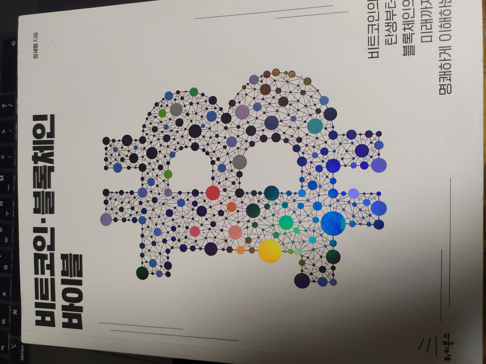
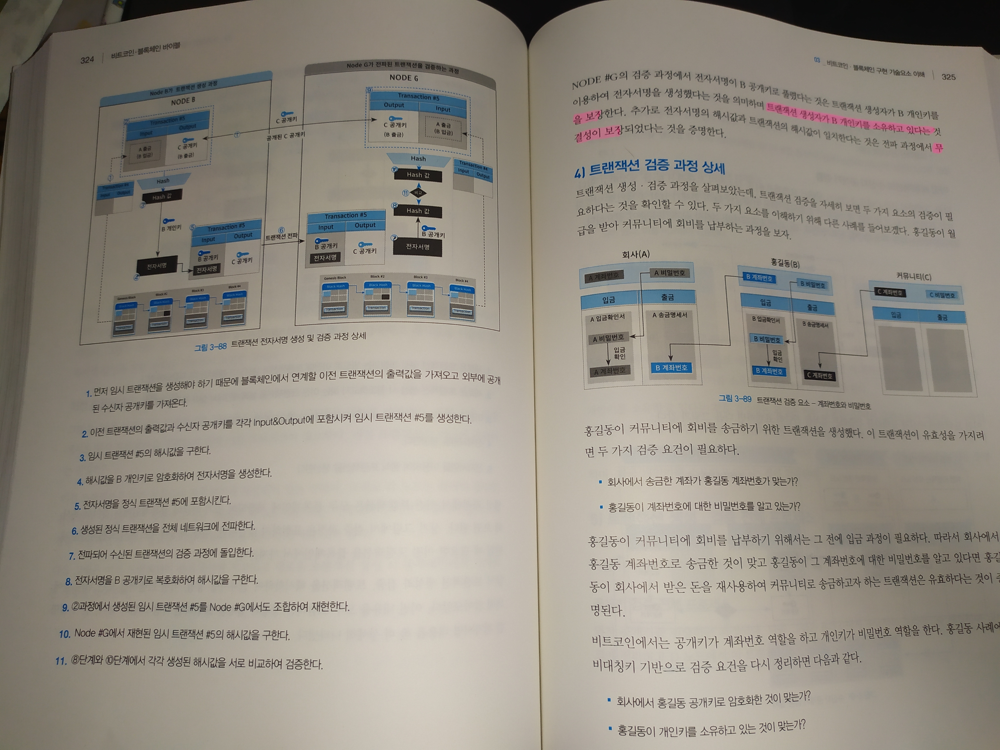

  

이미지 안눌리고 보여주는 방법 없나?...

비트코인·블록체인 바이블이라는 상당히 뻔한 제목이지만, **내용은 엄청 훌륭했다.**

1장에서, 비트코인의 탄생 배경 (기존 금융시스템, 사이버펑크)부터 시작해서 사토시가 어떤 관점으로 비트코인을 만들었는지 추측한다.

그 후 비트코인의 작동원리와 여러 암호기술, 아키텍처를 먼저 쉽게 설명하고, 다시 많은 이미지와 함께 설명한다.

마지막 장에서는 블록체인의 여러 오해들과, 산업 현황, 평가와 전망들을 다룬다.

 

### 아쉬운점을 말해보자면

내 생각에는 비트코인을 바라보는 굉장히 건강한 시각을 담고 있지만, 그럼에도 1장 내용에 대해서는 공감가지 않는 부분도 있다.
- 다만 작가님은 "사토시"의 시각에서 기존 시스템을 설명한다고 말한다.

 

또 아무래도 전체를 포괄해서 다루다보니, 깊이 부분이 아쉬운 부분이 있었다. (입문용이니 어쩔수없지만)

 

이더리움에 대한 부분.
- 제목에 비트코인을 넣을정도로, 비트코인에 중점한 설명이지만 이더리움에 관한 내용을 더 보강했으면 어땠을까 싶다.
- 특히 스마트 컨트랙트에 대해 너무 간단히 언급하고 넘어가서 개인적으로 아쉬움이 있다.

 

영지식 증명에 대한 부분
- 한두장 간단하게 언급하고 넘어간다. 실제 기술 활용을 어떻게 하는지 설명해줬으면 좋을 것 같다.

 

### 마무리 

아쉬움에도 불구하고, 한국어 블록체인 입문서를 하나 추천한다고 하면, **이 책을 강력 추천하겠다**. (국내 블록체인 기술 도서 약 10개는 읽은 입장에서)

작가님이 이더리움 입문서와 함께 더 깊이 있는 내용으로 또 책 써주셨으면 좋겠네요

마지막으로 책 마지막장 내용과 함께 마치도록 하겠다.

 

---

> 우선 비트코인은 내재적 가치가 없다

 

> 즉 암호화폐의 가치, 가격을 평가할 수 있는 정확한 지표나 평가 기준은 현재 부재한 상황이다. 

 

> 중앙시스템이 이런 저런 문제가 있기 대문에 탈중앙시스템이 대안이며 이상적이다, 라는 논리는 이분법적이며 매우 위험하다
> 핵심은 기존 시스템이 안고 있던 문제점을 어떻게 개선할 것인가이다. 탈중앙화 실현 자체가 목적이 아니다.
> \- 5.4.2 탈중앙화가 이상적인 가치인가?

 

> 비트코인의 핵심은 '탈중앙화'다. 그러면 비트코인은 '탈중앙화 구현'이 목적이었을까, 아니면 '신뢰구현'이 목적이였을까?
> 신뢰 구현을 위한 하나의 방법으로 탈중앙화를 선택했을 뿐이다. 
> \- 5.4.5 탈중앙화 구현이 목적이었나, 신뢰 구현이 목적이었나?