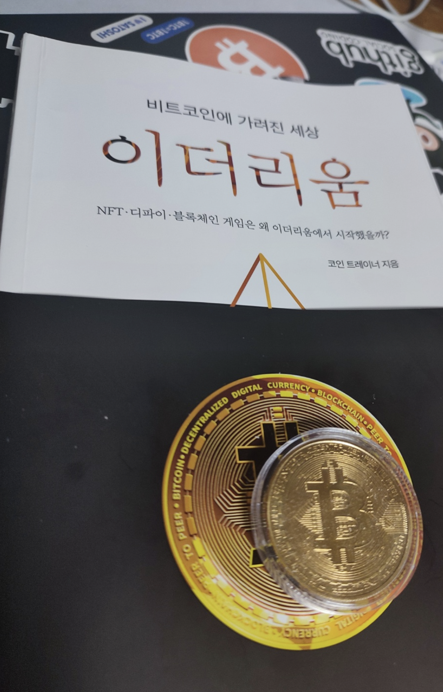

 

유튜버 '코인트레이더'님의 책이다.

이더리움 입문으로 가장 훌륭한 책이고, 최신 트렌드를 빠르게 따라갈 수 있다.

단순히 암호화폐란 좋고 멋진 미래로 가득찼다는 내용으로 만든 책이 아니다.

또한 2장 목차를 보면 알겠지만, 기술적인 내용이 알차다! 심지어 (비기술자도 이해할 수 있도록) 너무나도 쉽게 설명한다.


```
2장. 암호화폐/블록체인 기술이해
- 탈중앙화 시스템과 노드_73
- 비트코인 채굴자와 작업 증명_77
- 이더리움의 밸리데이터와 지분 증명_82
- 블록과 트랜잭션의 의미_86
- 블록체인에 수수료가 필요한 이유 - 가스란?_89
- 암호화폐의 최소 단위는 소수점이다_93
- 이더리움 가스값이 높은데도 계속해서 사용되는 이유_95
- 블록체인의 가장 큰 문제: 확장성_101
- 확장성은 어떻게 해결할까?_105
- Layer 2의 가장 앞선 기술 - 롤업이란?_111
- Layer 1의 기술인 샤딩 그리고 비컨 체인_116
- 이더리움 블록체인은 어떻게 발전하는가 - EIP와 ERC란?_122
- 이더리움의 역사상 가장 큰 업데이트 - EIP-1559_125
- 곧 그래픽카드가 싸질 수도 있는 이유_131
- 플랫폼 블록체인 대중화의 마지막 퍼즐_136
- 불로소득은 아닌 불로소득같은 스테이킹_141
```

매우 쉽게 설명한다고 느낀 부분 두가지를 소개해보고자 한다.
- '롤업'을 대법원과 지방법원의 관계로 설명한다.
- PoS에서 프로그램(노드)을 "24시간 켜놓아야 한다"라고 명확하게 설명하는 부분

