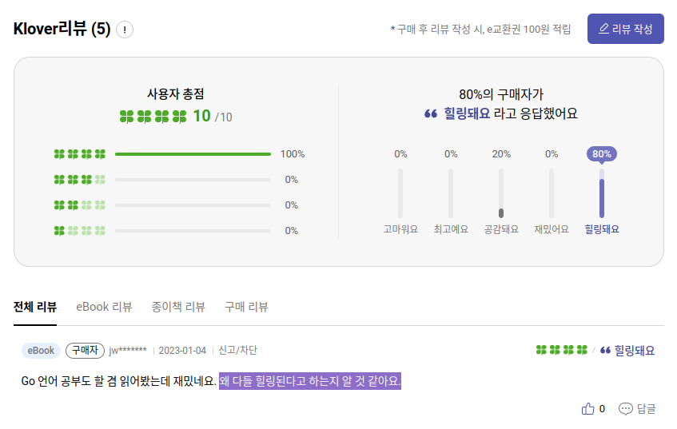

  

> 맨땅에서 시작해 완전히 작동하는 인터프리터 구현까지. 이 책은 드래곤북 류의 방대한 이론을 담은 책도, 50줄의 코드로 장난감 같은 인터프리터를 뚝딱 만드는 블로그 수준의 글을 모아놓은 책도 아닙니다. 저자는 그 중간 어느 지점에서 이론보다는 구현을, 여러 기능의 나열보다는 인터프리터를 제대로 이해하기 위한 본질적이면서 교육적인 기능에 초점을 맞추어 책을 집필하였습니다.

<br/>

21년 8월쯤 (출간당시) 이벤트로 받았는데, 지금에서야 읽어보게 되었다. 

책 내용 자체는 Go로 가볍게 인터프리터를 만들어보는 책이다. 

책 내용 중 3장까지 따라한다면 아래와 같은 코드를 REPL 환경으로 실행 가능하다. ([project Github](https://github.com/junha-ahn/monkey-go))

``` javascript
>> let newAdder = fn(x) { fn(y) { x + y}; };            
>> let addTwo = newAdder(2);
>> addTwo(3);
5
```

# 좋았던 점

책 내용 자체가 Go 언어 이해를 바탕으로 하지만, 실제로 읽는데 큰 문제가 없다. 

내용 전체가 새로운 기능의 테스트 코드를 먼저 작성 하고 이를 완성 시켜나가는 TDD를 이어나가는데, 문제 없이 따라갈 수 있다. 

# 아쉬웠던 점

책 코드를 생각없이 따라 치기 시작했던게 문제였을까... 뭔가 배웠다고 생각하기도 전에 책이 끝나버렸다... 

실제로 배웠다기보단 그냥 '코드 따라치기'를 끝낸 것... 이런? 
- 조언은 Go말고 다른 언어로 책 내용을 구현해보는 것
- 책 자체가 소스코드와 그에 대한 설명으로 이루어져서 설명도 넘기고 아무 생각 안하고 따라치기 쉬운 구조다.

<br/>

리뷰에 어째서 **힐링**된다고 하는지 알 수 있었다... [<밑바닥부터 만드는 컴퓨팅 시스템> 후기](/book/the-elements-of-computing-systems/)를 읽다가 부족하다고 느낀 **컴파일러** 구현을 차근차근 배워보고 싶었지만 뭔가 힐링만 하고 나온 느낌이... 

  


# 참고
- [project Github](https://github.com/junha-ahn/monkey-go)