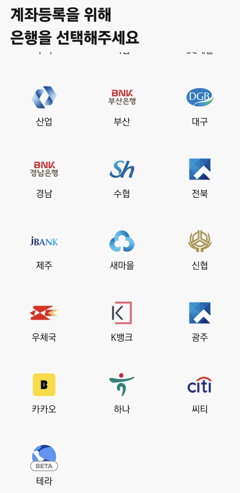
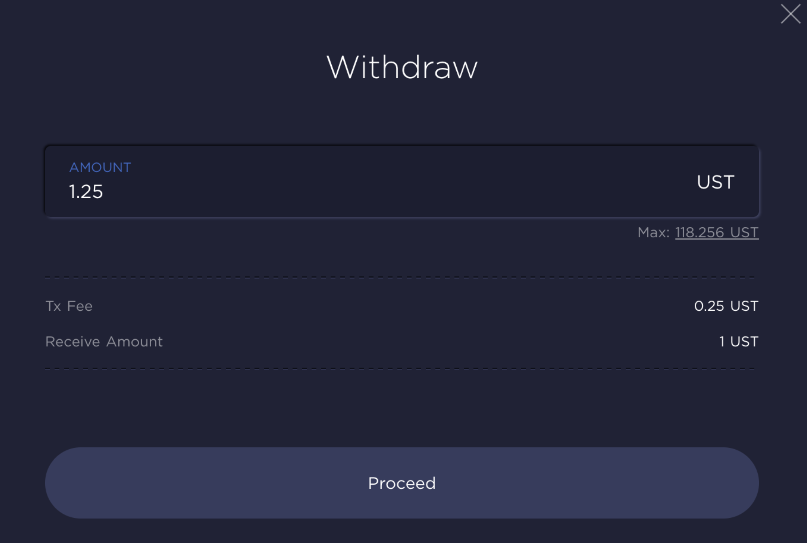
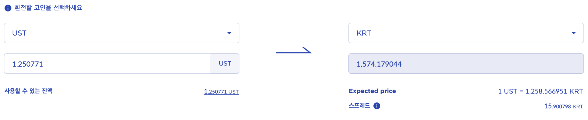
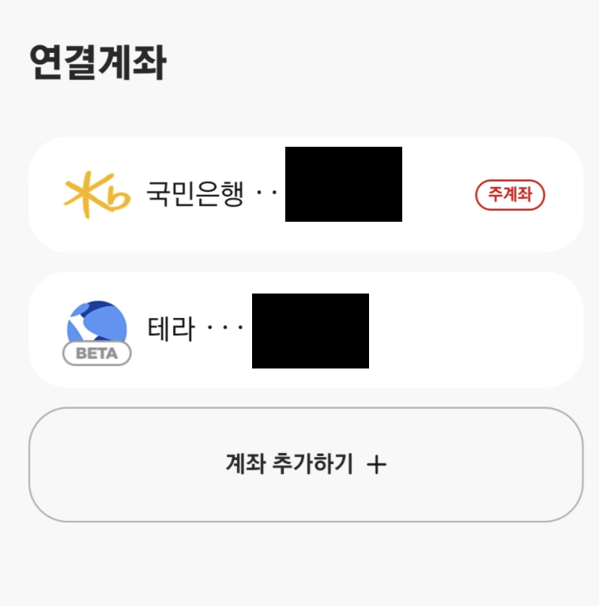
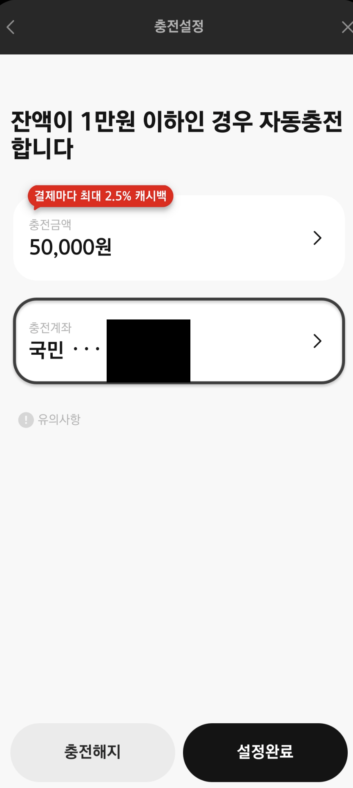
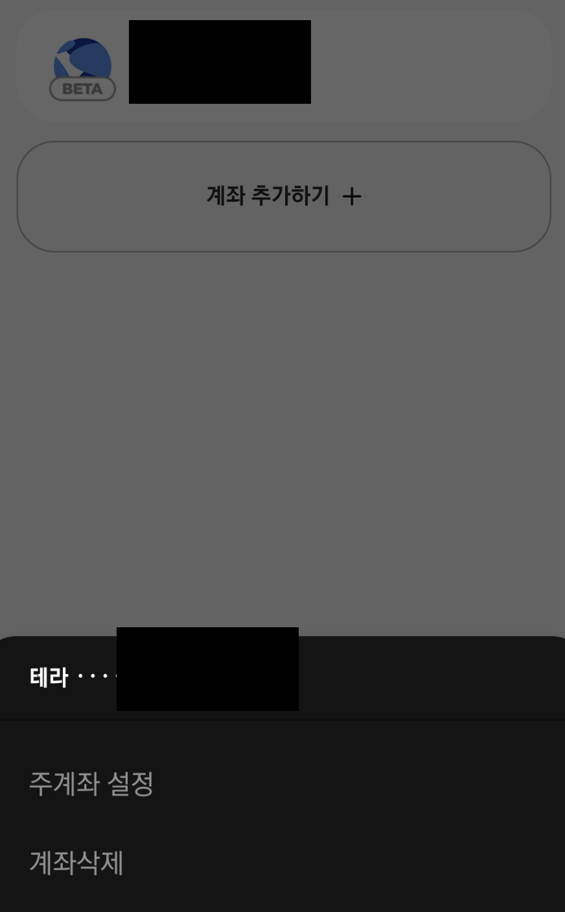
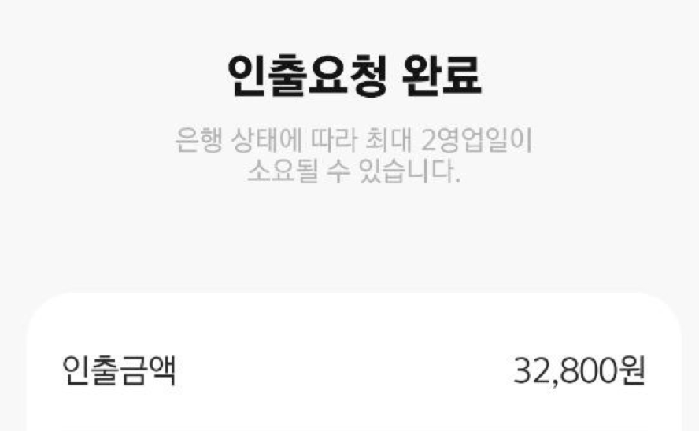
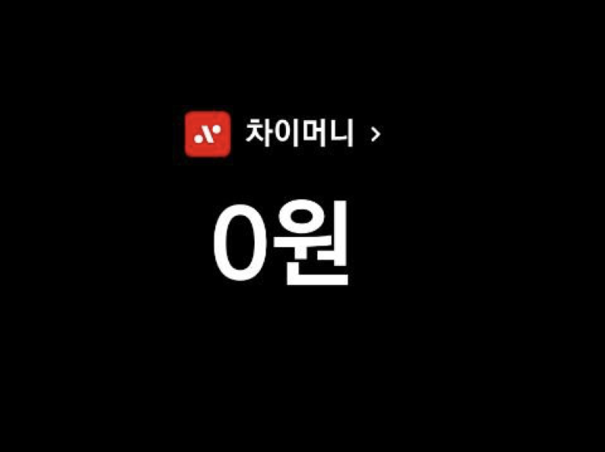
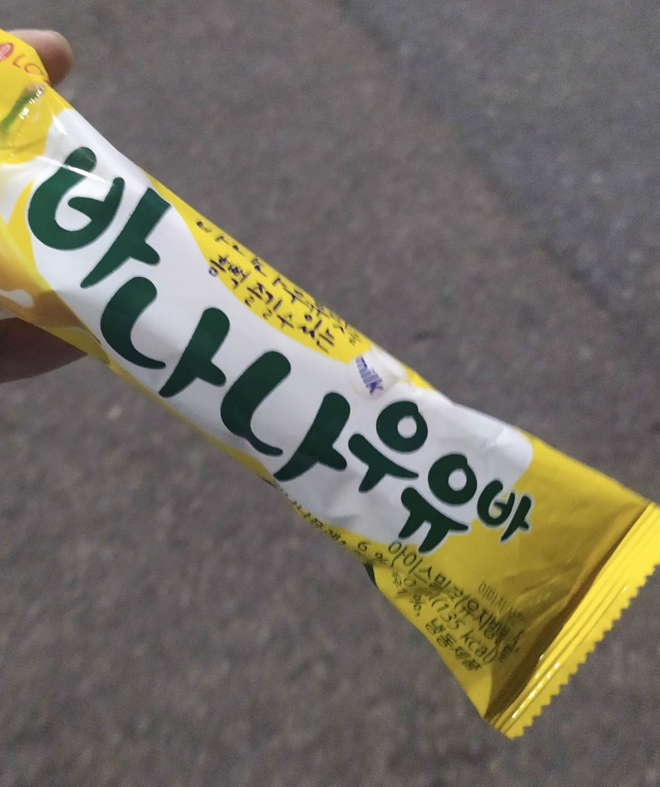
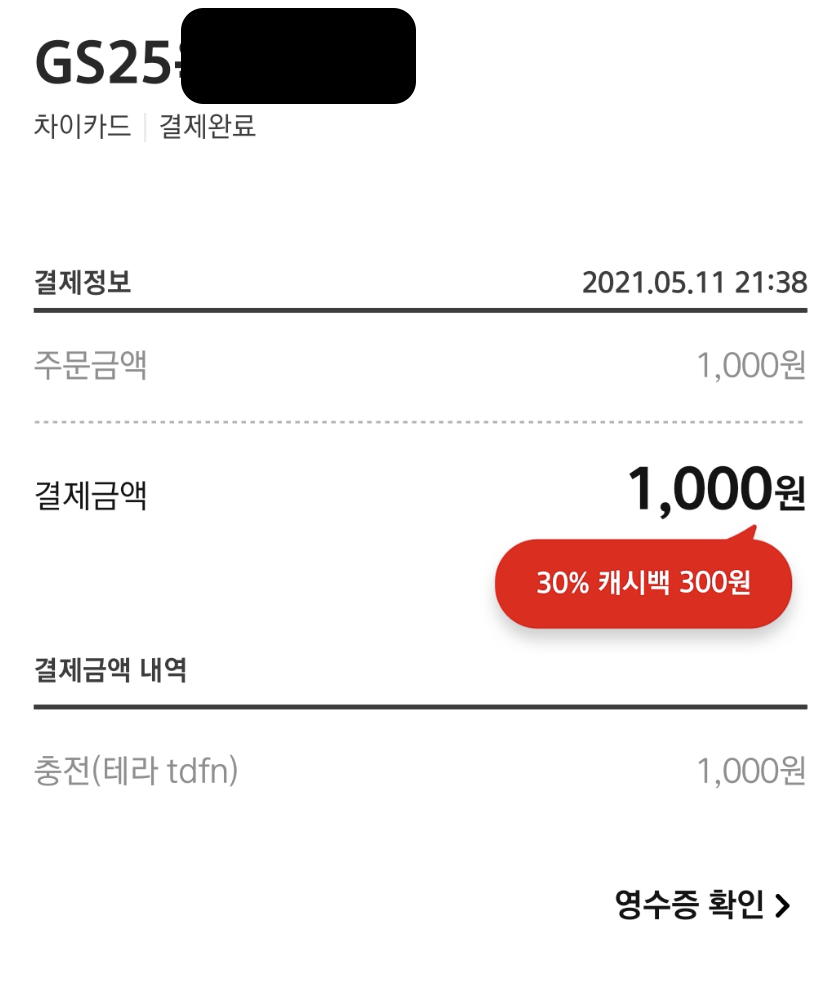

[차이로 사면 왜 물건값이 내려가는거죠?](https://www.coindeskkorea.com/news/articleView.html?idxno=71091)

차이카드 원리에 대해 설명이 되있는 글이다. 읽어보는걸 추천한다.

2020년 6월 작성된 글인데 이런 내용이 있다.

> 지금 차이로 결제를 하기 위해서는 이용자 소유의 원화 계좌를 연동해야 한다. 이 경우 계좌가 있는 은행이 결제원천사가 된다. 유저는 모르지만, 원화를 입금해서 차이로 물건을 사면 스마트폰 뒤에서는 다음 과정이 이뤄진다. 우선 차이 결제계좌에 연동된 고객의 원화를 원화기반 스테이블 코인인 '테라KRT'로 바꾼다. 그리고 결제사인 차이에 테라KRT로 물건 값을 치른다. 차이는 그걸 가지고 있다가 정산 때 판매자에게 보내주는 것이다. 

그리고 이런 내용도 있다.

> 설명하기 조금 긴데(웃음), 세 가지 이유가 있다. 우선 지금은 저희가 시중은행의 원화 계좌만 결제 원천사로 사용하고 있다. 그런데 앞으로도 꼭 은행 원화 계좌만 원천사로 쓰리라는 법이 없다. 암호화폐 지갑을 결제 원천사로 추가할 경우를 상상하면 우리 모델에 대한 이해가 쉽다. 저희는 테라KRT를 지원하는 암호화폐 지갑도 차이에 연동해서 같은 서비스를 제공 가능하게끔 할 예정이다.

 

 

그리고 기사에서 예고한 것처럼, 2021년 5월 11일 오늘 연결 계좌 목록에 테라가 등장했다!

## 그래서 어떻게 사용할건데? 

시나리오는 아래와 같다

1. 디파이(앵커)에서 UST 인출
2. 테라스테이션에서 UST -> KRT 스왑
3. 차이카드-테라 지갑 연결
4. 결제!

 

참고로 지갑 연결이 3번인 이유는 소액의 KRT 가 인증(권한 부여)을 위해 필요하기 때문이다

## KRT를 준비하자!

 

먼저 앵커(디파이)에서 예치중인 UST 일부를 출금한다
- UST는 달러(USD)에 페깅된 토큰이다.
- 앵커에서 UST 연20% 이자를 받고 있다.

 
 

 

KRT로 환전한다 (만약 모바일 테라지갑과 같은 주소가 아니라면 KRT를 송금한다)
- 김프가 적용되서 실제 달러 환율과 다르다.

 
 

 

## 차이카드와 연동하자!

 

KRT를 가지고 있다면 몇번의 클릭으로 쉽게 연결이 완료 된다.

## 차이카드 잔고 0으로 만들기!

여기서 중요한점은 차이카드의 **충전 방식**이다
- 차이카드는 수동충전 기능이 없다.
- 먼저 5만원 이상의 금액을 자동으로 충전해주는 기능 (잔고가 소액이기에 **해당 없음**)
- 결제할때 필요한 금액을 계좌(지갑)에서 바로 충전해 오는 기능

우리는 소액의 금액을 테스트해보고 싶기때문에, 차이카드 **충전금액을 0원으로 만들어야 한다**.

 
 

먼저 **주계좌, 충전계좌를 테라로 변경해야 한다.**
- 이 설정을 안하면 은행 계좌에서 돈이 빠져나간다.

 
 

 
 

그리고 인출을 진행한다.

 
 
 

인출 기능을 이용해 충전금액을 0원으로 만들었다.

## 결제 해보기!

편의점에서 아이스크림을 결제해봤다.

 

 

성공적으로 결제 완료!!

## 후기 

먼저 기존 결제와 속도차이가 없다.
- 기존에도 KRT로 결제하는건 알았지만...
- 카드 결제시 KRT를 가져가는 Transaction이 발생한다.

그리고 중앙거래소 없이 실제 물건을 결제할 수 있다는 점이 엄청난 발전이다.

물런 기존 디파이 사용자가 아니면, KRT로 충전할 아무런 메리트가 없다.

그럼에도 디파이로 받은 이자를 중앙거래소를 거치지 않고, 물건을 결제해보는 재밌는 경험이였다.

> 내년엔 세금이 어찌 될지...