# XOR gate to 16-bit 6-opcode CPU

이 글은 `밑바닥부터 만드는 컴퓨팅 시스템`의 1장~5장까지의 회로도를 담은 글입니다.

해당 프로젝트는 `Nand2Tetris`라는 이름으로도 알려져있습니다.

코드 및 테스트 결과는 [Nand2Tetris](https://github.com/junha-ahn/Nand2Tetris-Study)에서 확인 가능합니다.

책 후기는 [<밑바닥부터 만드는 컴퓨팅 시스템> 후기](/book/the-elements-of-computing-systems/)에서 확인 가능합니다.

## Chapter 1

### XOR
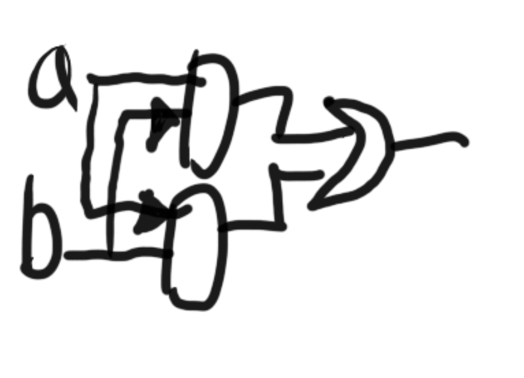

### MUX
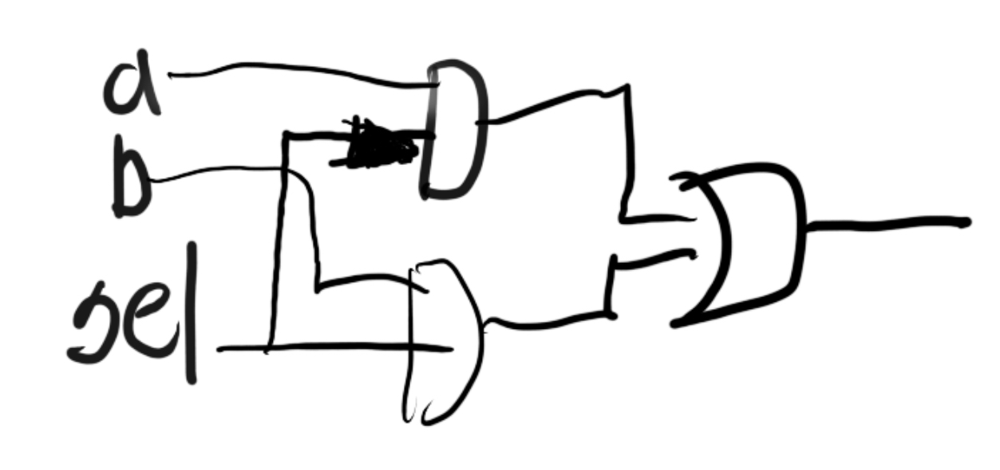

### DMUX
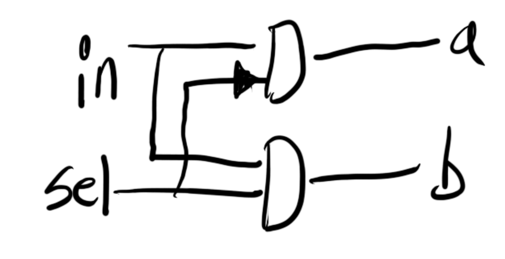

### Mux4Way16
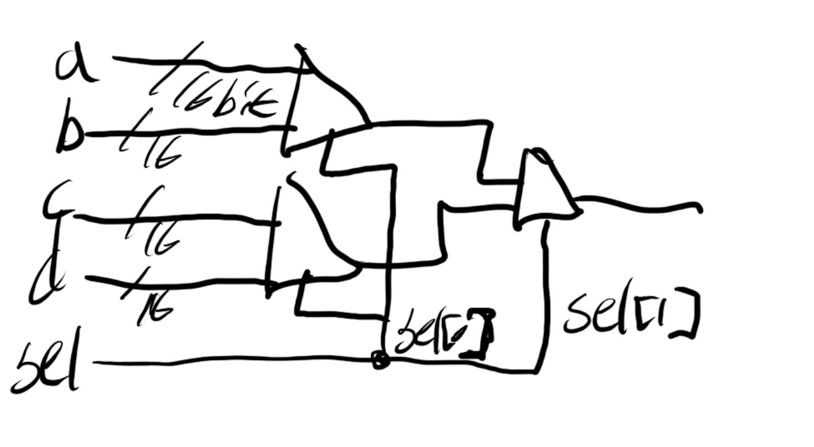

## Chpater 2

### Half Adder

### Full Adder
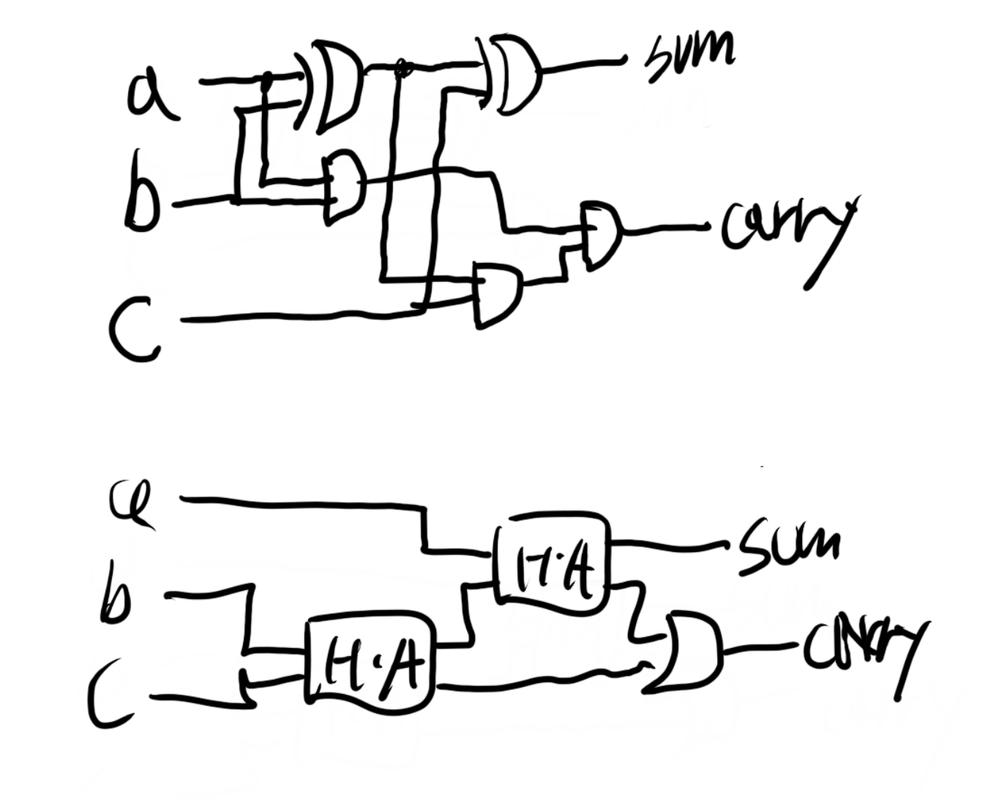

### ALU (6 opcode)
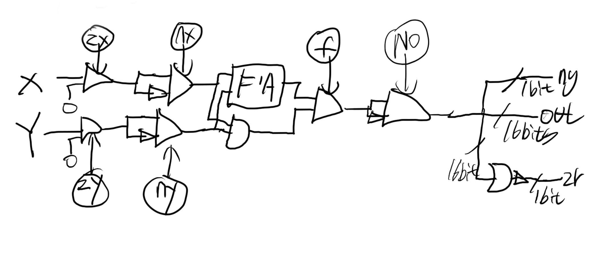

## CHapter 3

### D Flip-flop
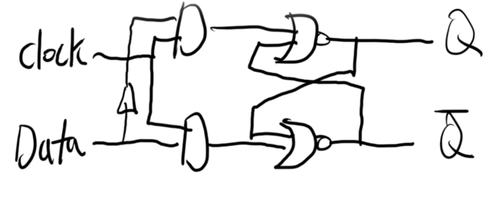

### BIT
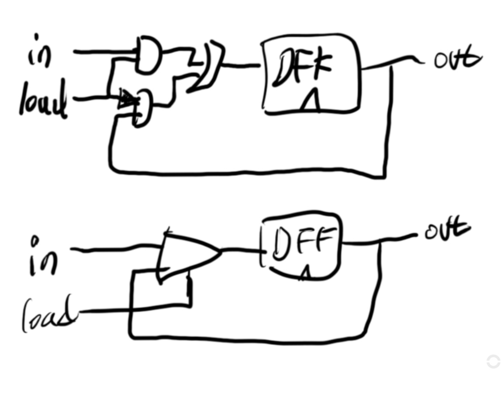

### 16bit-Register
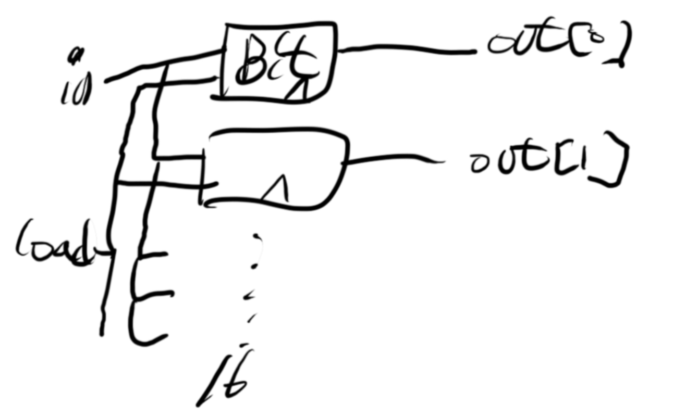

### RAM8
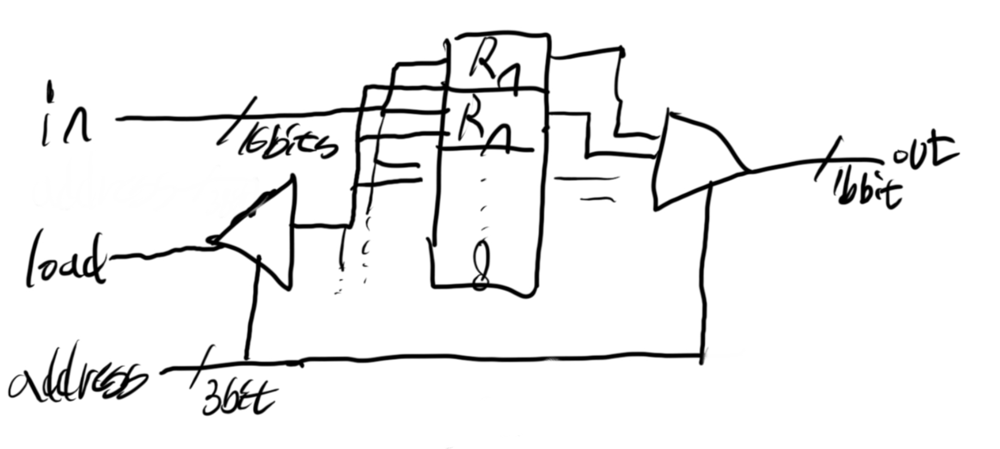

### Program Counter
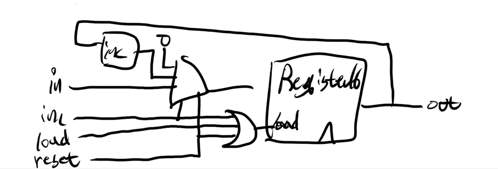

## Chapter 5

### Memory
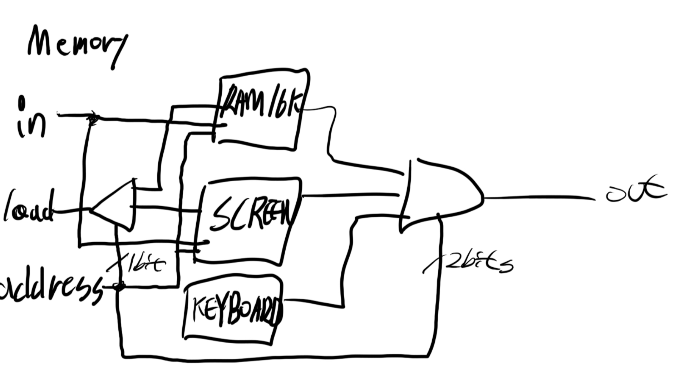

### CPU
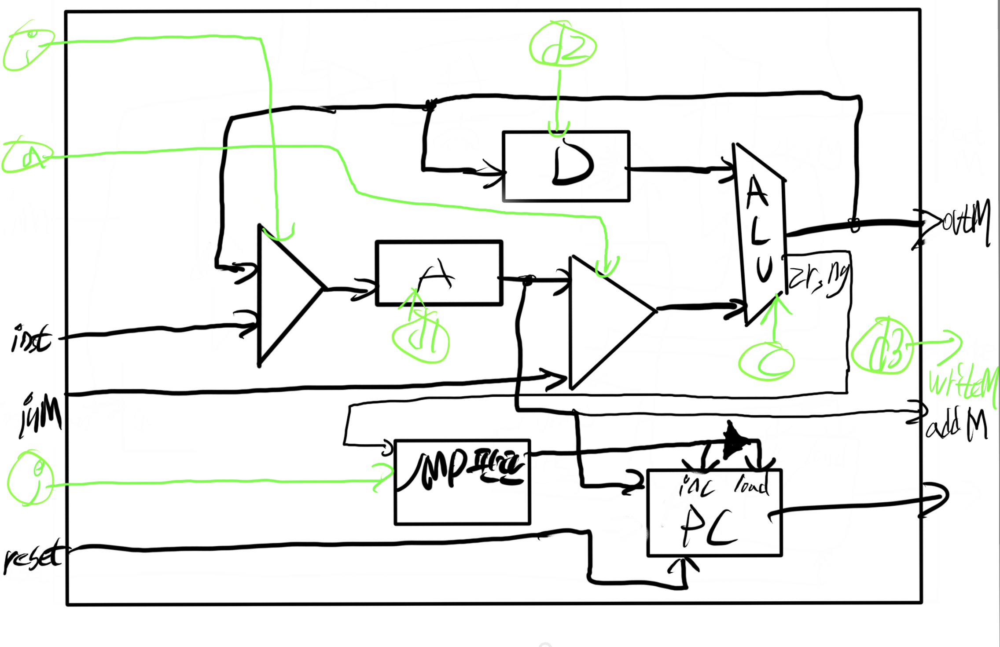
