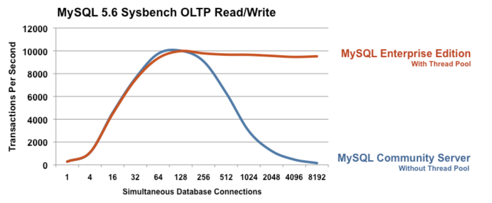

보통 Connection Pool을 사용하는 이유가 '**Connection에 드는 비용**'이 크기때문이라고 하는데, 정확히 어떤 비용인지 궁금하여 찾아서 정리해봤다.

애플리케이션에서 매 쿼리마다 새로운 Connection을 생성하고 종료한다고 했을때 어떤일이 발생할까?

 

네트워크 관점, DBMS관점에서 드는 비용을 살펴 본 후 애플리케이션 관점에서 설명해보겠다.

## 네트워크 관점

DBMS와의 통신은 TCP/IP로 이루어진다. 그렇다면 이러한 TCP/IP의 연결 과정은 무엇일까?

먼저 TCP는 연결형 프로토콜이다. 가상 경로를 생성하고 통신을 하는데, 이는 서버측이 미리 준비하고 있어야 가능하다

서버 프로세스(DB)는 OS에게 포트 번호 xx에 통신 요청이 오면 자신에게 전달해 달라하며 기다리는데, 이를 `LISTEN`하고 있다고 한다.

이때 우리는 연결을 위해 `3-way handshake` 과정을 거친다.

1. 클라이언트가 통신 상대인 서버측 OS에게 가상 경로 오픈을 의뢰하며 `SYN` 패킷 전송
2. 서버측 소켓은 `LISTENING`상태이기에 `ACK +SYN` 패킷 응답.
3. 클라이언트도 다시 `ACK`  패킷으로 응답하며 서버의 새로운 소켓이 생성되며 연결(`ESTABLISHED`)된다

> 더 자세한 내용은 [링크 참고](/network/3-way-handshake-with-c)

위 모든 요청은 실제 물리적 회선을 거쳐 이루어진다.

따라서 위 연결 과정을 매번 **반복하지 않을 수 있는데**, 반복한다면 비효율적인 일이다.

또 위 가상경로의 연결은 지속 유지되며 연결을 끊는 과정에서 `4-way handshake`을 거친다.

## DMBS 관점 (오라클)

오라클과 클라이언트의 연결과정은 아래와 같다

1. 오라클 리스너 시작 (`LISTEN` 상태)
2. 애플리케이션에서의 커넥션 시도
	- 리스너와 클라이언트 사이에 소켓 생성
3. 서버 프로세스의 생성
	- 서버 프로세스를 생성하여 SQL 처리를 즉시 인계
	- 리스너가 인계한 후부터 서버 프로세스와 오라클 클라이언트는 직접 송수신하므로 리스너는 자유로워 진다.
	-  애플리케이션에서 접속을 종료하는 처리(close, disconnect)를 수행하면 서버 프로세스도 함께 종료된다.

위 과정에서 알 수 있듯이, 오라클의 경우 연결마다 **매번 '서버 프로세스'를 실제로 OS단에 생성해야 한다**.

이는 공유메모리 확보 등 무거운 작업고, 따라서 이 과정을 반복하는것은 엄청나게 비효율적이다.
- 때로는 이 과정이 SQL처리보다 더 오래걸릴 수 있습니다.

## DMBS 관점 (MySQL)

위 오라클은, 하나의 쿼리마다 하나의 프로세스가 생기게 되어 부담이 큽니다.
- 위에서, 매 쿼리당 새 케넥션을 열기로 가정했다.

MySQL은 단일 프로세스, 멀티 스레드 개념이다.

즉, 오라클과 달리 클라이언트를 담당할 프로세스가 아니라 **스레드가 존재한다**.

### 포그라운드 스레드

- 이 스레드는 사용자가 요청한 쿼리문장을 처리하는 역할을 합니다 

- 그러나 이러한 스레드도 매 연결마다 생성하면 부담이 크기에 스레드풀 개념을 사용한다.
- 실제 동시접속이 늘었을때 스레드 생성으로 인해 지연이 발생할 수 있습니다.

### 스레드 풀

> 커뮤니티 버전에서는 사용 불가능한것으로 알고 있습니다.

- MySQL은 포그라운드 스레드를 미리 생성하여 대기시켜 놓는데, 대기하고 있는 스레드들을 모아둔 곳이 스레드풀
- 최소한 서버에 접속된 클라이언트 수만큼 존재해야 한다 (더 많을 수도 있습니다)
- 사용자가 DB 커넥션을  종료하면, 해당 스레드는 스레드풀로 돌아간다.

 

 

- Thread Pool 사용했을때와 아닐때를 비교

## 애플리케이션 관점

이제 각각 어떤 비용이 발생하는지를 정리했고, 애플리케이션에서 `Connection Pool`을 사용하는 과정을 설명하겠다. 

`Node.js` 애플리케이션 시작시, `Connection`을 5개 생성하여 `Connection Pool`을 구성한다고 가정하자

1. 애플리케이션이 시작되고 5개의 `Connection`이 생성된다.
2. 각 `Connection`은 TCP/IP `3-way handshake` 과정을 거친다 (이때 `Node.js` 애플리케이션이 클라이언트이고, 클라이언트 측 소켓은 각각 서로 다른 고유한 포트 번호에 할당된다.)
3. 연결은 유지된다. 즉 5개의 서로 다른 socket이 열려있다.
4. 이후 이미 형성된 `Connection`을 재사용한다.

## 결론

1. handshake 비용
2. 프로세스나 스레드 생성/삭제 비용
3. `Connection Pool`을 사용해 아낄 수 있다.

## 참고
- <제이펍> 그림으로 공부하는 IT인프라 구조
- <제이펍> 그림으로 공부하는 오라클 구조
- [Connection pool을 사용함으로써 얻는 이점은 무엇일까?](https://1-7171771.tistory.com/119)
- [Connection Pool의 각 Connection은 동일한 소켓 port를 사용합니까?](https://stackoverflow.com/questions/18653591/do-each-connection-in-connection-pool-use-the-same-socket-port)
- [How JDBC connect to a Database?](https://programmingsharing.com/why-connection-pool-is-fast-5e91fd3a0ae)
- [mysql을 시작하기전에 3](https://dung-beetle.tistory.com/68)
- [내가 만든 서비스는 얼마나 많은 사용자가 이용할 수 있을까? (DB Conection Pool)](https://hyuntaeknote.tistory.com/12)