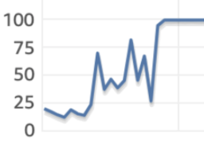

## [[개발바닥] NodeJS 장애회고 + 모니터링 이야기](https://www.youtube.com/watch?v=52t9DlwmqJI&t=104s)

영상의 내용을 요약해보겠다.

1. 이벤트를 했는데, 트래픽이 많이 발생
2. 성능테스트 해보진 않았지만, 현재 서버 사양으로 문제가 없어 보였다.
3. 갑자기 쿠폰 등록 마지막날 `Dead Lock Query` 들이 발생 
   - 조회해서 쿠폰 + 1 하는 로직이  0.5 ~ 1초정도 소요되고 `lock`이 잡힌다.
   - 동시에 50~100명이 요청하자 서로 `lock`을 잡아버렸다
   - `kill` 해도 의미가 없다 계속 `lock이` 잡히니까. 일단 락을 우회하게 **hotfix**
4. 또, `Slow Query` 문제로 긴급히 DB 사용을 높였다
5. 그런데 `Node.js`가 처리를 못해서 100대까지 늘렸는데 해결이 안됬다
6. 봤더니 `max connection` 수를 node 서버당 5개로 잡고 있었다. 
   - 5개에서 50개로 늘렸다. (DB 스펙도 5000개 가능하게)

 

위 영상 + 개인 경험을 바탕으로 **Slow Query 장애 시나리오**를 작성해봤다.

## 가정

DB는 master 1대가 존재한다고 가정한다.

 

`client > server > DB` 구조라고 가정한다.
- server는 10대가 존재한다고 가정한다.
- server는 Node.js 애플리케이션이다.

 

`/api/slow-query`에 **인덱스를 타지 않는 쿼리**가 있다고 가정한다.
- 즉 이 쿼리는 수천만건의 데이터를 `full scan`한다.
- 또 아주 가끔 실행되는 쿼리이기에 평소에 큰 문제를 발생시키진 않았다.

 

`/api/slow-query` 특점 시점에 자주 실행된다면 어떤일이 발생할까?

## 시나리오

 

 

**DB CPU 사용률이 99%로 급격히 증가하기 시작한다**
- 또 어째서인지 DB connection 수도 2배 이상 급격히 증가했다

 

모니터링을 통해 문제를 발견했고, 전사에 이슈를 공유한다.
- 이때 이미 앱/웹 사이트 **접속이 불가능**해진다.

 

CPU 사용률이 너무 높아, DBA팀에서 쿼리 확인조차 불가능했다

- 그러나 CPU 사용률이 조금 하락한다. 
- 이유는 사이트 접속이 불가능해졌기 때문이다.

 

DBA팀에서 `Active Query` 들을 확인하여 애플리케이션 개발팀에 전달한다.
- 문제가 되는 `Slow Query` 를 발견한다.
- 또 강제로 `kill`하기도 한다.

 

문제가 되는 쿼리를 수정하여 긴급 배포한다. 상황이 종료되었다.

##  왜 DB CPU 사용률이 급격히 증가했을까?

Slow Query를 처리하는게 CPU 사용률을 끌어올리고, 다른 요청(쿼리)는 처리하지 못한다.
- 한계점에 이르자 사실상 DB가 죽었다.

## Q. 왜 DB Connection수가 급격히 증가했을까?

Server 실행시 `connection pool`의 `connection`을 최소값만큼 생선한다.
- 예를들어 2개가 최소값이라면 `connection`을 2개 생성한다.
- 유휴 `connectoin`이 부족하자, 점점 **limit까지 생성한것이다.**

 

더 자세히 알아보자.

1. HTTP Request 발생
2. `DB Connection Pool`에서 유휴 `connection`을 가져와서 `slow query` 실행
   -  해당 쿼리의 응답이 오지 않는다.
   -  즉 아직 `Connection이` 반납하지 않았다.
3. 해당 요청이 반복된다.
	- `DB Module`은 설정된 limit까지 새로운 `Connection`을 생선한다.
	- 물런 새로운 `Connection`으로 요청을 해도 응답은 오지 않는다.

## Q. 왜 서비스가 다운됬을까?

가정상 `Node.js` 애플리케이션이다.

이때 Node.js 애플리케이션은 **DB랑 관련 없는** api 응답이 가능하다.
- Node.js 아키텍처상 싱글 스레드, 이벤트 루프 기반이기에 가능하다.
- Node.js 메인 싱글 스레드는 여전히 정상동작 중이며, 다른 비동기 작업(qeury)들도 콜백이 있다면 다시 처리될 것이다.

 

그러나 **DB 요청 필요한 api**는 응답 불가능하다.

 

따라서 `/api/slow-query` 요청은 계속 새로운 `Connection` 연결 시도를 만들고 DB에 `query`를 전달한다. 그러나 응답은 없다.

 

클라이언트 입장에서는 사실상 **서버로 보내는 모든 요청은 응답이 없다**.

> DB랑 관련되지 않은 API는 없을태니...