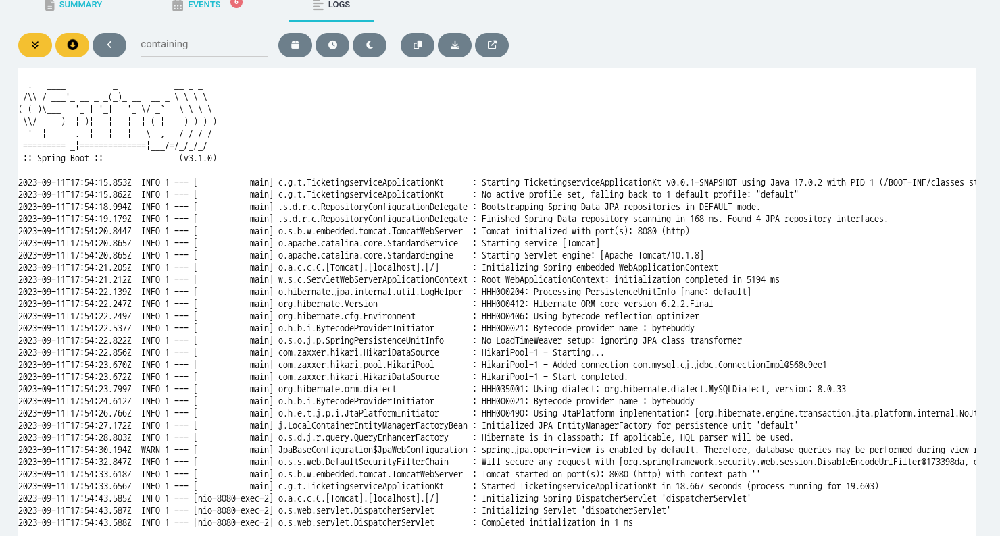

# 목표

AWS EKS에 Backend Pod에는 DB PASSWORD 등 여러 환경변수가 필요합니다. 

어떻게 EKS Pod에 ENV를 주입할 수 있을까요? 이 모든 과정을 Terraform으로 진행하겠습니다. ([이슈](https://github.com/f-lab-clone/ticketing-infra/issues/4)와 [PR](https://github.com/f-lab-clone/ticketing-infra/pull/45)에서 실제 작업을 진행했습니다)

```dotenv
spring.datasource.url=jdbc:mysql://${MYSQL_HOST}:${MYSQL_PORT}/${MYSQL_SCHEMA}?createDatabaseIfNotExist=true
spring.datasource.username=${MYSQL_USERNAME}
spring.datasource.password=${MYSQL_PASSWORD}
spring.jpa.properties.hibernate.dialect= org.hibernate.dialect.MySQLDialect

ticketing.jwt.secret=${JWT_SECRET}
ticketing.jwt.expiration-hours=${JWT_EXPIRATION_HOURS}
ticketing.jwt.issuer=${JWT_ISSUER}
```
> 환경변수 예시

# 간단한 사전지식

더 자세한 설명은 [출처](https://kim-dragon.tistory.com/279) 를 참고해주세요

### Service Account란?

Kubernetes의 Object
실제로 권한을 정의하고, 설정하는 부분은 Role, ClusterRole, RoleBinding, ClusterRoleBinding의 역할

### IRSA란?

IRSA는 **IAM Role for Service Account**의 약자

kubernetes의 Service Account를 사용하여 pod의 권한을 IAM Role로 제어할 수 있도록 하는 기능

### Service Account는 AWS의 자원이 아닌데 어떻게 IAM Role을 할당할 수 있는 걸까요?

이걸 해주는게 바로 OIDC라고 부르는 OpenID Connect

ServiceAccount 는 이러한 **권한을 적용할 수 있는 주체** 중 한가지로서, Pod에게는 신분증과 같은 인증서역할을 하게 됩니다.

### OIDC란?

OpenID Connect는 Google 등의 IdP(ID 공급자)에 로그인할 수 있도록 지원하는 표준 인증 프로토콜

권한허가 프로토콜인 OAuth 2.0 기술을 이용하여 만들어진 인증 레이어로 JSON 포맷을 이용하여 RESTful API 형식을 사용하여 인증을 하게 됩니다.

OIDC를 사용하면 손쉽게 외부 서비스를 통해 사용자 인증을 구현할 수 있게 됩니다.

즉, Kunernetes의 리소스와 AWS리소스 처럼 서로 다른 리소스간의 인증을 OIDC를 사용하여 가능

# 직접 따라해보기

[AWS Secret Manager Integration with EKS](https://towardsaws.com/aws-secret-manager-on-eks-e050b38bc77d)을 Terraform을 통해서 진행해봅니다.

## Secrets Store CSI Driver, ASCP 설치

```tf
resource "helm_release" "secrets-store-csi-driver" {
  chart            = "secrets-store-csi-driver"
  name             = "csi-secrets-store"
  namespace        = "kube-system"
  repository       = "https://kubernetes-sigs.github.io/secrets-store-csi-driver/charts"

  set {
    name  = "syncSecret.enabled"
    value = "true"
  }
}
resource "helm_release" "secrets-store-csi-driver-provider-aws" {
  chart            = "secrets-store-csi-driver-provider-aws"
  name             = "secrets-provider-aws"
  namespace        = "kube-system"
  repository       = "https://aws.github.io/secrets-store-csi-driver-provider-aws"
}
```

Q. 왜 Terraform 을 사용하는가? 그냥 가이드처럼 `helm install`을 하면 간단하게 끝나는데...
- 불편하지 않다면 그냥 써도 문제 없다.
- 하지만 만약 `helm install <...>` 을 통해 직접 설치했다면 다른 개발자가 해당 업무를 파악하는데 많은 리소스가 낭비된다. (특히 Document 등이 미비되어있다면 더욱 큰 문제가 발생한다)
- 왜 Desired State를 사용하는지 생각해보자 ([관련 주제를 담은 글](https://github.com/f-lab-clone/ticketing-infra/issues/43#issuecomment-1704315442))

Q. 어떤 리소스가 낭비되는가?
- (개인적 경험) 기존 작업 진행이 **선언형**으로 이루어져있지 않았고, 문서정리가 안되어 있었기 때문에 팔로업에 시간 추가.
- 당장 무엇이 설치되어 있는지 확인할 수 없었기에 '오류 메세지'에 집중하며 하나하나 장님이 코끼리 만지듯이 문제에 접근했다.


```sh
 $ helm list -n=kube-system
NAME                    NAMESPACE       REVISION        UPDATED                                 STATUS          CHART                                           APP VERSION
csi-secrets-store       kube-system     1               2023-09-08 13:41:47.163856656 +0000 UTC deployed        secrets-store-csi-driver-1.3.4                  1.3.4      
secrets-provider-aws    kube-system     1               2023-09-08 13:42:45.440840482 +0000 UTC deployed        secrets-store-csi-driver-provider-aws-0.3.4     
```
> 위와 같이 **직접** 명령어를 통해 확인해야 한다 (선언형 코드와 비교하면 추가 리소스가 많이 생긴다)

## Secret Manager Group 생성

```tf
module "secrets_manager" {
  source = "terraform-aws-modules/secrets-manager/aws"

  name_prefix             = "development/ticketing-backend"


  ignore_secret_changes = true
  secret_string = jsonencode({
    MYSQL_PASSWORD   = ""
    PORT: ""
    MYSQL_HOST: ""
    MYSQL_PORT: ""
    MYSQL_USERNAME: ""
    MYSQL_SCHEMA: ""
    JWT_SECRET: ""
    JWT_EXPIRATION_HOURS: ""
    JWT_ISSUER: ""
  })
}
```

## Iam Policy 생성

```tf
module "secrets_manager_access_policy" {
  source  = "terraform-aws-modules/iam/aws//modules/iam-policy"

  name          = "secrets-manager-access-policy"
  create_policy = true

  policy = jsonencode({
    Version = "2012-10-17"
    Statement = [
      {
        Action = [
          "secretsmanager:GetSecretValue", 
          "secretsmanager:DescribeSecret"
        ]
        Effect   = "Allow"
        Resource = [
          module.secrets_manager.secret_arn
        ]
      }
    ]
  })
}
```

## IAM Policy를 통해 Service Account 생성

```tf
resource "kubernetes_service_account" "backend_account" {
  metadata {
    name = "ticketing-backend-account"
    namespace = "default"
    annotations = {
      "eks.amazonaws.com/role-arn" = module.iam_eks_role.iam_role_arn # 중요
    }
  }
}


module "iam_eks_role" {
  source    = "terraform-aws-modules/iam/aws//modules/iam-role-for-service-accounts-eks"
  role_name = "backend-role"

  role_policy_arns = {
    policy = module.secrets_manager_access_policy.arn
  }

  oidc_providers = {
    backend = {
      provider_arn               =  module.eks.oidc_provider_arn
      namespace_service_accounts = ["default:ticketing-backend-account"] # 중요
    }
  }
}
```

```sh
$ kubectl describe serviceaccount  ticketing-backend-account
Name:                ticketing-backend-account
Namespace:           default
Labels:              <none>
Annotations:         eks.amazonaws.com/role-arn: arn:aws:iam::213060417361:role/backend-role
Image pull secrets:  <none>
Mountable secrets:   <none>
Tokens:              <none>
Events:              <none>
```

## SecretProvider 생성

```yaml
apiVersion: secrets-store.csi.x-k8s.io/v1alpha1
kind: SecretProviderClass
metadata:
  name: {{ include "ticketing-chart.fullname" . }}
  namespace: {{ .Values.namespace }}
spec:
  provider: aws
  secretObjects:
  - secretName: {{ include "ticketing-chart.fullname" . }}
    type: Opaque
    data:
    - key: "MYSQL_PASSWORD"
      objectName: "MYSQL_PASSWORD"
  parameters:
    objects: |
        - objectName: development/ticketing-secret
          objectType: "secretsmanager"
          jmesPath:
            - path: "MYSQL_PASSWORD"
              objectAlias: "MYSQL_PASSWORD"
```

## Pod에 적용하기

```yaml
apiVersion: apps/v1
kind: Deployment
metadata:
  name: {{ include "ticketing-chart.fullname" . }}
  namespace: {{ .Values.namespace }}
spec:
  template:
    spec:
      serviceAccountName: {{ .Values.backend.serviceAccountName }} # 중요

      volumes:
      - name: secrets-store-inline
        csi:
          driver: secrets-store.csi.k8s.io
          readOnly: true
          volumeAttributes:
            secretProviderClass: {{ include "ticketing-chart.fullname" . }}

      containers:
        - name: {{ .Chart.Name }}
          image: "{{ .Values.backend.image.repository }}:{{ .Values.backend.image.tag }}"

          env: # 중요
            - name: PORT
              value: "{{ .Values.backend.port }}"
            - name: MYSQL_USERNAME
              valueFrom:
                secretKeyRef:
                  name: {{ include "ticketing-chart.fullname" . }}
                  key: MYSQL_USERNAME
            # ... 반복

          volumeMounts: 
          - name: secrets-store-inline
            mountPath: "/mnt/secrets-store"
            readOnly: true
```

## 완료

