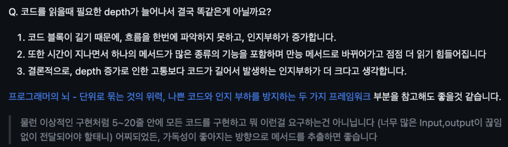
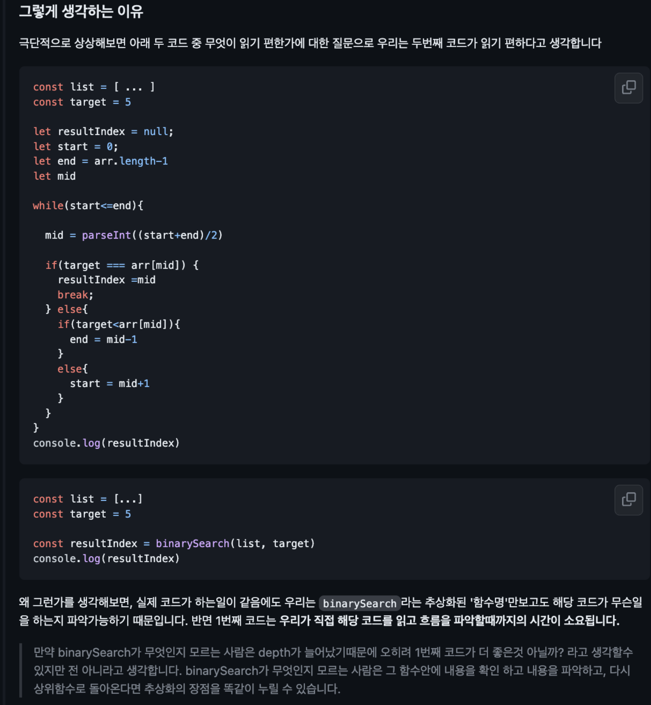
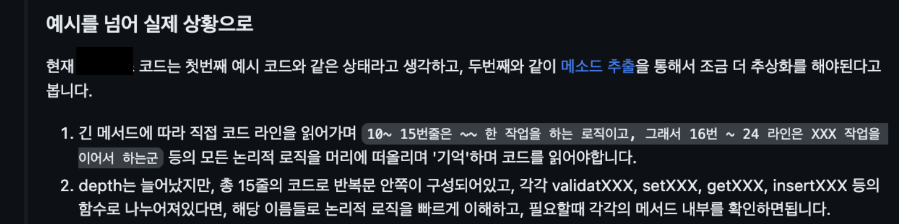

# 들어가며

작년 상반기 CS의 밑바닥을 다지고 싶어서 [Nand2Tetris](/book/the-elements-of-computing-systems/) 프로젝트와 몇몇 CS도서를 학습했고, 하반기에는 '대용량 트래픽 문제해결 경험'을 얻고 싶어서 [초특급 개발 부트캠프 입소식](/essay/f-lab-clone-start/)를 통해 이를 연습하는 사이드 프로젝트를 구성했고, 성공적으로 마무리했다.
> 일본 도쿄에서 일하고 싶은 희망을 가지고 있고, 막연히 상상하던 회사가 라인 본사였기 때문에 그 채용공고를 분석했고, '대용량 트래픽 경험'은 중요하다고 생각되었다.

그 다음으로는 '코드 퀄리티'를 올리고 싶었고, 앞으로 이야기할 '코딩철학 만들기'를 통하여 올해 상반기 하나의 (회사)프로젝트에서 월평균 52개의 코드 리뷰를 작성했다. 
> 직접 댓글 쓰레드를 생성한 경우만 카운팅에 포함했다. 대댓글 등은 포함하지 않았다. 

> 물런 '숫자'자체가 의미가 있는것은 아니다. 하지만 코드리뷰에서 매우 적극적인 자세로 임할 수 있게 되었다는 점에 큰 의미가 있다.

어떻게 어떤 코드가 좋은 코드인지 설명하지 못했던 내가 가장 활발한 코드리뷰어가 되었을까?

# 코드 퀄리티를 높이는 방법론 


기회는 우연치 않게 찾아 왔다. 올해 2월경, 평소 즐겨보던 개발 유튜브 채널 [에디의 개발 여행기](https://www.youtube.com/@eddie_the_traveler/featured)에서 고민상담 신청을 받고 있었고 망설임 없이 바로 신청했다. 여러가지 이야기를 들었지만, 그 중 이 글에서 다루는 것은 '코딩 철학'에 대한 이야기다.

### [어떻게하면 코딩을 잘할 수 있나요? - 에디의 개발여행기](https://www.youtube.com/watch?v=TrfS2TiYIB4)


위 코드 중 어떤 코드가 잘 짜여진 코드일까? 정답은 없다. '개발 철학'이란 코드를 쓰는 본인만의 기준을 의미한다. 먼저 개발 철학을 먼저 세우고, 그 철학에 맞는 '방법'을 선택하자.
1. 변수명을 통해 '어떤 정보'를 전달하는 방법
2. 코드를 더 간결하고, 변수를 저장하지 않아 메모리를 효율적 사용하는 방법


### 고민 상담 中 작성한 메모


> 무려 1시간 30분동안 이런저런 이야기를 알려주셨다...


그렇다면 이제 무엇이 좋은 코드인지 알게 되었고, 해피엔딩일까? 그건 아니다.

# 코딩 기준 세우기

위 상담 후 얼마 지나지 않아, '프로그래머의 뇌'라는 책을 읽게 되었고, 아래와 같은 코딩 기준을 만들었다.

> 아무리 작성할때 불편하더라도, 읽기 좋은 코드를 우선한다.

책 내용을 소개하는 글은 아니기에, 왜 이런 기준을 세우게 되었는지 간단하게 언급하고 넘어가겠다. 


**Q. 어떤 코드가 읽기 힘든 코드일까?**
- 하나의 흐름이 너무 길어 읽다가 이전 내용을 잊어버리고, 다시 반복해서 앞 내용을 살펴볼 때
- 읽다가 많은 내용을 기억해야 해서 머리가 아플때
- 개발자는 머리 속으로 코드를 실행해보면서 무슨 일이 일어날지 이해하려 시도하는데, 이는 매우 힘든 작업이다. 왜냐하면 사람의 기억공간에는 한계가 있기 때문이다, 위와 같은 `인지부하`를 줄여야 한다

**Q. 왜 읽기 좋은 코드를 우선해야할까?**
- 10줄 코드보다 30줄 코드의 이해는, 3배가 아니라 '몇배' 더 걸린다. 
- 개발자는 30% 시간동안 코드를 작성하고 나머지 70% 시간 동안은 코드를 읽는다.
- 코드는 몇명 사람에 의해 몇번 쓰여지지만, 여러 사람에 의해 몇십번 몇백번 읽힌다. 즉, 장기적으로 봤을때 코드를 작성하는 사람보다 읽는 사람이 더 많다. 
- 이해하기 힘들면 과감히 수정하지 못하고 무서움을 느낀다. 결국 '다시 레거시를 낳는' 악순환을 만든다.

**Q. 빠른 개발을 해야할때는?**
- 개발이 빠르다는건 언제나 '개발초기'에만 해당한다. 일단 코드를 만들면 반드시 수정할 일이 생기고, 수정할려면 먼저 코드를 읽어야 한다. 
- 비효율성은 '읽을 때' 더 크게 발생한다.

# 코딩 기준을 바탕으로 반복 연습하기 

이제 기준을 만들었으니 '실패와 극복'을 반복 연습하면 된다. 운이 좋게도 당시 실무에서 존재하던 (레거시) 입출금 시스템을 신규 입출금 시스템으로 마이그레이션 하는 과정에 있었고 매우 많은 '실패와 극복' 연습을 할 수 있었다. 2년 가까이 직접 메인 유지보수 하던 시스템을 다시 만들어보는 경험은 너무 만족스러웠다.

> 레거시 유지보수는 어떤 능력을 향상시킬까? '운영' 역량을 향상시키며, 개발자에게 유연한 구조와 코드퀄리티를 고민하게 만든다. (즉 신규개발과 유지보수는 필요한 역량이 다르다) 


이제 몇가지 사례를 소개하겠다. 아래 나오는 생각의 방식은 대부분 '프로그래머의 뇌'에 나오는 내용이다.

> 당연하게도, 옳은 코딩 스타일은 없으며 각각 장단이 존재한다. 또한 맥락 전체를 제공할 수도 없기 때문에 한계점이 존재하지만 '이런 관점도 존재하는구나'정도로 받아들여주면 좋겠다. 🙇‍♂️ 

> 생각이나 결론이 부족하더라도 넓은 이해 부탁한다. 🙇‍♂️


## Q. 왜 A가 더 수정하기 힘들까?

```javascript
// a
await sendSuccessDepositMsg(
  accountId,
  coin, 
  amount,
)

// b
await sendMsg(
  define.SEND_DEPOSIT,
  define.STATUS.SUCCESS,
  accountId,
  coin, 
  amount,
)
```

A는 내부 구현을 '숨기고' 외부에 필요한 최소한의 Input만을 기능 단위로 구분했다. 하지만 B는 이를 외부로 드러냈다. 
- B는 의존성에 따른 '수정'이 상위로 전파될 가능성이 큰 코딩 방법이다.


실제로 A,B 방법 모두 레거시 프로젝트에 공존하던 스타일이였고, '알림 시스템 통합'이 발생하며 해당 로직 전체를 수정할 일이 생겼다. 위와 같이 A 스타일의 코딩 방식은 내부 수정을 통해 어떠한 Input/Output 변화가 없었다. 즉 상위로 '코드 수정'이 전파되지 않았다. (단일 수정 원칙 위배)

> 당연하게도 B는 상위레이어로 코드 수정이 전파되었다.
 
## Q. 반복문을 두 번 실행하는것보다 한번 실행하는게 효율적이다. 그런데 왜 읽기 힘들까? 

예를들면 이러한 코드가 존재했다. 

```javascript
for (;;;) {
  // select and validate...
  // insert => update db...
}
```


> 매우 간단한 예시를 사용했지만, 많은 비지니스 로직이 섞여있었다. (한마디로 코드 블록이 상당히 길다. 매일 유지보수해도, 한눈에 이해할 수 없다.)

## Q. (위 케이스에서) 반복문 내용은 간결해지더라도, 어차피 코드 내용은 똑같은것 아닌가요?

> 실제로 남긴 리뷰 답변을 첨부한다.






## 읽기 쉬운 흐름에 대해


## Q. 테스트 작성은 너무 오래걸린다. 일단 빠르게 완성하는게 좋지 않을까?

문제의식: if 조건을 아주 조금만 변경하면 되는데, 관련 테스트 까지 함께 수정하다 보면 시간이 '몇 배'로 소요된다.

생각하는 방식
1. 빠르다는건 언제나 '개발초기'에만 해당한다. 코드를 만들면 반드시 수정할 일이 생기고, 수정할려면 먼저 코드를 읽어야 한다. 한번 작성한 코드는 각기 다른 사람들에게 수십번 읽힌다.
2. '전체적인 개발 관점'에서 바라보면 이야기가 달라진다. 개발자가 코드를 수정하면 테스트해야한다. 수동으로 테스트할려면 일단 필요한 코드를 다 완성해서 DB에 데이터를 준비해두고, 외부 API들을 다 띄우고 직접 호출해야 한다. 이 과정에서 에러가 발생하면 전체 콜스택을 따라 많은 코드를 분석한다. 이러한 테스트 시간을 줄일려면 테스트를 자동화해야한다. 즉 테스트 코드를 만들어야 한다.
3. 물런 테스트 커버리지가 높다고 완벽하게 모든 문제를 없앨 수는 없다. 하지만 통과한 '케이스'에 대해서는 문제가 없다고 확신 가능하다. 따라서 '테스트가 검증하는 범위', 즉 커버리지가 높아야 한다. 따라서 정상적인 상황과 많은 예외적인 상황(Failed) 에 대한 테스트 코드를 작성하자.

## 하나의 테스트케이스는 하나의 시나리오만 테스트하자


## 테스트 케이스를 이해하는데 오히려 불필요한 정보


## Q. Custom Repository가 필요할까?

`Controller - Service - Repository` 구조속에서 Repository를 Custom하게 직접 Class로 정의할 필요가 있을까?

> 해당 질문은 특히, 언어나 라이브러리, 맥락에 따라 다른 답변이 나올 것 같다. 

```javascript
@Injectable() 
export class NetworkConfigRepository {   
	constructor(
		@InjectRepository(NetworkConfigEntity) private NetworkConfigRepository   
	) {}

	async findNetworkConfigByNetworkId(networkId: numbe) {     
		return this.repository.findOne({ where: { networkId } });   
	}
}
```

ORM을 사용할때, 위와 같은 레퍼지토리 클래스가 필요할까? 
- 현재의 Repository Class는 주로 위와 같은 함수들의 반복으로 구성되어 있고, 그리고 해당 함수들을 Service Layer에서 사용한다. 


> Nestjs + Typeorm를 상요하면, 위와 같은 높은 수준의 인터페이스의 사용이 가능하다.

위와 같이 직접 사용하면 안될까?

Q. RepositoryClass를 만드는 니즈는 무엇일까?
- 첫번째 니즈는 쿼리 빌더를 주로 사용할때를 생각하면, 그때는 Library나 DB API와 강한 결합이 발생했다. 즉 Interface의 추상화 수준이 높지 않아서 Repository를 통한 의존성 분리가 필요했다.
- 두번째 니즈는 복잡한 쿼리로 너무 길어질때, 추상화해서 간소화. 즉 페이징, 동적쿼리와 같은 복잡한 기능은 QueryBuilder를 통해 구현하고, Repository 메서드 안에 그 복잡성을 감춘다. 그렇게 만들어진 `getXXX(...many options)`를 '재사용'하는 경우가 많고, 이에 따라 많은 options 와 조건문이 생긴다.

Q. (예를들면) 프로젝트 초기 똑같은 ORM과 거의 같은 Input/Output 인터페이스의 Custom Repository 메서드를 찍어내는 이유가 무엇일까? 더 근본적으로 왜 ORM과의 의존성을 분리해야할까?
- 현재 레벨의 ORM인터페이스는 매우 높은 수준의 추상화가 되어 있기 때문에, 억지로 함수를 Wrapping하는 함수를 하나 더 만들고 있다고 생각한다.
- 만약 ORM Library의 변경이 필요하다면, 잘 갖춰진 Service Layer 테스트를 통해 해결해야 한다.

그래서 내린 결론은 "필요할때 Repository Class를 만들자"
- 복잡한 쿼리가 발생하여 인지 부하가 발생하여 추상화가 필요할때
- 프로젝트 단위 다양한 DataSource의 Interface 통일이 필요할때
- 즉 '추상화'가 필요해질때 Method 분리를 해야하며, 분리 위치가 Repository Class일뿐이다.


# 마치며

반복 강조하지만, 이러한 코딩 스타일은 각가의 장단점이 있어서 쉽게 어떤 스타일이 더 좋다고 결론 내리기 힘들다. 그러나, 하나의 '코딩 기준'을 통해 우선순위를 매겨 가치판단할 수 있다는 점은 굉장한 것 같다. 

애매하게만 느껴지고, '막연히 이게 좋지 않을까?' 라고 생각해오던 내가 코딩 기준을 통해 매우 적극적인 코드 리뷰가 가능해졌다. 

지금 글에서 설명한 방법이나 결론은 당연히 언제나 좋은 것도 아니며, 심지어 대부분의 경우 좋지 않을 수도 있다. 그러나 이미 '코딩 기준'을 통해 '실패와 극복' 경험을 통해 더 나은 방법을 찾고, 내것으로 빠르게 흡수할 수 있다고 믿는다.

### 다음 목표는?

현재 내 다음 목표는 [최고의 개발자들의 코드를 보고 트랜드를 읽는 방법 - 잡상훈](https://www.youtube.com/watch?v=TzczeyoTidw)(오픈소스 코드 읽기)에 있다. 


에러가 생기거나 문서에 나오지 않는 기능을 개발해야 할때, 위와 같이 SDK의 버전 태그를 선택하고 해당 버전 소스코드에 필요한 부분을 중심으로 콜스택을 따라 소스코드를 분석하여 문제를 해결한다. 

그러나 아직은 '익숙한 언어'의 한계와 '문제해결 중심 리딩'이라는 한계점이 있다고 생각한다. 올해 오픈소스의 기여하는 도전도 성공했지만, 아직은 위 한계점을 깨지 못한것 같다. 앞으로 더욱 더 노력해서 장기적으로 더 좋은 퍼포먼스를 보이고 싶다.
> [Kaia Add PebbleDB Support](https://github.com/kaiachain/kaia/pull/42)

