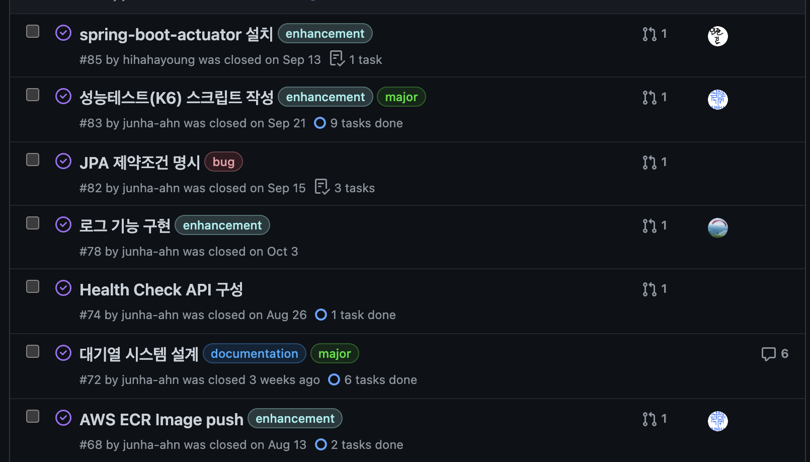
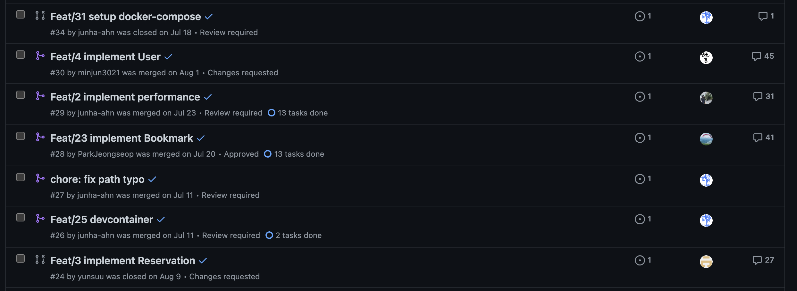
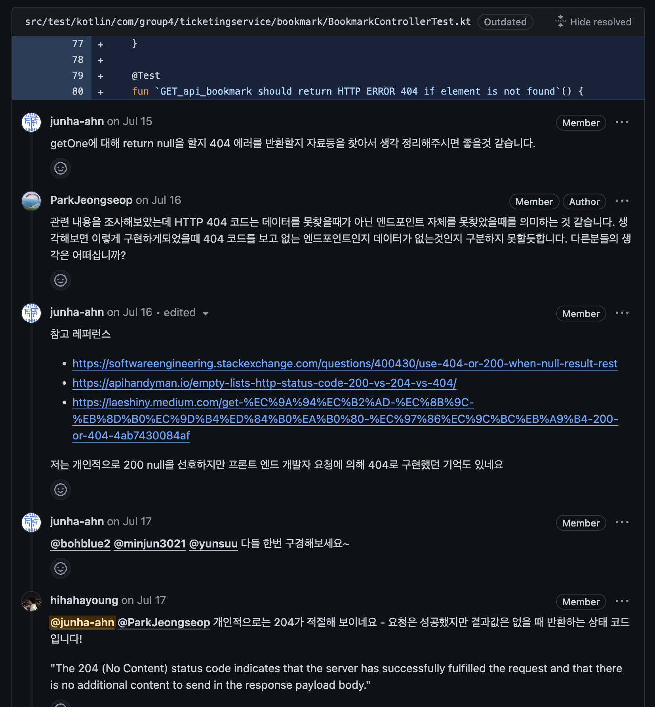
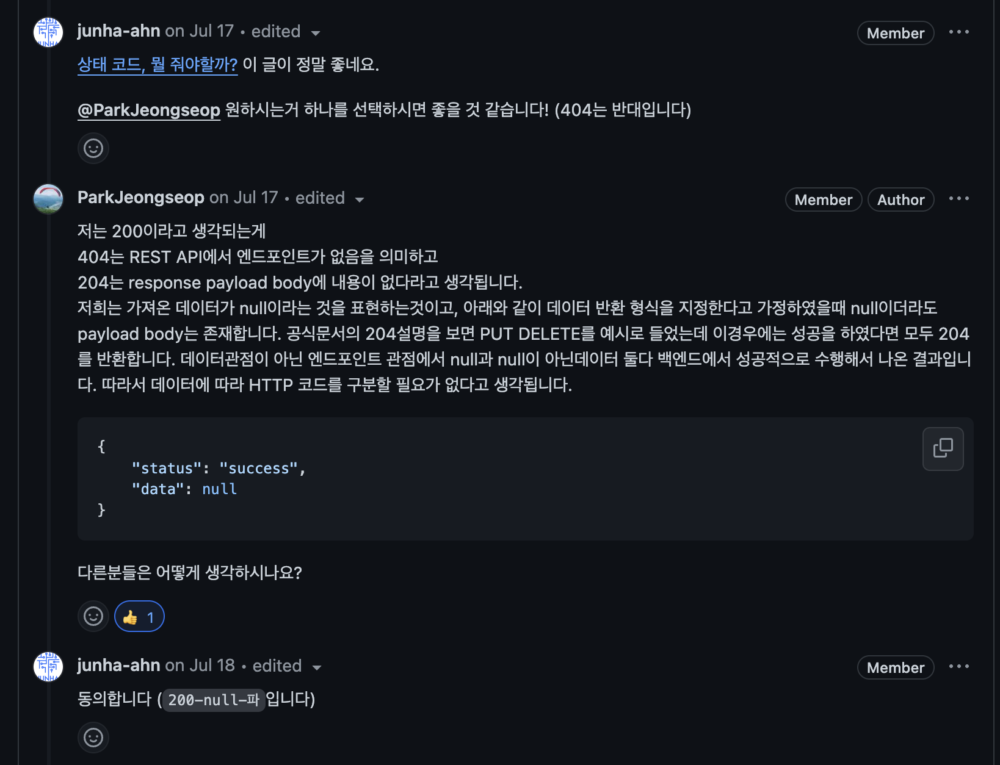
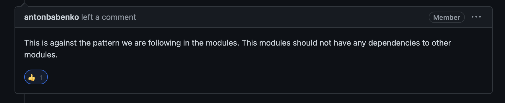
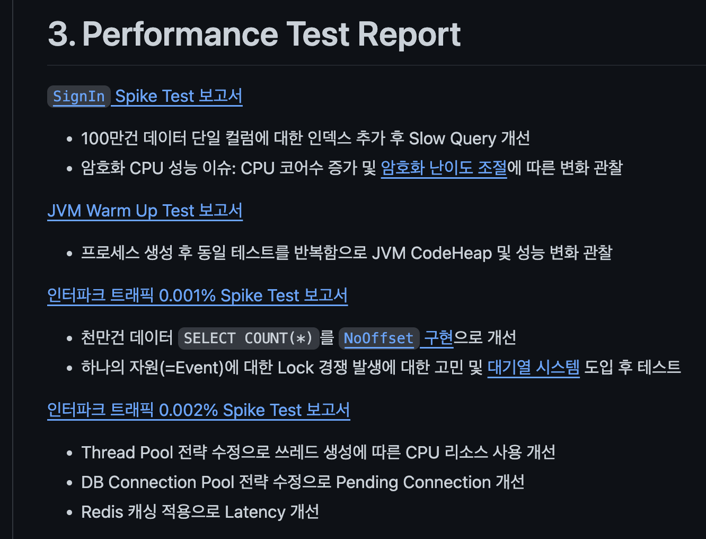

[초특급 개발 부트캠프 입소식](/essay/f-lab-clone-start) 글에서 당차게 시작했던 우당탕탕 부트캠프가 끝났다. 

'대규모 트래픽', '초특급', '3개월' 무엇도 아니였지만... 어쨌든 끝냈다!

> [프로젝트 README.md](https://github.com/f-lab-clone/ticketing-backend)

## 어떻게 진행했는가?

사실 시작글에서도 언급했지만 전원 현역 군인이자 같은 생활관에서 생활하는 소프트웨어 개발병이기 때문에, 매일 매일 같은 방에서 이야기 하고 사지방으로 가서 열심히 작업했다.

주말을 회의 날짜로 잡고 가장 기본적인 [브랜칭 모델](https://github.com/f-lab-clone/ticketing-backend/wiki/Convention#branch-strategy)을 따라 이슈를 관리하며 PR 리뷰도 하고, 매일 매일 개발 사이클을 이어나갔다.

 

## 기억에 남는 이슈

사실 가장 기억에 남는건 사지방의 열악함과 코드스페이스의 엄청난 능력이다. 
> 사지방이든 어디든 인터넷과 웹브라우저만 있다면 모든걸 가능하게 만드는 그저 빛...

 

- ELB 가격 이슈로 인해 Ingress도 모르고, Nginx도 모르고 아무것도 몰라서 몇일동안 고생한 [Nginx Baremetal 설치](https://github.com/f-lab-clone/ticketing-infra/issues/42)
- Desired State가 왜 중요한지 실감한 [Terrafrom Secret Manager](https://devkly.com/devops/terraform-secret-manager/)
- 인프라 오픈채팅방에서 질문하다 "요금계산부터 재대로해!"라고 혼나서 계산해본 [Spike Test 요금계산](https://github.com/f-lab-clone/ticketing-infra/issues/62) 
- 프로젝트 중 오픈소스 기여에 도전했지만 깔끔하게 실패한 경험도 기억에 남는다 
- 열심히 공부한 흔적들도 담아본다. 물런 일부분에 불과하다 

## 후기 

> 개인적으로 얻어갈 수 있는 가장 얕은 학습은 각 레이어의 ‘멋있는 툴/서비스’ 사용법 익히기라고 생각했다. 예를들어 당장 필요한 젠킨스의 사용법을 익히고 끝난다면 가장 얕은 학습이 아닐까 생각한다. - [목표 中](/essay/f-lab-clone-start) 

 

위에서도 언급했듯 실제로 '대규모 트래픽', '초특급', '3개월' 무엇도 아니였다. 실제로는 Terrafrom과 같은 몇몇 툴 사용법 익히기에 대부분의 시간을 투자했다.

 

한마디로 두 마리 토끼를 잡을려했다. 물런 여러명의 팀원이 있고, 포트폴리오 목적이 있기 때문에 코드에 집중하지 않을 수는 없었지만 그럼에도 무게중심을 잘못 잡은 것은 사실이다. '트래픽'등의 키워드에 집중한다면 아래와 같이 프로젝트를 진행하면 좋았을 것 같다.

> 배열에서 값 하나를 랜덤하게 돌려주는 Endpoint 만들고 EC2에 서버를 하나 실행시키고 점점 부하를 늘린다.

 

사이드 프로젝트에서 대규모 트래픽은 진짜 '대규모'를 의미하는게 아니라, 트래픽의 점진적 증가라고 생각한다. 하지만 아쉽게도 이번 프로젝트에서는 이러한 경험 사이클을 길게 이어나가지 못했다. 
> 길게 이어나가면 되는 것 아닌가 싶지만, 초반 부분에 힘이 좋을때 하는게 베스트였고, 프로젝트가 길어지면서 일정 이슈도 존재했다. (전역, 취업)

> [#3-performance-test-report](https://github.com/f-lab-clone/ticketing-backend#3-performance-test-report)

> 수치적으로 말하면 [테스트 목표](https://github.com/f-lab-clone/ticketing-infra/issues/62#issuecomment-1736618921)는 [인터파크 최고 트래픽](https://zdnet.co.kr/view/?no=20230915101820)의 `0.001%`였으나 실패했다! 

 

물런 경험을 쌓았기 때문에, 다음 도전은 보다 명확한 목표를 설정하고 도전할 수 있을 것이다.

## 마치며

시작할때 대충 머리 속으로 그리던 `엄청나게 멋진 뭔가가 있는 정상`에는 도달하지 못했지만 '부트캠프 클론코딩'이라는 재밌는 목표를 가진 군인들의 재밌는 프로젝트였다. 

군 생활 마지막 큰 2가지 목표 마라톤과 프동프동! 모두 끝!

> 아직 나는 팀 리딩을 할 사람이 아니다. 

> 열심히 노력한 팀원들 모두 고생하셨습니다 ^^7

> 프로젝트 [README.md](https://github.com/f-lab-clone/ticketing-backend)

> ㅂ2ㅂ2
