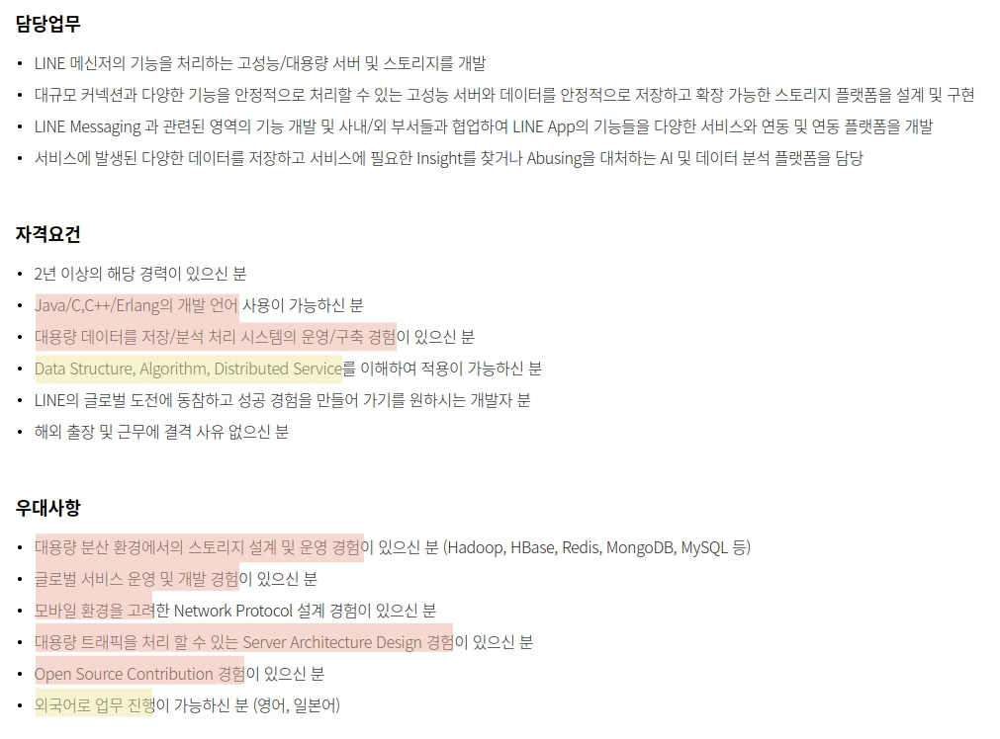
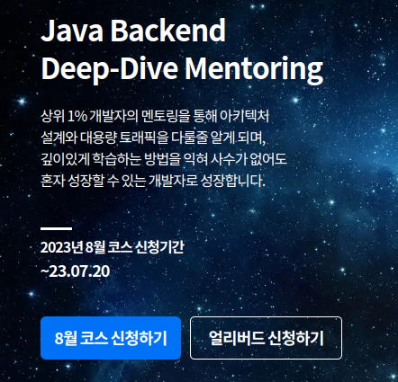
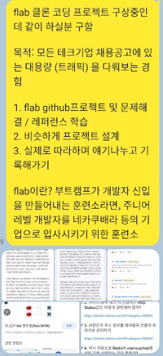
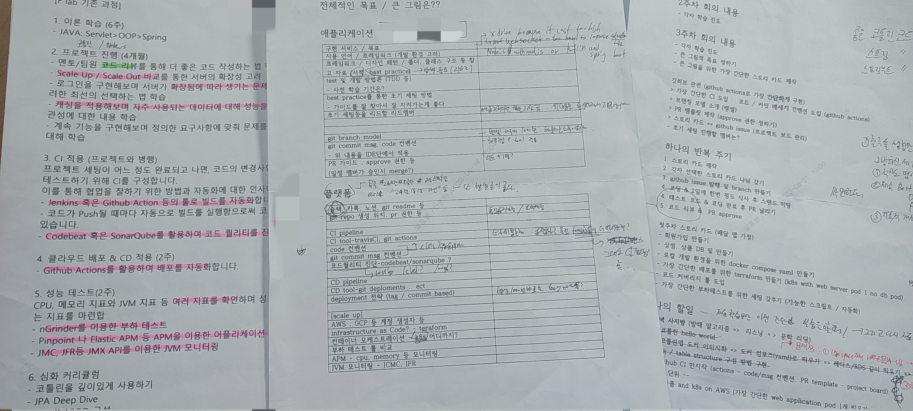

초특급 개발 부트캠프 '프동프동' 에 입소한걸 환영한다

> 진짜 부트캠프 아닙니다. 사이드 프로젝트입니다.

# 1. 발단

[당근마켓 백엔드 개발자 영입정보에 대한 C/C++ 개발자의 추측성 해설](https://youtu.be/-DI0mHOB5Qc)

위 영상을 시청하고 라인 채용공고를 출력해서 사무실에서 생각해봤다. 

- 라인을 선택한 이유는 나중에 일본 시부야에서 일하고 싶기 때문이다.
- 채용공고를 뽑아서 무슨 기술을 실제로 요구하는지 확인하는건 좋은 방법이라고 생각한다. 

 

내가 **부족하다고 생각하는 부분**을 칠했는데 흠...?

뭔가 대책이 필요하다고 생각했다. 

그러다가 갑자기 '대용량' 관련된 키워드로 Flab이 생각났다. 

> Flab 백엔드 과정 소개 - 한마디로 주니어 개발자를 네카쿠배라로 보내는 부트캠프

## 그렇다면 내가 직접 FLab의 과정을 따라해보면 어떨까?

항상 부트캠프나 국비지원을 다닐려고 하는 지인을 보면서 생각했던건 '저 커리큘럼을 온라인 강의를 통해서 직접 배운다면 더 좋지 않을까?' 그런데 나에게도 그런 **기회**가 찾아왔다. 
- 물런 처음배우는 사람의 입장에서 트레이드오프를 고민하면 결론은 '다니는게 안전하네...'

# 2. 목표

목표는 한마디로 "대규모 트래픽을 다뤄 보는 경험"

그 과정에서 어떤 멤버는 TDD를 훈련해볼 수도, CI/CD 툴을 사용해볼 수도, 특정 이슈를 해결해볼 수 도 있을 것이다. 사실 무엇을 얻어갈지는 모르겠다. 적어도 '이렇게 프로젝트 하면 안된다' 정도는?...

개인적으로 얻어갈 수 있는 **가장 얕은 학습**은 각 레이어의 '멋있는 툴/서비스' **사용법 익히기**라고 생각했다. 예를들어 당장 필요한 젠킨스의 사용법을 익히고 끝난다면 가장 얕은 학습이 아닐까 생각한다.

사실 그 이상으로 무엇을 얻어가야할지 정확히 목표로 설정하지는 못하겠다.  문제해결 능력? 이해력? 너무 추상적이다...

# 3. 멤버 구성기

> 생활관 톡방

> 홍보와 설명을 위해서 작성한 문서들

그렇게 멤버 모집에 들어갔고, 필자 포함 총 7명을 모았다. 

참고로 본인은 현역 군인이고 '소프트웨어 개발병'으로 생활관 인원 14명이 모두 개발자다(!) 

이것보다 더 좋은 개발 환경이 어딨을까?

사무실도 근무지도 모두 같기 때문에 24시간 같이 생활하는 사람들과 함께하는 3개월 **특별과정(?)**

**매일매일(주말포함) 미팅이 가능한 초특급 개발 부트캠프(?)에 입소한걸 환영한다**

# 4. 계획

위에서 언급했듯 "3개월 특별과정"이다. (2023.07 ~ 2023.09)

 

매주 아래와 같은 반복 주기를 진행한다

1. 구현가능한 가장 작은 기능 리스트 만들기
2. 원하는 기능 각자 선택하기 
3. 구현 & 저녁 식사 후 미팅

아마 7월 1,2주는 반복주기의 속도 체크 과정일 것 같다

 

그리고 7명을 개발팀과 인프라팀으로 나눠서 진행한다. 
- 인프라팀은 CI/CD, 부하테스트 구성 등에 집중

# 5. 마무리 멘트

참고로 나의 역할은 **함장**이다. (채찍 담당)

군대에서 몇가지를 도전중인데 내 마지막 도전 중 하나가 될 것 같다. (10월 전역)

참고로 또 다른 중요한 도전은 마라톤 20km이다. 이것도 생활관 사람 5~6명과 마라톤 동아리를 만들어서 진행중이다. 매주 3번 3개월동안 훈련을 진행한다. 여기서도 함장을 역임하고 있다. (달리기를 너무 사랑해서 마동마동이 1순위다)

나중에 군생활 후기에 마동마동(=마라톤동아리 두번 외치기)와 프동프동(= Flab 동아리 2번 외치기) 모두 성공했다고 말하고 싶다!

# 참고 
- [ticketing-backend](https://github.com/f-lab-clone/ticketing-backend/blob/main/README.md)
- [우당탕탕 개발 부트캠프 수료식](/essay/f-lab-clone-end) 
