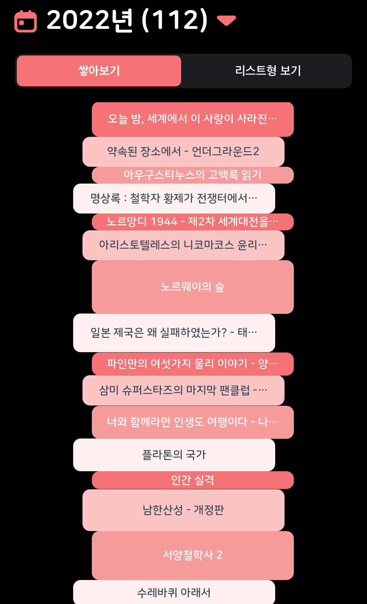
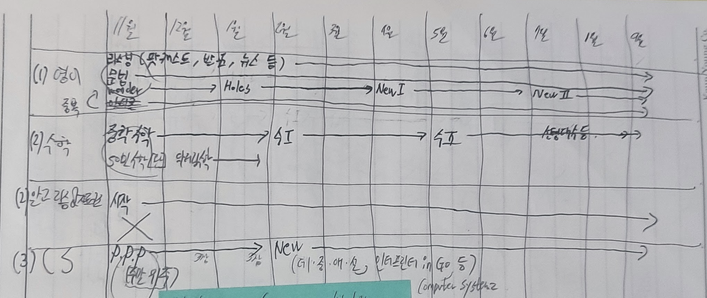
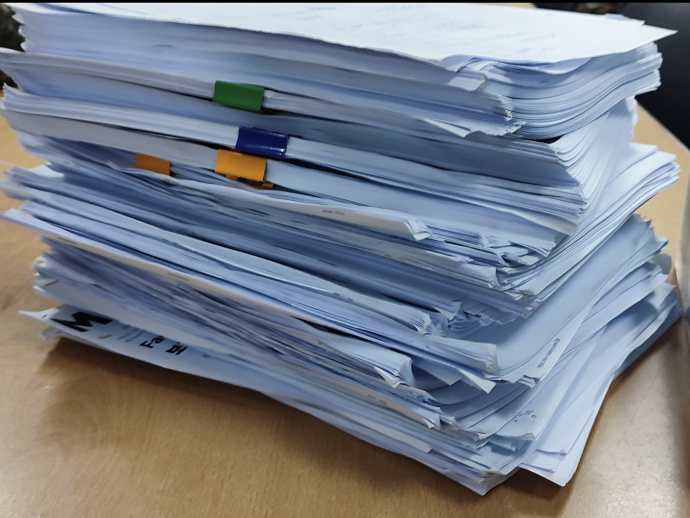
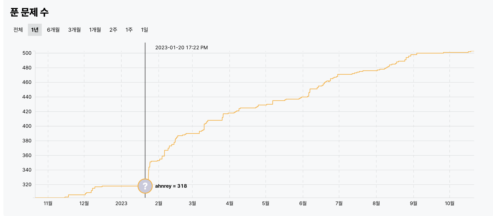
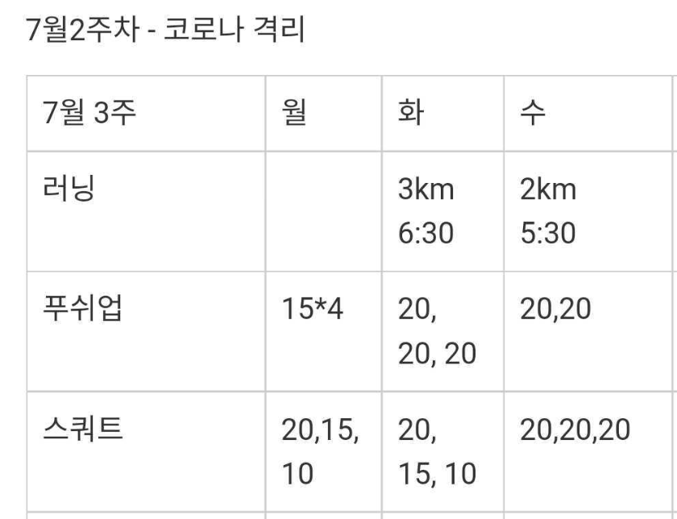
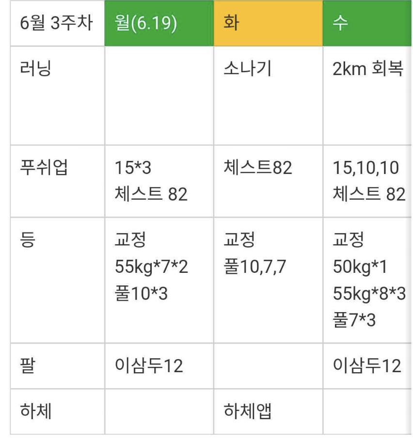
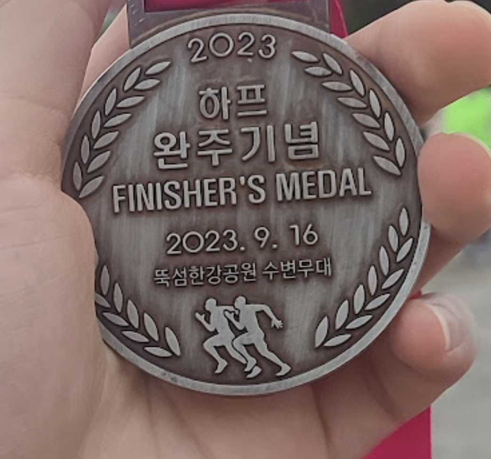
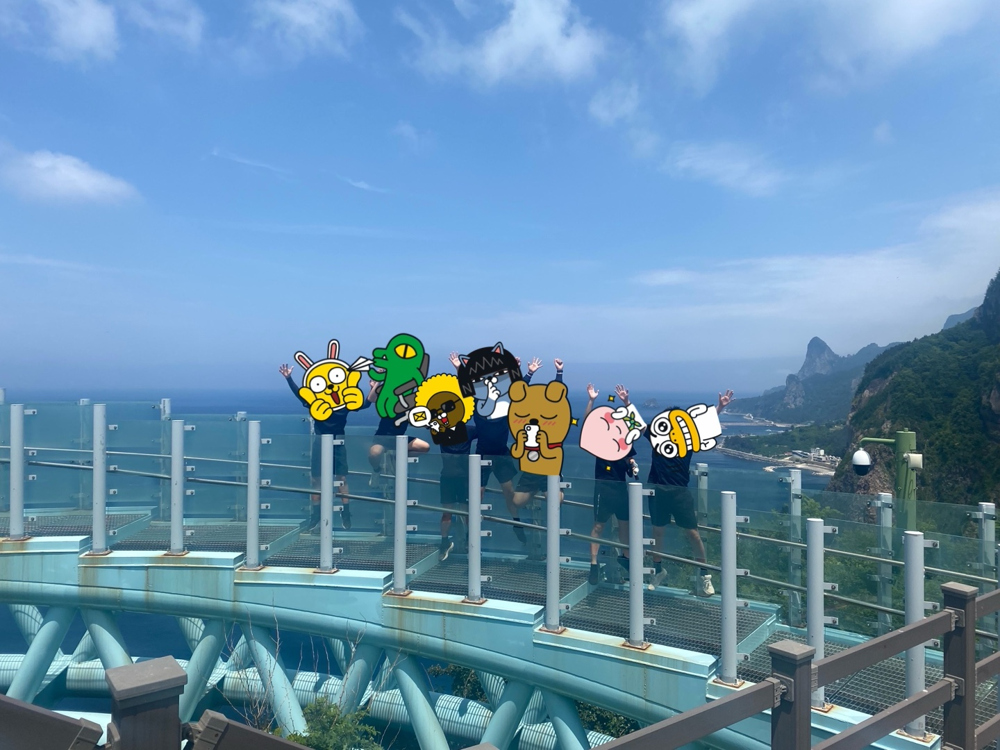
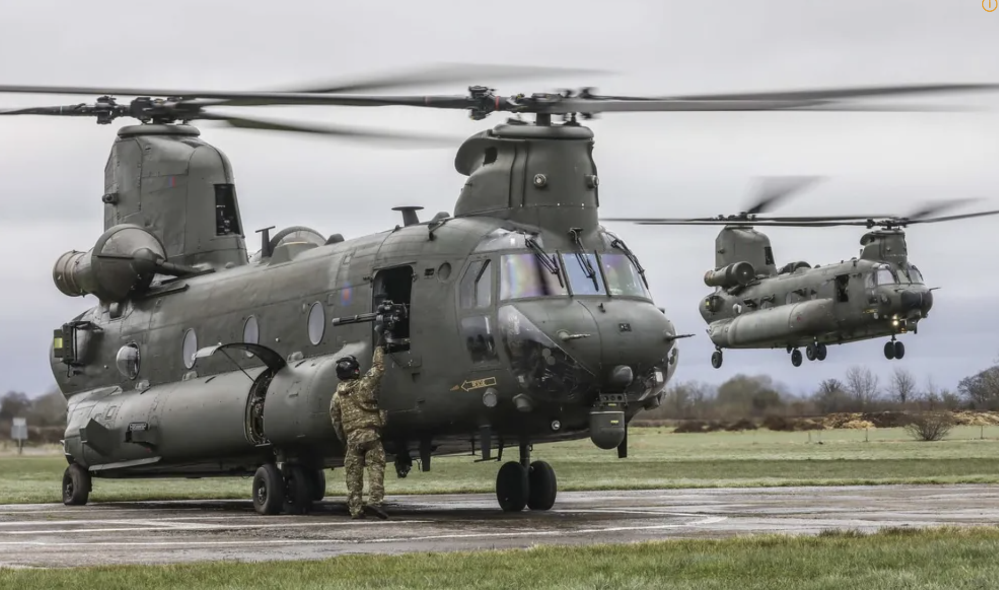

블로그 주인장 1년 8개월간(22.02.14 ~ 23.10.13)의 해군 소프트웨어 개발병 생활을 마치고 **전역**했습니다.

사실 후기라고해서 뭐 특별한건 없고 무엇을 했는지, 어떤 사람과 어떤 환경이였는지, 마지막 감상정도 써보겠습니다.

> 전역 1주일정도 지난 오늘 글 작성해봅니다.

> 해군 소프트웨어개발병 후기

> 해군 SW개발병 후기

## 무엇을 했는가?

### #독서

2월 ~ 4월 훈련소와 후반기 교육을 마치고, 4월부터 10월까지 정말 6개월동안 **책만 읽었습니다**. 정말 행복한 순간이였고 평생 책을 꾸준히 읽어왔지만 이렇게 많이 읽어본 경험은 처음이였습니다.

> 놀라운건 생활관에 (인생 최대 갱신중인) 본인보다 많이 읽는 사람이 있었다는 것... 이xx 수병님

> 23년은 한달 평균 3권을 읽었으니, 입대 이전 읽던 수준으로 다시 돌아왔습니다.

### #공부

그렇게 책만 읽다가 10월 부터는 공부를 하기 시작했습니다.

계획을 세우고 중학교 수학부터 고등학교까지 (쉬운)수학을 공부해보거나, 영어 공부 목적으로 기술서적을 원서로 읽어보거나... 여하튼 이때 세운 계획을 23년 7월까지 지켰습니다. (그 이후에는 '프동프동'이라는걸 시작해버려서...)
> X 쳐놓은 알고리즘은 미루다 미루다 23년 2월에서야 시작

 

위 그림은 계획 중 CS부분에 `P.P.P` 라고 나와있는 [Nand2Tetris (후기)](/book/the-elements-of-computing-systems-2nd/) 프로젝트의 CPU 다이어그램입니다. 말그대로 Nand 게이트부터 Tetris게임까지 만들어보는 야심찬 프로젝트로 생활관 사람과 같이 몇달간 주말 하루씩 써가면서 정말 재밌게 즐겼습니다.

### #프동프동

[초특급 개발 부트캠프 입소식](/essay/f-lab-clone-start/)에서도 확인 가능하지만 "성능테스트"를 목적으로 23년 7월에 시작하게 되서 현재까지도 진행중입니다. 

> 프동프동을 위해 읽은 자료들 중 일부입니다. 

> 사지방에서 <공식문서 전체, 한/영 아티클> 인쇄해서 다음날 사무실에서 읽고 공부하고, 다시 저녁에 사지방에서 코딩하는 루틴을 가졌습니다. (글 작성일 기준) 어제도 새벽 1시까지 코딩했습니다

프동프동은 아직 끝나지 않았기 때문에 여기서 마치겠습니다

> 사실 성능 테스트가 주목적인데, 지난 3달간 성능 테스트를 하기 위한 환경을 구축해버렸습니다. (11월이면 회사에 입사하는데...!)

 

> [추가] 이제 끝나서 링크 남깁니다. [우당탕탕 개발 부트캠프 수료식](/essay/f-lab-clone-end) 

### #알고리즘

미루다 미루다 계획보다는 늦게 시작했지만 열심히 풀었습니다

군생활 중 약 200문제를 풀었고 목표했던 [solved.ac](https://solved.ac/) 기준 플레5티어에는 아직 도달하지 못했지만 현재 골드1이니 눈앞이라고 할 수 있습니다!

> 물런 7월 이후에도 계획대로 알고리즘을 풀었다면 목표에 도달했지만 프동프동이라는 재밌는 프로젝트를...

### #운동

태어나서 한번도 재대로 운동을 한 경험이 없었는데 군대에서 처음으로 운동을 시작해봤습니다. (중학교 1학년때 방과후로 농구를 했던게 유일한 경험)

22년 7월 운동을 시작

약 1년 뒤인 23년 6월 운동 기록

> 7월부터 9월까지는 허리통증이 있어서 MRI를 2번 찍고 휴식기를 가졌습니다.

지금도 학교 운동장에 가서 턱걸이하고, 뛰고 있습니다. (아마 회사 입사한다면 헬스장을 다닐듯합니다)

참고로 턱걸이 15개를 해내서, 휴가를 2일 받았습니다. (뿌듯)

### #달리기

가장 자랑스럽게 생각하는 도전은 하프마라톤이였고 부상없이 완주했습니다. 

군대에 오기전에는 몰랐는데, 사실 저는 달리기를 좋아했습니다(?). 조짐은 있었는데 이걸 군대에서 깨달았습니다. (군생활 중 약 700km를 뛰었습니다) 23년 6월 30일 [초특급 개발 부트캠프 입소식](/essay/f-lab-clone-start/)에서도 아래와 같이 말했었습니다.

> 참고로 또 다른 중요한 도전은 마라톤 20km이다. 이것도 생활관 사람 5~6명과 마라톤 동아리를 만들어서 진행중이다. 매주 3번 3개월동안 훈련을 진행한다. 여기서도 함장을 역임하고 있다. (달리기를 너무 사랑해서 마동마동이 1순위다)

> 나중에 군생활 후기에 마동마동(=마라톤동아리 두번 외치기)와 프동프동(= Flab 동아리 2번 외치기) 모두 성공했다고 말하고 싶다!

7~9월 휴식기를 가져서 못뛰나 걱정했는데 1년간 뛰어오던게 있어서 그런지 부상없이 완주했습니다! **너무 뿌듯합니다**

### #울릉도

번외로 여행을 올려봅니다.

군생활 중 생활관 사람 7명과 함께 울릉도로 여행갔습니다. 

놀랍게도 [국군수송정보체계](https://www.dtis.mil.kr/dtis/)를 통해 무료로 울릉도로 들어갔습니다. 이 글을 보는 국군장병 여러분은 꼭 이용해보십시요.

> [치누크 헬기](https://namu.wiki/w/CH-47)를 통해 울릉도로 여행가는 경험은 정말 특별하다

특별한 에피소드가 많았지만, 한마디로 울릉도는 너무 아름답고, 너무나 재밌었습니다.

### 요약

그래서 20개월 동안 무엇을 했는가? 2개월은 훈련소! 6개월은 독서! 10개월은 공부! 2개월은 프동프동! 꾸준히 운동하고!

## 어떤 환경이였는가?

사실 이건 그냥 혹시 입대를 위해 검색해서 들어올 사람들을 위한 짧은 정보정도일것 같습니다.

자세한 내용을 여기에 담는건 아닐것 같고, 이미 읽어왔겠지만 정말 최고의 환경이라고 생각합니다. 일단 절대 배 안탑니다. 그리고 개발환경이 어떻고 이런건 어차피 계속 변하기 때문에 (대체로 최신은 아닐겁니다) 더 말씀드리고 싶은건, "정말 좋은 사람들과 함께 군생활 할 수 있다"라는 것 입니다.

물런 사람도 변하기에 보장은 못하지만, 소프트웨어 개발병들끼리 모아서 생활관을 만들었고 모두 관심사도, 성향도 비슷비슷합니다. (~~생활관에 사람이 너무 많아요~~) [Nand2Tetris](/book/the-elements-of-computing-systems-2nd/)나 [프동프동](/essay/f-lab-clone-start/)도 생활관 사람들과 같이 했습니다.

> 역시나 다들 개발자라서 그런지 '축구'하는 사람이 군생활동안 2명 있었습니다.

> 물런 나와 아예 다른 환경을 가진 사람을 만나 생활하는게 더 우선순위에 있다면 모르겠습니다

> 참고로 저는 Worst Case에 가깝습니다

## 마무리

사실 모든 전역자가 시원섭섭한 감정을 느낀다고는 하는데 저는 시원함이 없고, 섭섭함만 남은것 같습니다.

특히 입대전 3년간 회사생활을 끝내고 입대해서 그런지, 군대는 방학과 같았고 특히 6개월간 책을 읽을때는 더더욱 그랬습니다. 

> 물런 1년정도지나니까 내보내줘 라는 마음이 점점...

전역할때 인생의 마지막 방학이 끝났다라고 생각했지만 그것때문에 서운하고 섭섭했던건 아니였고 아마도 인생에 언제 이런 사람들과 한 곳에 ~~강제로~~ 모여서 이렇게 즐겁게 생활해보겠냐는 생각 또 돌아갈 수 없다는 생각 때문에 그런게 아닐까 싶습니다.

[Goodbye World, See you soon](/essay/goodbye-world)를 쓸때만 해도 군대라는 곳에서 엄청난 정신적 성장을 겪고 전역할거라고 생각했는데, 그런건 없었네요. (오히려 더 고등학생같아졌습니다)

정말 재밌었고 진심으로 30대에 다시 6개월간 소프트웨어 개발병으로 생활하고 싶습니다 (이 조건은 **AND 조건**입니다 모두 맞아야 다시 돌아갑니다)

해상병 681기 필승! 해군 소프트웨어개발병 필승!

## 다른 해군 SW개발병 후기

- [Paco Kwon](https://www.pacokwon.org/posts/20230415-after-navy-software-developer)
- [enKODING](https://enkoding.tistory.com/entry/%ED%95%B4%EA%B5%B0%EB%B3%91-682%EA%B8%B0-SW-%EA%B0%9C%EB%B0%9C%EB%B3%91-%EB%B3%B5%EB%AC%B4-%ED%9B%84%EA%B8%B0)
- [Jeongseop Park](https://www.linkedin.com/feed/update/urn:li:activity:7146501066002415616/)
