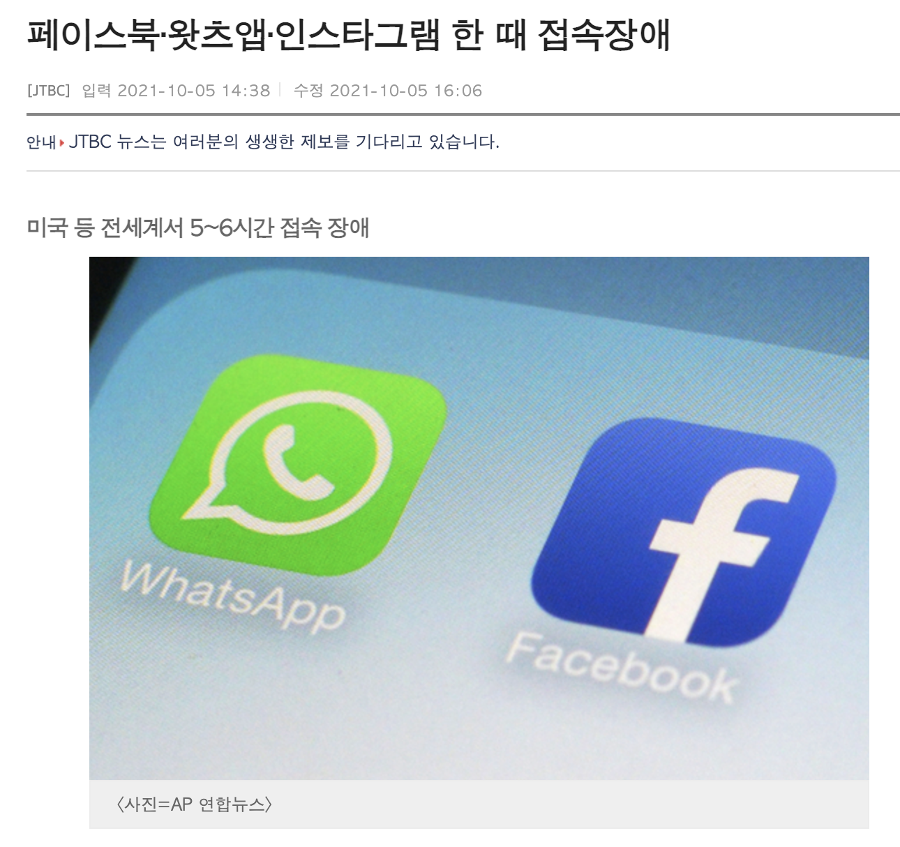
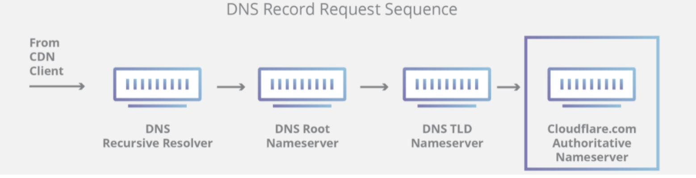
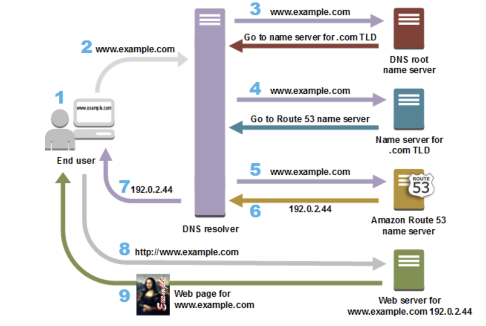
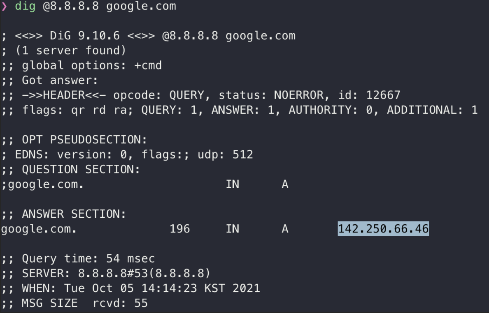
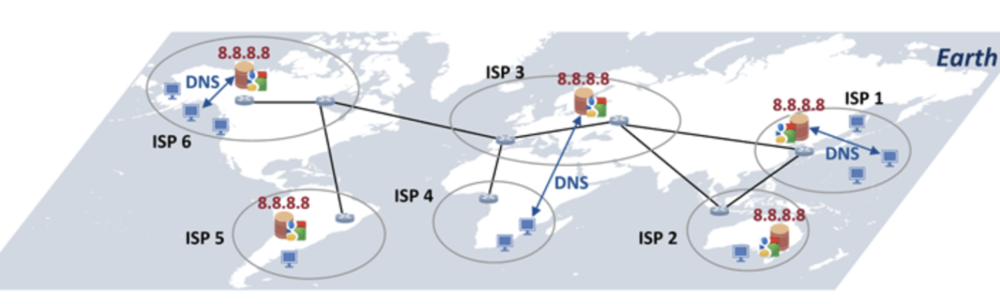
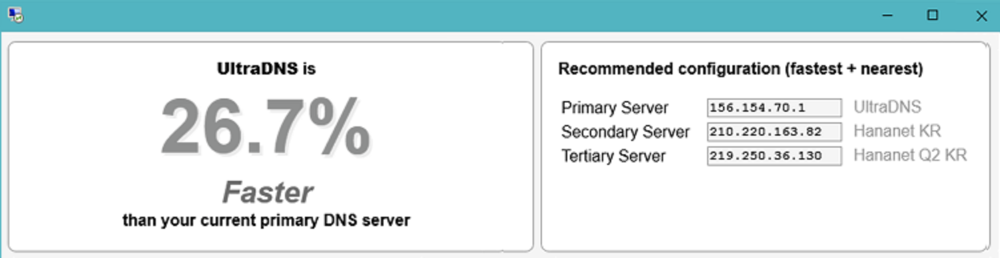
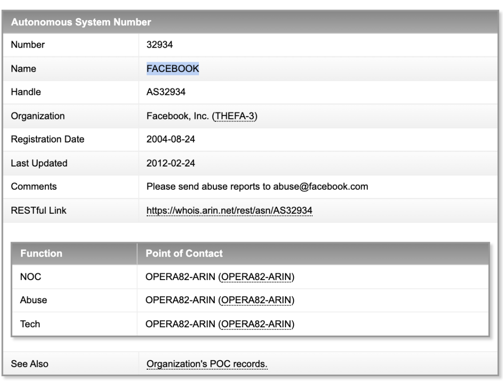

> [페이스북, 왓츠앱, 인스타그램 한 때 접속장애](https://news.jtbc.joins.com/article/article.aspx?news_id=NB12025822)
 
# 요약

1. 인터넷은 다양한 네트워크들로 구성된 네트워크들이다. 이러한 네트워크들의 라우터는 지속적으로 route를 교환하고 업데이트한다.
2. "설정 변경 실수"로 페이스북 네트워크는 다른 네트워크에게 BGP advertizing(경로 알리기)을 중단했다.
3. 이제 Facebook 네트워크에 속한 모든 IP 주소를 라우팅할 수 없게 되었다.

<br/>

즉 6시간 동안 페이스북 네트워크가 인터넷 세상에서 단절되어 사라졌습니다.

<br/>

이 글은 위 사건에 대해 학습하는 과정에서 얻은 지식을 총 정리하는 글입니다.
- 빠르게 결론을 파악하고 싶다면 `3. AS와 BGP` 파트를 추천합니다
- [What really caused the 2021 facebook outage (summary)](https://youtu.be/PsLNQaY5SqE)도 추천(3분20초 요약영상)

# 목차

1. DNS
2. 라우터
3. AS(Autonomous System)와 BGP(Border Gateway Protocol)
4. 사건 분석
5. 결론

# 파트1. DNS

> DNS는 인터넷에서 사용되는 주소 체계로 .com 또는 .net과 같은 특정 최상위 도메인(TLD)의 모든 도메인 네임 및 해당하는 IP주소, 및 관련 값들을 저장, 관리하는 분산 형 데이터베이스 또는 그에 해당하는 기능을 갖는 물리적인 서버 장치를 지칭합니다 - [CODNS - DNS란 무엇입니까?](http://www.codns.com/b/B05-162)

<br/>

간단히 말하면 DNS는 우리가 브라우저에 주소를 입력하면 실제 IP 주소를 응답하는 서버.
- 즉 `www.naver.com`(요청) 에 대한 응답으로 `125.209.222.141` 를 반환

<br/>


> [Cloudflare - What is DNS?](https://www.cloudflare.com/learning/dns/what-is-dns)

위는 실제 DNS 쿼리 요청 흐름을 간략화한 이미지이다. 

위 이미지 속 4개의 DNS 서비스 유형에 대한 설명을 첨부한다.

**Recursive Resolver**
- 대개 클라이언트는 `Authoritative Nameserver`에 직접 쿼리를 수행하지 않는다.
- 대신 `Recursive Resolver`에 먼저 질의하는 경우가 일반적.
- 실제 정보를 소유하고 있지 않지만 클라이언트를 대신해서 DNS 정보를 가져올 수 있는 중간자 역할.
- 보통 ISP가 제공하는 서버를 사용하나, `8.8.8.8` 등 직접 선택 가능하다.

**Root Nameserver**
- 13개의 루트 네임서버는 모든  `Recursive Resolver`에 알려져 있으며 이들은 `Recursive Resolver`가 DNS 레코드를 요청하는 과정의 첫 단계.
- 루트 네임서버는 도메인 이름을 포함한 `Recursive Resolver`의 쿼리에 대해, 해당 도메인의 확장자(.com,. net, .org, etc.)에 따라 TLD 네임서버 정보를 포함해 응답.

**TLD Nameserver**
- TLD 네임서버는 .com, .net 등 도메인 확장자를 공유하는 모든 도메인 이름의 정보를 유지.
- .com TLD 네임서버는 `.com`으로 끝나는 모든 웹사이트의 정보를 갖고 있다.

**Authoritiative Nameserver**
- Authoritative DNS는 도메인에 대해 **최종 권한**이 있다.
- `Recursive Resolver`에 IP 주소 정보가 담긴 답을 제공할 책임이 있다.

### DNS 쿼리 과정



> [AWS - What is DNS?](https://aws.amazon.com/route53/what-is-dns/?nc1=h_ls)
> 캐싱 등의 과정이 제외 후, 간략화된 이미지


(2) 사용자가 `www.google.com`을 검색하는 경우

(3) `Recursive Resolver`는 루트 네임서버로부터 응답을 받는다 (캐싱)

(4) TLD 네임서버는 해당 도메인의 `Authoritative Nameserver`에 대한 정보를 응답

(6) `Authoritative Nameserver`는 최종 결과로 IP를 응답

(8) (브라우저에 캐싱하고) 알아낸 IP를 이용하여 직접 요청

<br/>

### 사건 당시 facebook.com을 DNS에 요청해보자



구글이 운영하는 `8.8.8.8 DNS`에 쿼리를 요청하고 **정상 응답**을 받은 것이 확인된다.

참고로 명령어 해석은 아래와 같다.
```
> dig @dns-server dmain
```


위 캡쳐는 사건 당시, facebook.com에 대해 쿼리를 날린 결과. 
- `ANSWER: 0` 를 확인 가능하다.

<br/>

### 더 알아보면 재밌는 것들

<br/>

**1. 어째서 전세계 어디에서든 `8.8.8.8` DNS를 빠르게 이용 가능할까?**


> 각 대륙별로 8.8.8.8 주소를 가지는 Google DNS 서버를 위치시키십니다. 
> [Google DNS 소개](https://www.netmanias.com/ko/post/blog/5357/dns-google-network-protocol/google-dns)


댓글에도 나와있지만, DNS를 운용하면 어떠한 장점(수익, 데이터 분석 등)이 있는지 궁금하다.

<br/>

**2. 과연 어떤 DNS를 써야 가장 빠르게 이용 가능할까?**


> [내게 맞는 최적의 DNS 서버주소찾기](http://www.codns.com/b/B05-175)

DNS는 IP주소를 받아오는 역할을 할 뿐이다. 실제 인터넷 속도를 증가시키지 않는다.

따라서 일반적으로 인터넷을 설치하면 설정되는 통신사 DNS를 사용해도 무관하다.
- 다만 원하는 경우 최적의 DNS를 설정 후 사용 가능하다.
- [내 인터넷에 맞는 DNS를 결정하는 방법](https://hi098123.tistory.com/417) 등의 글도 존재한다.


# 파트2. 라우터 

라우터는 이름처럼 경로를 지정해주는 역할을 한다 (3계층에서 동작하는 장비)
- 라우터에 들어오는 패킷의 "목적지 IP 주소"를 확인하고 자신이 가진 "경로 정보"를 이용해 포워딩한다.

### 1. 경로 지정 

다양한 방법으로 경로 수집 후, `라우팅 테이블`에 저장한다. 그 후 최적 경로로 패킷을 보낸다.

경로 수집 방법은 아래와 같다.
1. 다이렉트 커넥티드 (인접 네트워크 정보를 얻는 방법)
2. 스태틱 라우팅 (관리자가 직접 입력하는 방법)
3. **다이나믹 라우팅** (서로 경로를 자동 교환하는 방법)

> 특히 다이나믹 라우팅에 대해서는 아래에서, 자세히 살펴보겠다.


### 2. 브로드캐스트 컨트롤 

패킷의 목적지 주소가 **라우팅 테이블에 없으면 패킷을 버린다.**
- 만약 불분명한 패킷을 플러딩하면 인터넷은 쓸모 없는 패킷으로 가득차 통신 불가능 상태가 될 수 있다.(물런 TTL 개념 존재)

### 3. 프로토콜 변환

- 라우터의 또 다른 역할은 서로 다른 프로토콜로 구성된 네트워크를 연결하는 것
- 현재는 이더넷으로 수렴되어 이 역할이 줄었다.

그럼에도 과거나 현재도 LAN에서 사용하는 프로토콜과 WAN에서 사용하는 프로토콜이 전혀 다른 완전히 구분된 공간
- LAN은 다수 컴퓨터가 함께 통신하는 것에 초점, WAN은 원거리 통신에 중점

## Hop-by-Hop


> [IT엔지니어를 위한 네트워크 입문 요약](https://catsbi.oopy.io/225439bd-ec84-4e16-aeca-0dfcb9954ea6)

> 다양한 장비를 거쳐 목적지까지 도달하는 것을 이해하자

위 이미지에서 보이듯, 출발점에서 목적지 단말까지 모든 경로를 한번에 이동하지 않는다.
- 또한 각각의 라우터는 패킷이 목적지까지 가는 전체 경로를 파악하지 않고, 최적의 넥스트 홉으로 보낸다.
- 참고로 위 홉을 하나 지날때마다 TTL 값이 1씩 감소된다.


## 다이나믹 라우팅

이제 위에서 살펴봤던, 경로 수집 방식 중 '다이나믹 라우팅'에 대해 설명하겠다.

<br/>

다이나믹 라우팅은 라우터끼리 자신이 알고 있는 경로 정보를 교환해 전체 네트워크 정보를 학습하는 경로 수집 방법이다.

- **주기적으로 라우터끼리 경로 정보가 교환된다.**
- 즉 하나의 경로가 장애가 생겨도 이 상황을 인지해 대체 경로로 패킷을 포워딩할 수 있게 된다. 
- 대부분의 네트워크에서 다이나믹 라우팅이 사용된다.

<br/>


- **다이나믹 라우팅에선 자신이 존재한다고 알려줄(`Announce`) 네트워크를 선언해줘야 한다.**

<br/>

라우터끼리 정보를 교환해 경로 정보를 최신으로 유지할 수 있는, 다이나믹 라우터는 다양한 프로토콜이 존재한다.
- 최근에는 OSPF와 `BGP 프로토콜`이 주로 사용된다.

# 파트3. AS와 BGP

### Autonomous System?

인터넷을 "네트워크의 네트워크"라고 한다. 
- 인터넷에서는 개별 네트워크로 구성된 그룹이 다른 대규모 조직에 의해 관리되는 다른 네트워크 그룹과 연결된다. 

<br/>

이와 같은 하나의 네트워크 그룹을 자율 시스템(Autonomous System, AS)이라고 한다.
- 즉 인터넷은 이러한 AS들의 네트워크이다

<br/>

SKT, KT, LGU+같은 ISP(Internet Service Provider)가 한 개 이상의 AS를 운영.

### BGP?

BGP는 다른 AS 라우터간 **최신 라우팅 정보를 교환**하는 데 사용되는 EGP(External Gateway Protocol)
- 쉽게 말해, 서로 다른 AS들끼리 "내가 가진 네트워크 대역은 ...이야"
- 또한 자동으로 이루어지는 `Dynamic Routing Protocol`

<br/>

다시 말해, AS들이 서로 라우팅 경로를 주고 받는 프로토콜이 바로 `BGP`
- AS내부에서 사용하는 라우팅 프로토콜을 IGP(Interior Gateway Protocol)
- AS간 통신에 사용하는 라우팅 프로토콜을 EGP(Exterior Gateway Protocol)
- **라우터는 이렇게 교환한 라우팅 정보를 이용해 패킷을 포워딩한다.**


<br/>


> [IT엔지니어를 위한 네트워크 입문 요약](https://catsbi.oopy.io/225439bd-ec84-4e16-aeca-0dfcb9954ea6)

<br/>

두개의 AS가 BGP에 의해 "라우팅 경로"를 교환하는 모습을 추상화한 이미지
- 하나의 AS안에서는 IGP가 라우팅 경로 교환에 프로토콜로 사용되는 것을 알 수 있다. (`IS-IS` 등)

<br/>

> 참고로 AS는 서로 다른 사업자이고, 무작정 통신을 허용해서는 안된다. 인터넷 사업자 간에도 통신 비용을 지불해야 한다.


# 파트4. 사건 분석

결국 사건은 네트워크 라우팅의 문제였다.

대부분의 기업은 이러한 문제를 경험할 일이 없지만, 페이스북 등 대규모 데이터센터를 운영하는 기업의 경우 직업 AS로써 인터넷 네트워크에 참여한다.
- 즉 페이스북은 ISP를 통하지 않고 직접 인터넷에 연결하고, 직접 관리


> [whois.arin.net](https://whois.arin.net/rest/asn/AS32934/pft?s=as32934)

<br/>

AS들의 라우터는 라우팅 테이블은 BGP 프로토콜에 의해 갱신, 유지된다. 

1. 페이스북 AS는 특정 IP prefix가 자신에게 속한다고 지속적으로 주변 노드에게 `Announce` 해야 한다.(`BGP advertisement`)
2. 하지만 "어떠한 이유"로 이러한 `Announce`를 중단
3. 따라서 AS 네트워크에서 사라졌다 (BGP Down)

```
Due to Facebook stopping announcing their DNS prefix routes through BGP
DNS resolvers had no way to connect to their nameservers.
```

다시말해, 페이스북은 인터넷이라는 세상 속에서 단절되어, 사라지게 된 것이다.

```
Facebook and its sites had effectively disconnected themselves from the Internet.

As a direct consequence of this, 
DNS resolvers all over the world stopped resolving their domain names.
```

<br/>

그 후, 다시 `BGP Announce` 를 시작하고 연결이 재개 되었다. (BGP Up)
- 물리적인 통신선이 절단된 것은 아님으로 다시 `Announce` 후 인터넷에 참여
- 이때부터, 다른 AS 라우터의 라우팅 테이블에 페이스북이 포함된다. 
- 즉 트래픽을 주고 받을 수 있게 된다.

<br/>

### 만약 누군가(DNS) facebook.com IP 주소를 기억하고 있었다면 접속이 가능했을까? 

결론은 아니다. 
- 이 사건은 페이스북 네트워크로 가는 route(경로)가 사라진 것이다.
- 사라진건 페이스북의 Authoritative Nameserver만이 아니다.

<br/>

### 페이스북 내부에 어떠한 사건이 있었을까?

> configuration changes on the backbone routers that coordinate network traffic between our data centers caused issues that interrupted this communication. 


> 더 자세한 정보는 [Facebook: More details about outage](https://engineering.fb.com/2021/10/05/networking-traffic/outage-details/)

<br/>

한마디로 정리하면 "설정 변경을 잘못 했다" 

1. 글로벌 백본(?) 가용성을 평가하기 위한 명령이 오동작
2. 글로벌 데이터센터와 지역 데이터센터와의 연결을 끊음
3. 안정적 운영을 위해서 지역 DC의 DNS는, 상위 글로벌 DC와 연결이 안될 경우 다른 ISP로 `BGP Announce` 중단
4. 3번 이유로 DNS 서버는 여전히 동작 중이나, 인터넷에서 Facebook이 사라짐

> 참고로 3번에서 언급하는 DNS는 페이스북의 지역 Authoritative NS라고 추측.

<br/>

### 왜 복구에 오래걸렸나?

1. 네트워크가 다운되어 정상적인 수단을 통해 DC에 엑세스 불가
2. 전체 네트워크의 실종으로 모든 내부 툴의 사용 불가 
3. 엔지니어가 데이터센터로 갔으나, 물리적/시스템 보안등으로 지연

# 파트5. 결론


> 인터넷이 수백만 개의 시스템과 프로토콜이 함께 작동하는 매우 복잡하고 상호의존적인 시스템이라는 것을 상기시킨다. 기업 간의 신뢰, 표준화 및 협력이 전 세계 50억 명에 가까운 유저를 위해 작동되도록 한다.
> [Cloudflare](https://blog.cloudflare.com/october-2021-facebook-outage/?fbclid=IwAR0woPKgVDYbxcuw0z1hI2YoBiFi24WFG84CbUSM9IRpO_mtlIY9M_9sJa4)


<br/>

하나의 사건을 중심으로, 아래와 같이 학습했습니다.
1. 이해안되는 부분 검색 
2. 검색 내용 학습
3. 다시 1번 반복

<br/>

아무래도 글의 흐름이 중구난방한 부분이 느껴지실 것 같습니다.
- 학습 내용을 정리하다보니, 이 부분은 양해 부탁드립니다 (_ _)
- 몇일동안 밤새 학습한 내용을 담았습니다!

<br/>

참고로 이 글을 작성 한 이유 KT 네트워크 장애 사건(2021.10.25)이 발생했습니다.
- 이 사건 또한 "라우터간의 통신" 이슈였습니다. (BGP가 아니라 내부 네트워크 프로토콜인 IGP에 의해)
- [과기부 KT 네트워크 장애 분석 보도자료](https://www.msit.go.kr/bbs/view.do?sCode=user&mId=113&mPid=112&pageIndex=&bbsSeqNo=94&nttSeqNo=3180886&searchOpt=ALL&searchTxt=)
- 매우 읽기 쉽게 잘 쓰여진 글입니다. (wow...)

<br/>

더 자세한 학습은 아래 참고 부분의 각 링크에서 가능합니다.

# 참고

DNS 파트
- [CODNS - DNS란 무엇입니까?](http://www.codns.com/b/B05-162)
- [Cloudflare - What is DNS?](https://www.cloudflare.com/learning/dns/what-is-dns)
- [AWS - What is DNS?](https://aws.amazon.com/route53/what-is-dns/?nc1=h_ls)

<br/>

라우터, AS, BGP 파트
- 길벗 <IT 엔지니어를 위한 네트워크 입문>
- ["인터넷이 지구 반대편을 연결하는 방법" BGP의 개념과 동작 원리](https://www.itworld.co.kr/t/62078/%EB%84%A4%ED%8A%B8%EC%9B%8C%ED%81%AC/181614)
- [과기부 KT 네트워크 장애 분석 보도자료](https://www.msit.go.kr/bbs/view.do?sCode=user&mId=113&mPid=112&pageIndex=&bbsSeqNo=94&nttSeqNo=3180886&searchOpt=ALL&searchTxt=)

<br/>

사건 분석 파트
- [Facebook: More details about outage](https://engineering.fb.com/2021/10/05/networking-traffic/outage-details/)
- [Cloudflare: Understanding How Facebook Disappeared from the Internet](https://blog.cloudflare.com/october-2021-facebook-outage/?fbclid=IwAR0woPKgVDYbxcuw0z1hI2YoBiFi24WFG84CbUSM9IRpO_mtlIY9M_9sJa4)
- [Youtube: BGP hijack Explained](https://youtu.be/9NBv7lKrG1A)
- [Facebook을 다운 시킨 원인, BGP hijaking](https://dataportal.kr/14?fbclid=IwAR2zI6PrBfSxMf2kKh1g9qoXZ3nSdBXbsHP_vqDyVYqhTqBbtr-i-lhBU2M)
- [선관위 접속장애에 대한 기술적 설명](https://www.hani.co.kr/arti/society/society_general/525718.html)
- [네트워크 전문가 따라잡기 카페: 페이스북 장애 업데이트 상세](https://cafe.naver.com/neteg?iframe_url_utf8=%2FArticleRead.nhn%253Fclubid%3D10344409%2526page%3D1%2526boardtype%3DL%2526articleid%3D237841%2526referrerAllArticles%3Dtrue)

<br/>

또한 전체적인 흐름을 자세히 공부하고 싶다면 [Why was Facebook down for five hours?](https://www.youtube.com/watch?v=-wMU8vmfaYo)