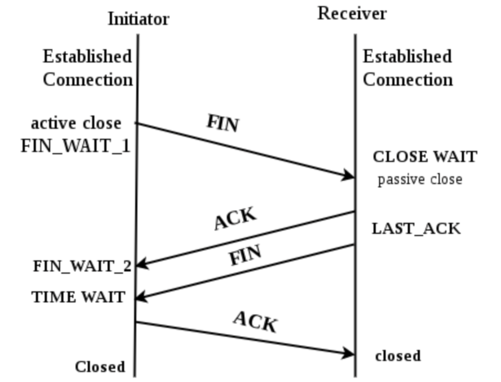
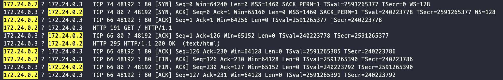
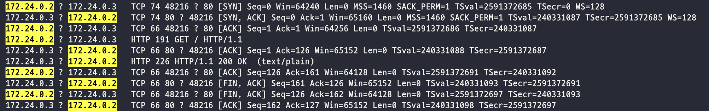
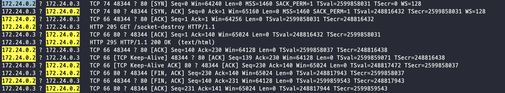

도전 목표는 간단하다 `HTTP/1.1` 환경 `express.js` 서버가 먼저 소켓 연결을 끊어보는 것이다.

그리고 실제 `packet`을 확인해보겠다.

## 4 Way Handshake

 

먼저 가장 기본이 되는 지식인 TCP 연결종료에 대해 간단히 설명하겠다.

1. `Active Close`가 `Passive Close`측에게 '연결 종료'를 의미하는 `FIN` 패킷 전송
2. `Passive Close`는 '연결 종료'에 대한 `ACK` 응답
3. `Passive Close`는 '연결 종료'를 의미하는 `FIN` 전송
4. `Active Close`는 '연결 종료'에 대한 `ACK` 응답

참고로 일반적인 웹 클라이언트-서버 환경에서는 클라이언트가 `Active Close`이다

일반적인 종료과정이 4번의 데이터 송수신을 거쳐 진행되기 때문에 `4-way-handshake`라고 불리며 이것이 `Graceful Close`이다

> 더 자세히 알고싶다면? [3 Way Handshake 이해하기 (내부 소켓의 구조)](/network/3-way-handshake-with-c/)

## 왜 보통 클라이언트가 먼저 연결을 끊을까?

사실 TCP 연결 요청은 무조건 클라이언트가 먼저하지만, 연결 종료는 서버/클라이언트 어디서든 먼저 가능하다.
- 물런 비정상 종료라고 흔히 말하는 네트워크의 단절등도 어디서든 먼저 일어날 수 있다.

<br/>

그런데 보통 Socket을 먼저 `close()`하는것은 클라이언트이다.
- 이유는 간단하다. 서버는 요청에 응답하고 소켓을 유지하기 때문이다. 

<br/>

더 자세히 말하면

1. 클라이언트는 연결을 요청하고 `3 way handshake` 과정을 거쳐 소켓 연결.
2. 연결된 소켓을 이용해 `HTTP Request`. 서버는 `HTTP Response`. 
   - **이때 서버는 응답 이후, 연결된 소켓을 끊지 않고 유지한다.**
3. 응답을 받은 클라이언트는 필요없어진 소켓을 `close()`한다
   - 필요하다면, 연결된 소켓을 재사용할 수 있다.

<br/>

위 과정은 보통 프레임워크나, 라이브러리가 담당해서 눈치채기 힘들다.
- 또 `TCP/IP`는 보통 OS에 구현되어 있다

<br/>

그럼 어떻게 `Socket`을 유지할 수 있을까? TCP와 HTTP의 `keepalive` 의 특징 덕분이다
- 간단히 말해 `Socket`을 유지해서 데이터를 계속 주고받을 수 있게 하는 특징이다.
- 그럼에도 HTTP는 **비연결성**을 특징으로 가졌지만, `HTTP/1.1` 이후로는 커넥션 유지가 가능하다


## HTTP 헤더의 Connection을 이용하면 가능하지 않나요?


Q.혹시 클라이언트가 Request 헤더에 `Connection: close`를 넣는다면?
- 아니다. 그럼에도 서버가 먼저 연결을 끊지 않을 가능성이 높다.
- 이는 헤더를 보내는 클라이언트가 서버에게 '연결을 끊어주세요' 라고 요청하는 의미로, 서버가 따를수도 있고 아닐수도 있다.
- 대부분 현대의 프레임워크는 `Connection` 헤더와 상관없이 `Socket`을 유지할 것이다.

<br/>

Q. 혹시 서버가 Response 헤더에 `Connection: close`를 넣는다면?
- 아니다. 서버가 먼저 연결을 끊지 않는다.
- 서버가 클라이언트에게 "연결을 끊어주세요"라고 요청한것. 서버가 연결을 먼저 끊는 행위가 아니다

<br/>

Connection 헤더에 대해 더 자세히 알고싶다면? 
- [Difference between NodeJS new Agent() and HTTP Keep-Alive header](https://stackoverflow.com/questions/44649566/difference-between-nodejs-new-agent-and-http-keep-alive-header/58332910#58332910)

<br/>

## 어떻게 서버가 먼저 연결을 끊을 수 있을까?

이제 실제 사용 가능한 방법을 알아보자

### 1. `res.end(), res.send(), res.json()`

소켓을 유지하며 응답을 보내는 경우. 즉 원하는 경우가 아니다


### 2. `res.socket.end()`

> [Half-closes the socket. FIN 패킷을 보냅니다. 서버가 일부 데이터를 보낼 수 있습니다](https://nodejs.org/api/net.html#net_socket_end_data_encoding_callback)

### 3. `res.socket.destroy()`

> [FIN 패킷을 보냅니다. 스트림을 삭제하고 연결을 닫습니다](https://nodejs.org/api/net.html#net_socket_destroy_error)


## Half-close란?

2번과 3번 모두 `FIN`패킷을 보내며 연결을 끊는건데 어떤 차이점이 있을까? `Half-close`가 무엇일까?

말그래도 절반만 종료한다는 것을 의미한다.
1. 송신만 가능, 수신 불가능
2. 수신만 가능, 송신 불가능

이 경우에는 2번의 경우로 `FIN` 패킷을 보내고 연결을 종료할것인데, 혹시 더 보낼게 있다면(수신) 보내도 괜찮아 라는 의미이다.
- 그리고 `Passive Close`측은 데이터를 다 처리한 후 `FIN` 패킷을 `Active Close`측에 전송할 것이다.

<br/>

**다만 이 글에선 이 특징에 대해 다루지 않는다.**

## 직접 구현해보자 

먼저 [Repository](https://github.com/junha-ahn/nodejs-server-socket-close)를 소개한다.

### Docker 

```
FROM ubuntu:18.04

# install nodejs
RUN apt-get -qq update
RUN apt-get -qq upgrade --yes 
RUN apt-get -qq install curl --yes
RUN curl -sL https://deb.nodesource.com/setup_14.x | bash -
RUN apt-get -qq install nodejs --yes

# istall tools
# RUN apt-get -qq install net-tools --yes
RUN apt-get install tshark --yes

WORKDIR /app

COPY ./package.json ./

RUN npm install
COPY . .
```
패킷을 확인해야 하기 때문에, `ubuntu`이미지를 사용했다.
- 패킷 확인 모듈로 `tshark`를 install한다.

```yml
version: '3'
services:
  server:
    build: .
    container_name: server_app
    volumes:
      - .:/usr/app/
      - /usr/app/node_modules
    command: npm run server
  client:
    build: .
    container_name: client_app
    volumes:
      - .:/usr/app/
      - /usr/app/node_modules
    command: npm run client
```
두 컨테이너간 통신을 위해 `docker-compose`를 이용했다.

### 클라이언트

```javascript
const httpAgent = new http.Agent({ keepAlive: true })
await axios.get('http://server:80/', { httpAgent })
```

간단하게 axios를 이용해서 요청하는 구조

### 서버

```javascript
// 1번 방법
app.get('/', async (req, res) => {
	res.send('bye')
})

// 2번 방법
app.get('/socket-close', async (req, res) => {
	res.socket.end(
		[
			'HTTP/1.1 200 OK',
			'Content-Type: text/plain; charset=utf-8',
			'Content-Length: 4',
			`Date: ${new Date().toGMTString()}`,
			'Connection: keep-alive',
			'Keep-Alive: timeout=5',
			'',
			'bye!',
		].join('\n'),
	)
})

// 3번 방법
let socket = null
app.get('/socket-destroy', async (req, res) => {
	res.send('bye')

	socket = res.socket
	setTimeout(() => {
		console.log('destroyed: ', socket.destroyed)
		if (!socket.destroyed) socket.destroy()
	}, 1500)
})
```

2번은 `socket.end()`시 메세지를 함께 보낼 수 있어서, `String`으로 `HTTP Response`를 만들어보았다.

해당 내용에 대해 더 자세히 알고싶다면?
- [Http와 tcp/ip의 이해](https://hwan-shell.tistory.com/271)
- [Node.js net Module을 사용해 HTTP 저수준 이해하기](https://iamssen.medium.com/node-js-net-module%EC%9D%84-%EC%82%AC%EC%9A%A9%ED%95%B4%EC%84%9C-http-%EC%A0%80%EC%88%98%EC%A4%80-%EC%9D%B4%ED%95%B4%ED%95%98%EA%B8%B0-4835618ec46)

<br/>

3번은 `HTTP Response` 1초 이후, `socket.destroy()`를 진행한다.
- `keep-alive` 을 준수하기에 응답 이후 `socket` 연결을 양측 모두 끊지 않는다.

### 사용법은?

```bash
> docker-compose up --build 
> docker exec -it  server_app /bin/bash # 서버 컨테이너 bash 접속
> tshark -i eth0 # 패킷 확인
```

## 패킷을 확인해보자

### 클라이언트가 먼저 소켓을 close하는 1번째 방법
 
> 클라이언트에 노란색을 표시했다

<br/>

간략히 요약하면 아래와 같다
```
...
Client > Server [FIN, ACK] Seq=126 Ack=230
Server > Client [FIN, ACK] Seq=230 Ack=127
Client > Server [ACK] Seq=127 Ack=231
```

`3-way-handshake`과정 (앞 3줄) 을 거치고 `Data Transfer` 과정에 이어서
- 클라이언트가 먼저 연결 종료(`FIN`)를 요청하는것을 확인할 수 있다.

### 2번째 방법

 

```
...
Server > Client [FIN, ACK] Seq=161 Ack=126
Client > Server [FIN, ACK] Seq=126 Ack=162
Server > Client [ACK] Seq=162 Ack=127
```

### 3번째 방법

 

```bash
...
Client > Server [TCP Keep-Alive] [ACK] Seq=139 Ack=230
Server > Client [TCP Keep-Alive ACK] [ACK] Seq=230 Ack=140

Server > Client [FIN, ACK] Seq=230 Ack=140
Client > Server [FIN, ACK] Seq=140 Ack=231
Server > Client [ACK] Seq=231 Ack=141
```

`setTimeout(..., 1500)`동안 소켓을 유지하고 있기 때문에 `keep-alive` 패킷도 확인 할 수 있다.

<br/>

---

<br/>

위 패킷 내용에 대해 더 자세히 학습하고자 한다면? [TCP의 기능과 패킷 구조](https://mr-zero.tistory.com/36)

<br/>

참고로 종료과정이 4개의 패킷인 것이 아니라, 3개의 패킷인 이유는?
- [Piggyback 방식](http://www.ktword.co.kr/test/view/view.php?m_temp1=3242)
- 또는 Half-close의 특징이라는 글도 존재한다. ([에반문 블로그](https://evan-moon.github.io/2019/11/17/tcp-handshake/#fin_wait_1))

<br/>

> 확실한 자료를 찾으면 글 내용을 수정할 예정이다.


## 마무리

현대 웹 서비스에서는 클라이언트가 먼저 소켓을 끊는다는다길래 

단순하게 '그럼 서버로 먼저 끊어볼까?'라는 생각으로 몇일동안 여러가지를 학습하게 되었다.

## 참조

- [Repository](https://github.com/junha-ahn/nodejs-server-socket-close)
- [TCP의 기능과 패킷 구조](https://mr-zero.tistory.com/36)
- [Http와 tcp/ip의 이해](https://hwan-shell.tistory.com/271)
- [Node.js net Module을 사용해 HTTP 저수준 이해하기](https://iamssen.medium.com/node-js-net-module%EC%9D%84-%EC%82%AC%EC%9A%A9%ED%95%B4%EC%84%9C-http-%EC%A0%80%EC%88%98%EC%A4%80-%EC%9D%B4%ED%95%B4%ED%95%98%EA%B8%B0-4835618ec46)
- [How to close HTTP connection in node.js using Express](https://stackoverflow.com/questions/36680794/how-to-close-http-connection-in-node-js-using-express)
- [Difference between NodeJS new Agent() and HTTP Keep-Alive header](https://stackoverflow.com/questions/44649566/difference-between-nodejs-new-agent-and-http-keep-alive-header/58332910#58332910)
- [Piggyback 방식](http://www.ktword.co.kr/test/view/view.php?m_temp1=3242)
- [TCP가 연결을 생성하고 종료하는 방법, 핸드쉐이크](https://evan-moon.github.io/2019/11/17/tcp-handshake/)