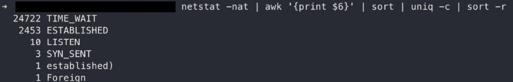

이 글은 실제 업무 중에 만났던 오류를 노트에 기록해놓은 후 왜 그랬을까? 왜 해결됬을까?를 고민하는 글이다.

- 참고로 이 글의 해결방법은 소프트웨어적인 로직을 수정하는 것이다.
- 커널 단의 소켓 관련 변수를 수정하지 않는다.

<br/>


 
 

- 간단하게 대량의 `TIME_WAIT` 상태와 `ESTABLISHED` socket을 확인 할 수 있다


# 상황

```
Client => Middleware => Server
```

위 스크린샷 속 Application은 위 구조에서 Middleware이다. 

- Client는 브라우저가 아니다, 프로그램이다. 즉 초당 다량의 요청을 보낸다.
- 서버는 `Public API`로 생각하면 편할것 같다. 어떤 구조를 지녔는지 모른다.


<br/>

클라이언트의 많은 요청을 받고 미들웨어는 그 요청을 처리하기 위해 **더 많은 요청을 서버로 보낸다**

서버의 응답 속도는 점점 느려졌다. 
- 아마 3초 ~ 5초 걸리는 응답도 있었던걸로 기억한다.

<br/>

`The connection cannot be served because Server.Concurrency limit exceeded`
- 서버가 보내온 응답 메세지이다.
- `golang fasthttp`를 사용한 것으로 추측된다.

<br/>

간단히 말해 `concurrencyLimit = 1000`이라면 동시에 1000개의 요청을 처리중일때 나머지는 위 응답을 보내온다.

<br/>

즉 만약 오랫동안 지연되는 요청이 있다면, 그 요청은 끝나지 않고 계속 연결된 채로 자원을 점유한다.
- Client로 부터 요청은 계속 오니까, 지연된 상태의 소켓이 계속 존재하면서 새로운 `connectoin`들은 만들어진다
- 그래서 새로 생성되는 수 많은 다른 요청들은 <이미 존재하는 지연 요청>으로 인해 모두 무시된다.

# 문제 해결

일단, 나의 경우 가장 간단하고 쉬운 해결 방법을 사용했다.

`timeout` 옵션을 짧게 만들어 해당 문제를 해결 했다.
- 만약 지연되는 요청이 있다면, 바로 끊어버린다.
- 그래서 다음 요청이 문제가 생기는 일을 발생시키지 않는다.
- 이러한 해결 방법이 가능한 경우와 아닌 경우가 있을 것.

# 고민 과정

문제는 사실 간단하게 해결했지만 고민과정에서 이상한 방향으로 빠질뻔했다.

일단 이 글은 먼저 오류를 해결하고, 몇달뒤에 다시 고민해보는 과정에서 만들어진 글이다.

`The connection cannot be served because Server.Concurrency limit exceeded`

위 오류가 있었다는 사실을 잊어버리고, 대량의 `TIME_WAIT`에 집중하다 보니 TCP/IP 부분을 많이 학습하게 되었다...

<br/>

**`TIME_WAIT`가 많은 캡쳐사진만 보면서 아! TCP/IP를 공부해보자!**
> 실제 오류 메세지부터 확인했어야 하는데... 오류가 있었다는 사실만 기억하다보니....


> '오류 메세지'를 보고 오류를 해결하고, 다시 공부하는 과정에서 '오류 메세지'를 잊어버려서 더 공부하게 되다니...

<br/>

그런데 고민하면 할 수록 왜 `timeout` 옵션으로 문제가 해결됬는지가 의문이였고 
- 결국 서버에서 보내는 오류를 `slack`에 남은 메세지로 발견했다.

## 왜 TIME_WAIT가 클라이언트 OS에서 발생할까?

간단하다 `HTTP/1.1`은 `keep-alive` 속성을 가진다.
- 이건 꼭 서버가 지키진 않을 수 있지만 대부분의 서버는 `HTTP Response` 를 처리한다고 해서, `socket`을 끊지 않는다 
- 즉 클라이언트가 응답을 받고 `socket`을 끊는다
- 여기서 `socket`을 끊는다는건 `4-way handshake`를 말한다

<br/>

이미 말했듯이, 실제 오류 메세지를 잊어버리고 너무 많은 `TIME_WAIT` 소켓이 존재하기 때문에 새로운 `socket` 생성이 불가능하다고 추측했다.
- `TIME_WAIT`는 아직 `socket`이 종료되지 않은 상태이기에 local port등 자원 점여 중 상태이다 
- `TIME_WAIT` 상태의 소켓은 자연스럽게 사라지긴 하지만, 그 사이 너무 많은 요청이 생성되어 문제가 발생했다고 추측했다.

<br/>

## 2만개의 `TIME_WAIT` 소켓이 존재한 이유는 무엇인가?
  
이건 사실 글을 쓰는 지금도 명확히 파악하지 못했다.

<br/>

지연된 상태의 소켓이 계속 존재하고 새로운 `socket`들은 만들어진다 
- 그럼 서버는 `Concurrency limit exceeded` 오류 메세지를 응답하고, 클라이언트가 `socket.close()`를 한다.
- 이 과정에서 많은 `TIME_WAIT` 들이 발생했을까?

<br/>

`Docker-compose` 를 이용해서 재연해 볼려고 시도했으나, **실패했다**.

<br/>

아래는 문제 재연을 위해 사용된 `Dockerfile`, `docker-compose.yml`
- `netstat`를 사용해서 `socket`을 확인해야 하기 때문에 `ubuntu` 이미지를 사용했다.
- 서버는 요청에 `sleep()`을 가지고 응답하고, 클라이언트는 `setInterval()`을 통해서 대량의 요청을 만들어내었다.


```
FROM ubuntu:18.04

# install nodejs
RUN apt-get -qq update
RUN apt-get -qq upgrade --yes 
RUN apt-get -qq install curl --yes
RUN curl -sL https://deb.nodesource.com/setup_14.x | bash -
RUN apt-get -qq install nodejs --yes

# istall tools
RUN apt-get -qq install net-tools --yes

WORKDIR /app

COPY ./package.json ./

RUN npm install

COPY . .
```

```
version: '3'
services:
  client:
    build: .
    container_name: client_app
    volumes:
      - .:/usr/app/
      - /usr/app/node_modules
    command: npm run client
  server:
    build: .
    container_name: server_app
    volumes:
      - .:/usr/app/
      - /usr/app/node_modules
    command: npm run server
```

# 후기

 

이 문제를 겪고 생성한 에버노트 파일인데, 9개월쯤 지난 지금도, 새로 배울때마다 다시 찾아보면서 원인이 뭐였을까 고민하고 있다

> 글을 수정한 지금도 `2021-08-28`이다 (블로그 글 생성일은 `2020-12-10`)

기록으로 남기는건 엄청 도움되는 일 같다.
- **이전에 만났던 오류들을 다시 고민하고 새로운걸 배울 기회로 만들 수 있다.**


<br/>

또 이번 이슈를 계기로 조금이지만 네트워크/OS를 더 배우게 되었다. (실제로 블로그 글도 많이 쓸 수 있었다)
- 특히 `socket`과 `4-way handshake` 과정 및 비정상 종료 등

<br/>

> 이 단순한 과정이 매번 어렵게 느껴지는 이유는 대부분은 고급언어로 소켓을 랩핑해서 사용하기 때문에 소켓에 문제가 생기지 않는 한 로우 레벨로 내려가 확인할 일이 흔치 않고, 또한 확인하는 방법을 아는 이도 드물기 때문일 겁니다. 
> 
> [CLOSE_WAIT & TIME_WAIT 최종 분석](https://tech.kakao.com/2016/04/21/closewait-timewait/)에서


# 참고

- [TCP 연결 종료와 비정상 종료](https://hyeonstorage.tistory.com/287)
- [CLOSE_WAIT & TIME_WAIT 최종 분석](https://tech.kakao.com/2016/04/21/closewait-timewait/)
- [Embedded Tomcat  in 스프링 부트](https://brunch.co.kr/@springboot/98)

