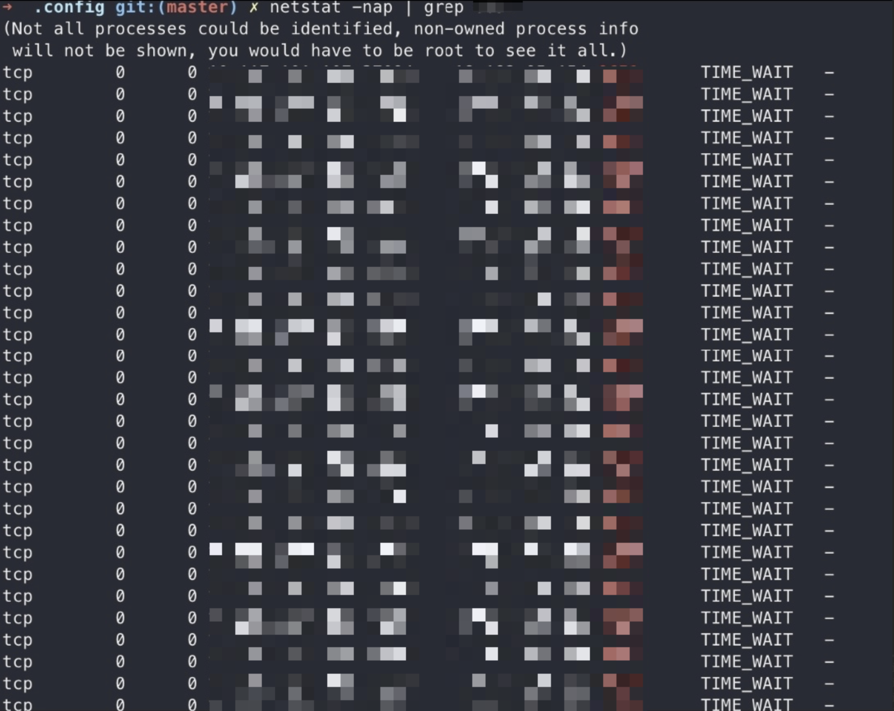

# 요약

 

Socket Hang Up에 빠져 더 이상 통신이 불가능한 Application...

- `netstat -nap | grep TIME_WAIT | wc -l`을 사용하여 간단하게 `TIME_WAIT` 상태의 socket을 확인 할 수 있다
# 상황


이전 글에서 설명했지만, TCP/IP 프로토콜은 Socket이라는 가상의 통로를 이용해 통신한다

그런데, 이 Socket은 한정된 자원임으로 너무 많은 Socket이 연결되있을 경우, 더 이상 할당이 불가능하여 Hang up에 빠질 수 있다

```
Client[] => Middleware => Server --> DB...
```

위 스크린샷 속 Application은 위 구조에서 Middleware이다. 

- Client는 브라우저가 아니다, 프로그램이다. 즉 일정시간에 다량의 요청을 보낼 수 있다

클라이언트의 많은 요청을 받고 Middleware또한 그 요청을 처리하기 위해 동일한 수의 요청을 Server로 보낸다

그 와중에, 자연스럽게 연결이 끊어지거나 할 수 있지만 Server에 상태가 좋지않을 경우, 연결을 끊게 된다.

계속해서 요청은 대량으로 발생하는 상황속에 middleware의 대량의 Socket은 일정 시간동안 `TIME_WAIT` 상태로 남게 된다.

\* 더 자세한 내용은 아래 참고 글을 확인해주세요

# 문제 해결

일단, 나의 경우 가장 간단하고 쉬운 해결 방법을 사용했다.

연결 로직 중 `timeout` 옵션을 짧게 만들어 해당 문제를 해결 했다.

빠르게 연결이 종료되게하여, 문제가 발생하지 않게 원인을 제거했다.

또, 다른 글에서는 Socket의 제한을 늘리거나, TIME_WAIT 지속 시간을 감소시키는것을 언급하기도 한다.

# 후기

> 이 단순한 과정이 매번 어렵게 느껴지는 이유는 대부분은 고급언어로 소켓을 랩핑해서 사용하기 때문에 소켓에 문제가 생기지 않는 한 로우 레벨로 내려가 확인할 일이 흔치 않고, 또한 확인하는 방법을 아는 이도 드물기 때문일 겁니다.

위 내용은 [CLOSE_WAIT & TIME_WAIT 최종 분석](https://tech.kakao.com/2016/04/21/closewait-timewait/)중 일부이다

이번 이슈를 계기로 조금이지만 네트워크/OS를 더 배우게 되었다.

# 참고

- [TCP 연결 종료와 비정상 종료](https://hyeonstorage.tistory.com/287)
- [CLOSE_WAIT & TIME_WAIT 최종 분석](https://tech.kakao.com/2016/04/21/closewait-timewait/)
- [Embedded Tomcat  in 스프링 부트](https://brunch.co.kr/@springboot/98)

