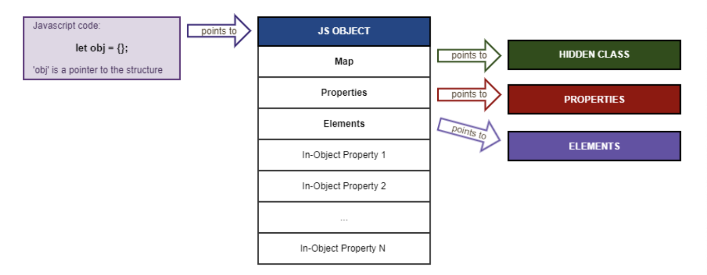

이 글은 각각의 글들을 학습하고 간략하게 요약한 게시글이다.

출처를 통해 더 자세히 학습 가능할 것이다.

특히 [How is data stored in V8 JS engine memory?](https://blog.dashlane.com/how-is-data-stored-in-v8-js-engine-memory/) 글을 추천한다.

# 목차

1. Array와 Object의 관계
2. Hidden Class
3. Properties vs Elements
4. 결론
5. 출처

# 1. Array와 Object의 관계

일반적으로 배열이라는 자료 구조의 개념은 동일한 크기의 메모리 공간이 빈틈없이 연속적으로 나열된 자료 구조를 말한다

자바스크립트의 배열은 지금까지 살펴본 일반적인 의미의 배열과 다르다. 

 

즉, 배열의 요소를 위한 각각의 메모리 공간은 동일한 크기를 갖지 않아도 되며 연속적으로 이어져 있지 않을 수도 있다. 

자바스크립트의 배열은 일반적인 배열의 동작을 **흉내낸 특수한 객체이다**.

 

자바스크립트 배열은 인덱스를 프로퍼티 키로 갖으며 length 프로퍼티를 갖는 객체이다. 
- 즉, 자바스크립트 배열의 Index는 사실 프로퍼티 값이다. 
- 따라서, 모든 값은 객체의 프로퍼티 값이 될 수 있으므로 어떤 타입의 값이라도 배열의 요소가 될 수 있다.
  
 

from [자바스크립트 배열은 배열이 아니다](https://poiemaweb.com/js-array-is-not-arrray)

# 2. Hidden Class

위 내용에는 자바스크립트 객체와 배열이 사실 큰 차이가 없어 보인다.

그러나 자바스크립트 엔진은 `Array`와 `Object`를 동등하게 처리하지 않고, 최적화를 한다.

모든 `Javascript Object`는 `Hidden Class`를 가진다. 

 

아래 글을 추천한다
- [JavaScript engine fundamentals: Shapes and Inline Caches](https://mathiasbynens.be/notes/shapes-ics)
- [V8의 히든 클래스 이야기](https://engineering.linecorp.com/ko/blog/v8-hidden-class/)
# 3. Properties vs Elements

그렇다면 Javascript Array도 히든 클래스를 가지고 어떻게 처리 되는건가? 아니다. 

> from [How is data stored in V8 JS engine memory?](https://blog.dashlane.com/how-is-data-stored-in-v8-js-engine-memory/) 

심지어 Object의 property 정보도 히든클래스에서 관리되는것이 아닐 수 있다. 

위 이미지의 `In-Object Property`를 보면 확인 가능하다

 

그러면 Array의 property는 어디에 저장되는 것일까?
- 위 이미지 속 `Elements`에 저장된다. (정확히는 `fast-elements`일 경우)

 

즉 자바스크립트 엔진은 `number-properties`를 구분하고, 최적화하여 저장한다. 

 

다시 정리하면
- `Array` 변수는 `stack`에 저장되어 `JS Object`의 `reference`를 가진다.
- `JS Object`는 힙에 저장된다.
- Array의 property는 `Elements`에 저장/관리 된다.

 

> 참고로 SMI(31-bit signed integer)를 제외한 모든 자료형은 힙에 저장된다. 
> 스택에는 SMI와 Heap에 대한 reference만 저장된다. 

# 4. 결론

1. 자바스크립트 `Array`는  `number-property Object`이다.
2. 그러나 자바스크립트 엔진(v8)은 `Array`와 `Object`를 명백히 구분한다.
3. `number-properties`는 `Heap`에 존재하는 `JS Object.elements`에 저장/관리 된다.

 

그렇다면 v8엔진이 구현한 자바스크립트의 Array는 배열(자료구조)이 아닐까? 

이름은 같지만 설계상 편리를 위해 만든걸까?

- 만약 "스택에 저장된 배열과 그 첫번째 인자의 pointer"가 배열이라고 생각한다면 그러한 관점에서는 아닐것이다.

- 또 물리적인 순서가 중요하다면, v8엔진이 힙에서 물리적 순서를 구현했다고 추측함으로 맞을것이다.

> 참고로 추측하는 이유는 v8엔진 소스코드를 이해하지 못했기 때문이다.

 

결국 관점에 따라 다른것 같다. 

> 다만 대부분 자료에서 '저장위치'등을 언급하지는 않는다.

 

> 참고로 C언어의 배열은 Stack에 저장되지만, Java의 배열은 Heap에 할당되고 변수는 Stack에 저장되어 Heap의 reference를 가진다.

# 5. 출처
- [자바스크립트 배열은 배열이 아니다](https://poiemaweb.com/js-array-is-not-arrray)
- [How does JavaScript VM implements Object property access? Is it Hashtable?](https://stackoverflow.com/questions/6586670/how-does-javascript-vm-implements-object-property-access-is-it-hashtable)
- [JavaScript engine fundamentals: Shapes and Inline Caches](https://mathiasbynens.be/notes/shapes-ics)
- [객체에 프로퍼티 설정 시 성능 이슈](https://ohgyun.com/764)
- [Stack-Allocated Arrays](https://people.eecs.ku.edu/~jrmiller/Courses/JavaToC++/StackAllocatedArrays.html)
- [Fast properties in V8](https://v8.dev/blog/fast-properties)
- [How is data stored in V8 JS engine memory?](https://blog.dashlane.com/how-is-data-stored-in-v8-js-engine-memory/)