`Nest.js`를 이용해서 간단한 API `GET /books/:id`를 만들어볼 생각이다 (**테스트 주도 개발** 방법론을 적용한다)

`Nest.js`의 3 레이어 아키텍처(`Controller-Service-Repository`)를 지켜가며 코딩해보겠습니다
> Repository: Data Access Layer

# 계획

일단 뼈대를 생성한다 (컨트롤러, 서비스 파일 생성)

1. 컨트롤러: 실패하는 test 작성 > 성공하게 코드 작성
2. 서비스: 실패하는 test 작성 > 성공하게 코드 작성
3. 레퍼지토리: 실패하는 test 작성 > 성공하게 코드 작성

## 상세 계획: Controller

1. `controller.getBook(id)`  테스트 코드 작성 
	- `service.getBook(id)` 가 x를 리턴하도록 mockup
	- `service.getBook(id)`가 x를 리턴할때 컨트롤러는 성공
2. 테스트 성공 가능하게 구현 
	- `service.getBook(id)` 함수헤더정도만 작성
	- `service.getBook(id)` 함수를 컨트롤러 내부에서 호출하도록 코드 작성
3. 테스트 성공 확인

## 상세 계획: Service

1. `service.getBook(id)` 테스트 코드 작성
	- `repository.findOne(id)`가 x를 리턴하도록 mockup
	- `repository.findOne(id)`가 x를 리턴할때 컨트롤러는 성공
2. 테스트 성공 가능하게 구현
	-  `repository.findOne(id)` 함수를 서비스 내부에서 호출하도록 코드 작성
3. 테스트 성공 확인

# 따라해보기

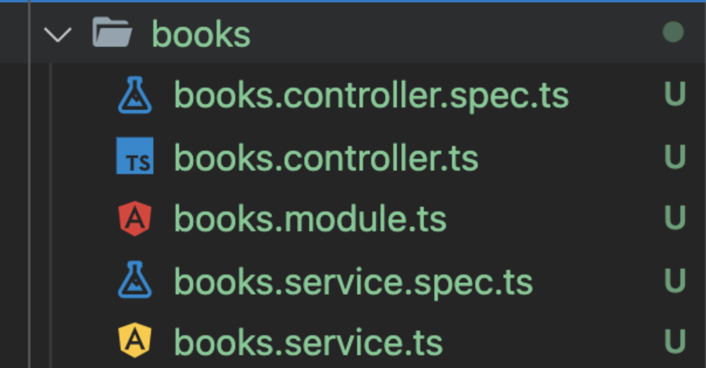

뼈대를 만들기 위해, 위 파일을 새로 생성해준다.

``` bash
nest g mo books // module 추가
nest g co books // controller 추가
nest g s books // service 추가
```

## Controller TDD

### 1단계: 테스트 코드 작성

```
- service.getBook(id) 가 x를 리턴하도록 mockup
- service.getBook(id)가 x를 리턴할때 컨트롤러는 성공
```

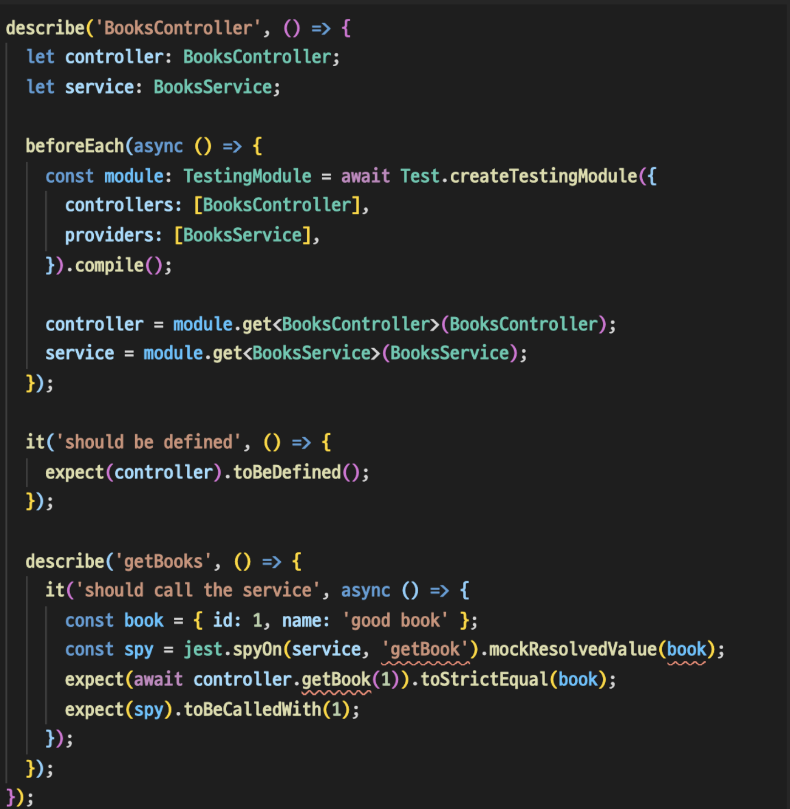
> 아직 controller, service에 구현한게 없으니 에러 발생

### 2단계: 테스트 성공 가능하게 구현

```
- service.getBook(id) 함수헤더정도만 작성
- service.getBook(id) 함수를 컨트롤러 내부에서 호출하도록 코드 작성
```


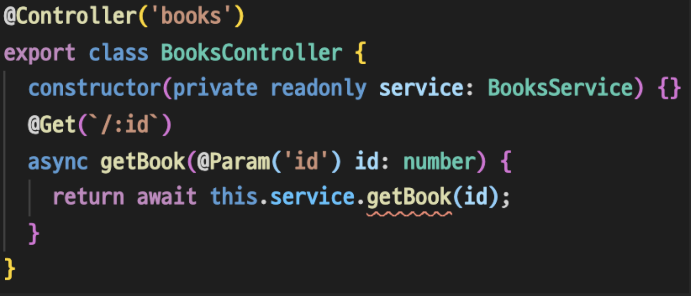
> Service에 구현한게 없어 에러 발생

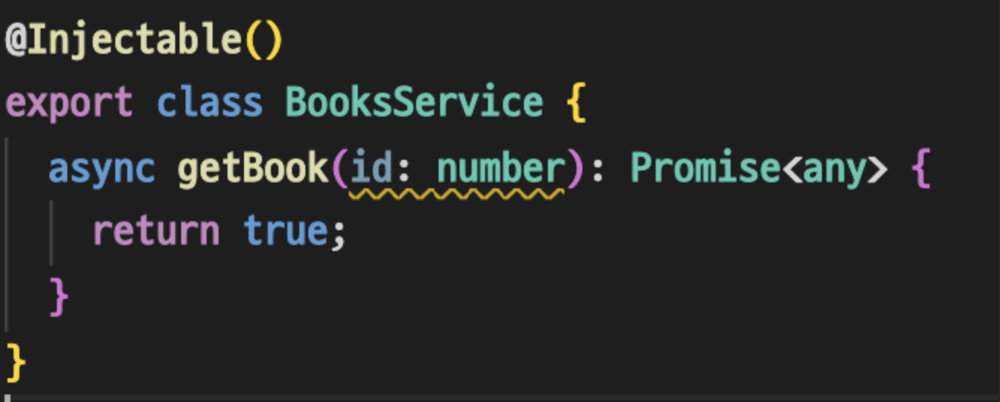
> Any Type대신 Book Type을 만들까 생각했지만... 이후 수정하도록 하겠다.

이제 test가 성공하도록, **최소한의 구현**을 마쳤다. (에러도 모두 사라졌을것이다.)

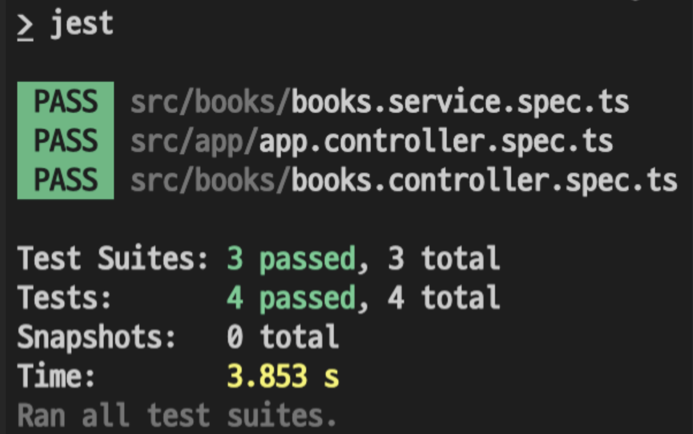

## Service TDD

### 1단계: 테스트 코드 작성

```
- repository.findOne(id)가 x를 리턴하도록 mockup
- repository.findOne(id)가 x를 리턴할때 컨트롤러는 성공
```

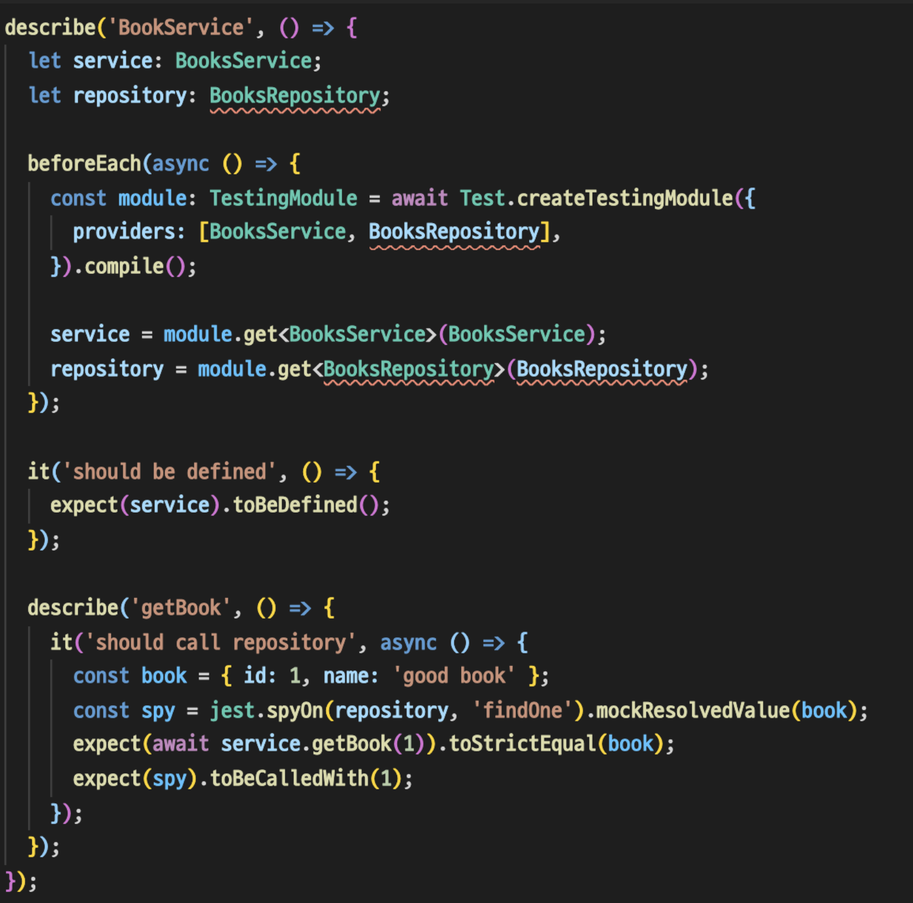
> 마찬가지로, 미구현 상태임으로 에러가 발생

### 2단계: 테스트 성공 가능하게 구현

이번엔 약간 특이하게 `typeorm` 관련 세팅을 해줘야 한다. 


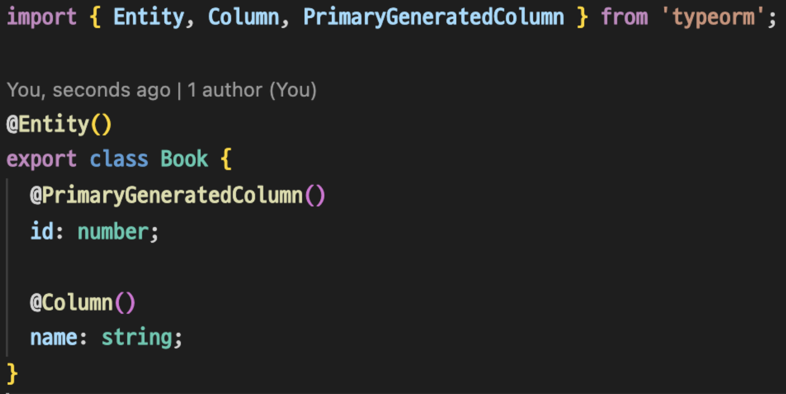
> books.entity.ts
<br/>

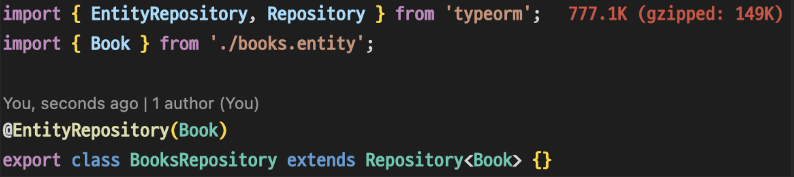
> (커스텀 레퍼지토리) books.repository.ts
<br/>

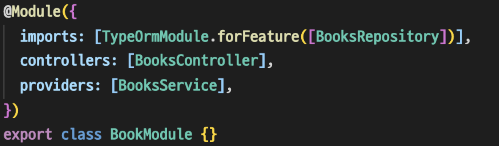
> books.module.ts > imports
<br/>

이 외에도 `npm install` 등등 있지만 생략하겠다.

```
-  repository.findOne(id) 함수를 서비스 내부에서 호출하도록 코드 작성
```
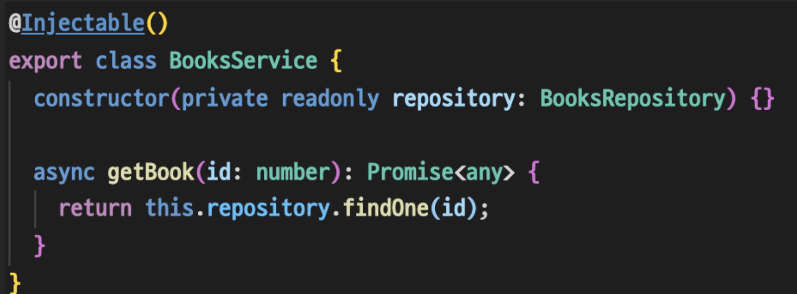

이제 test가 성공하도록, **최소한의 구현**을 마쳤다. (에러도 모두 사라졌을것이다.)
- 참고로 controller test에도 `BooksRepository`를 `provider`에 넣어줘야한다.

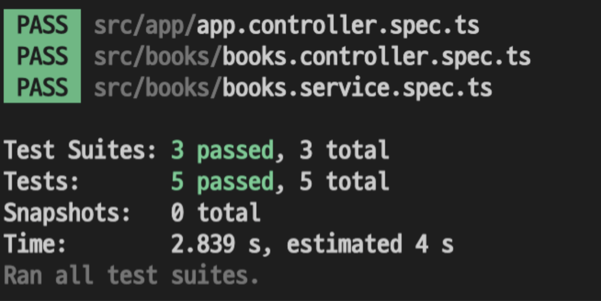

## Test coverage

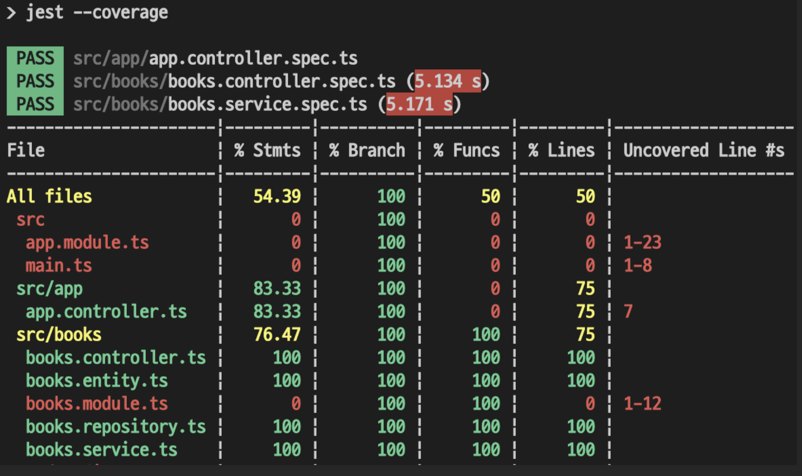

상당히 심플하게 구현해보았다. 

더 나아가 Fail에 대한 테스트, Validator등 여러가지 테스트를 추가해보자!

참고로 Repository에 대한 Test도 추가할 수 있을것이다.