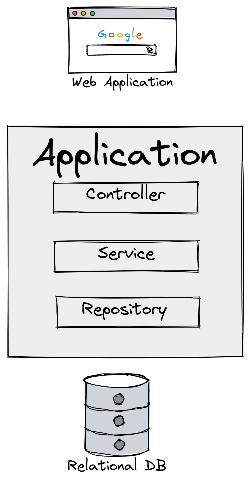
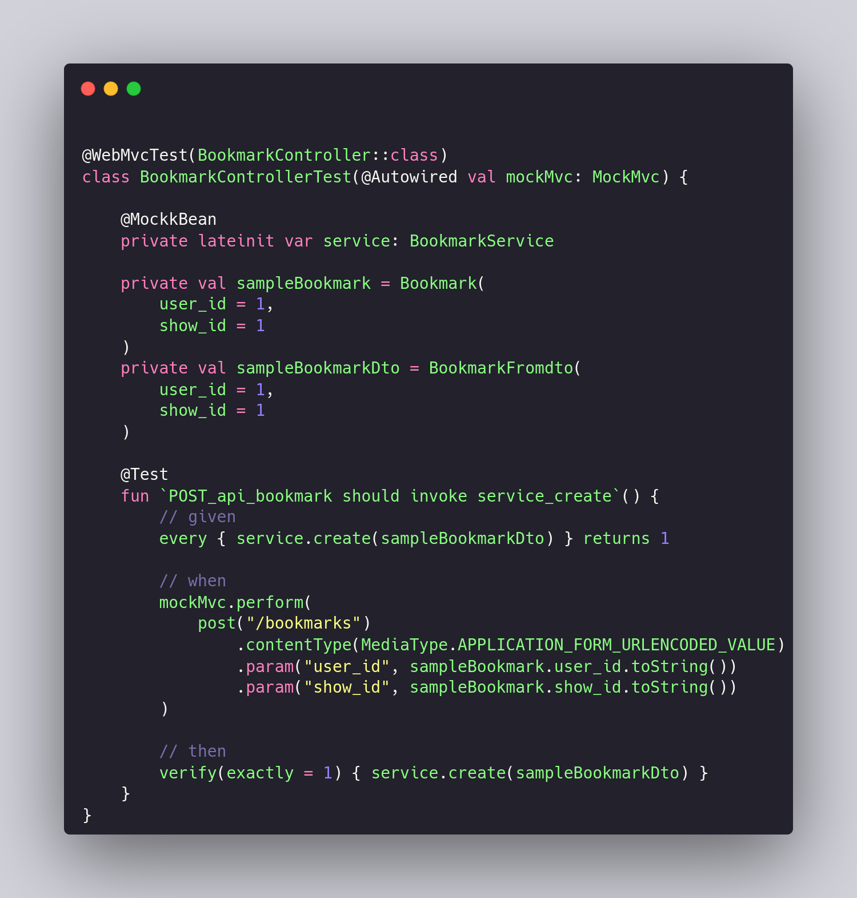
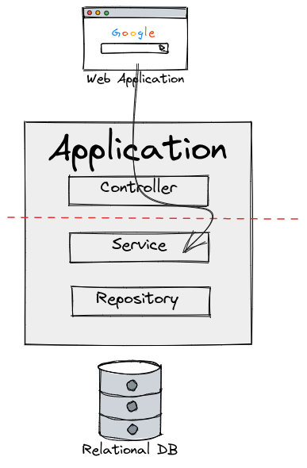
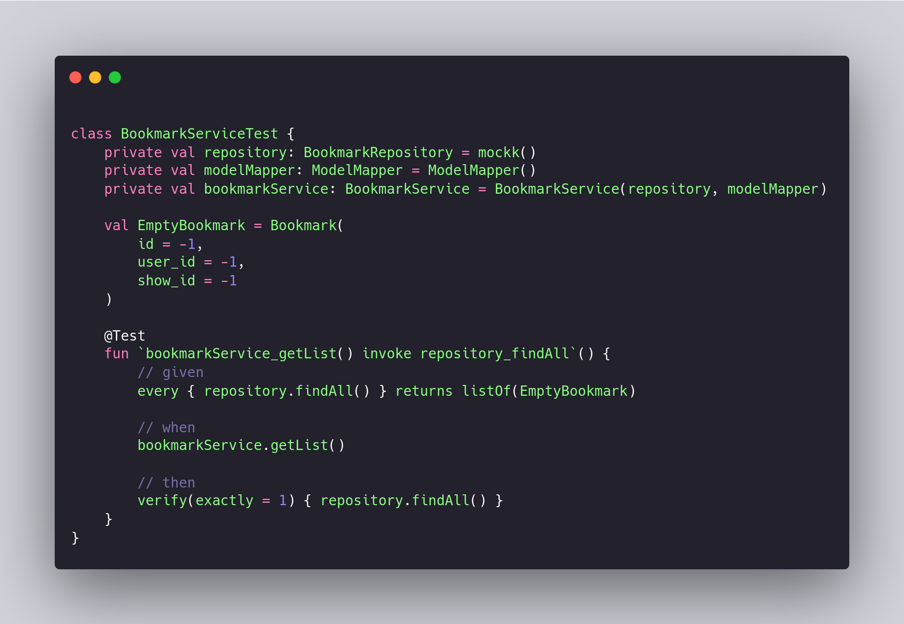
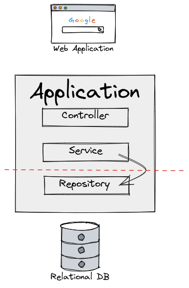
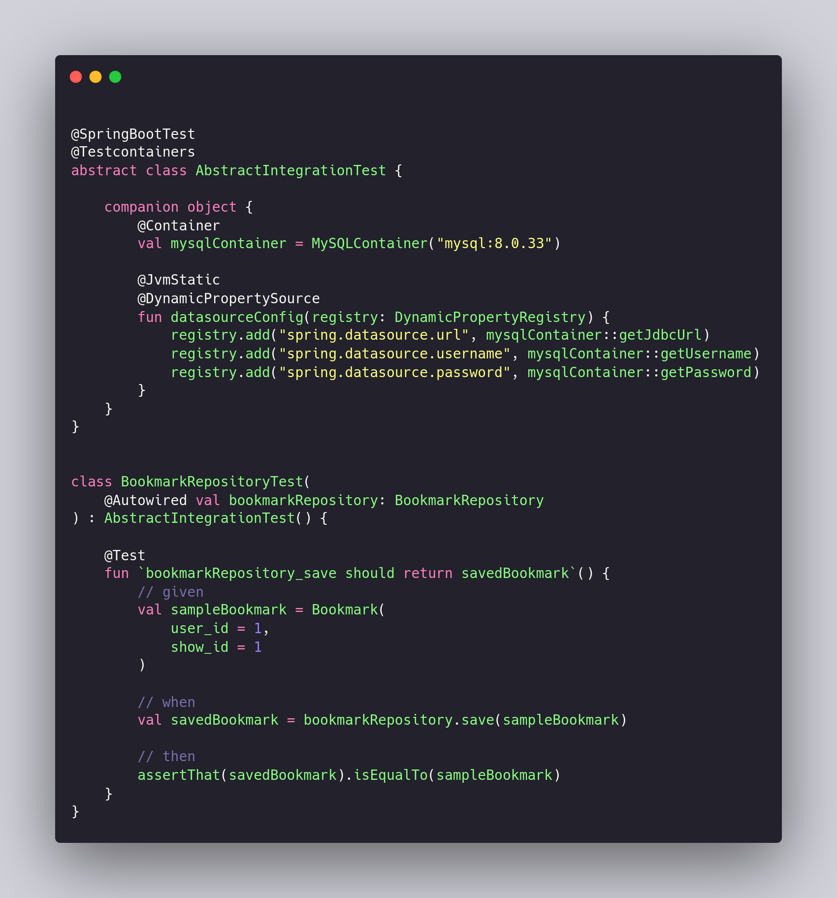

# 목차

1. 서론
2. 구글의 테스트 구분 방법
3. 각 레이어별 테스트  

# 서론

이 글은 Spring Boot(Kotlin)를 통해 Web-3-Layer 중 어떤 레이어 테스트가 무슨 테스트라고 생각하는지를 정리하는 글이다.

사실 단위 테스트와 통합 테스트는 개념상 정의기 때문에, 구분하기 불분명한 부분이 분명히 존재한다.

예를들어 하나의 함수에 대한 테스트는 단위 테스트라는 것에는 모두 동의할 것이다. 하지만 여러 메소드로 구성된 클래스는 분리될 수 있는 많은 코드 조각을 포함한다. 그렇다면 클래스에 대한 테스트도 단위 테스트일까? 
> 보통 아니라고 대답할 것 같다. 하지만 현실의 문제는 이 예시보다 더 복잡하다

# 구글의 테스트 구분 방법

구글은 단위/통합테스트 대신 범위(Scope)와 크기(Size)를 통해 테스트를 구분한다.
- 크기: 테스트 케이스 하나를 실행하는데 필요한 자원 (메모리, 프로세스 등)
- 범위: 검증하려는 특정한 코드 경로

## 크기에 의한 구분 - 작은/중간/큰 테스트

### 작은 테스트

**단 하나의 프로세스**에서 실행되는 테스트
- 언어에 따라 하나의 스레드로 좁힌다
- 테스트도 테스트 대상 코드와 같은 프로세스에서 실행
- 테스트가 독립된 프로세스를 가지거나, 데이터베이스와 같은 프로그램을 수행해서도 안된다.
- 또한 Sleep, I/O 연산, 블로킹 호출, 네트워크, 디스크에 접근해선 안된다.

이러한 제약의 목적은 테스트를 느리게하거나, 비결정적으로 만드는 원인들로부터 작은 테스트를 분리하는 것이다
- 비결정적: 실행마다 불규칙하게 결과값이 달라지는 상태

 

### 중간 크기 테스트

**여러 프로세스와 스레드** 이용이 가능 
- 즉 데이터베이스 인스턴스의 실행이 가능
- 다만 외부 시스템과의 통신은 여전히 불허한다 - 단 **한대의 기기**에서 수행되어야 한다

 

### 큰 테스트

**여러대의 기기** 활용 가능
- 로컬 호스트 제약 해제
- 원격 클러스터에서 구동중인 시스템 테스트 가능

## 범위에 의한 구분 - 좁은/중간/넓은 범위 테스트

- 좁은 범위(보통 단위 테스트): 독립적인 클래스나 메서드 같이 코드 베이스 중 **일부 로직** 검증 수행
- 중간 범위(보통 통합 테스트): 적은 수의 컴포넌트들 사이의 **상호 작용**을 검증하도록 설계 - 서버와 데이터베이스의 상호 작용 검증
- 넓은 범위 테스트(보통 기능 테스트, E2E 테스트): 서로 다른 부분들 사이의 상호작용 검증

 

단위 테스트의 범위가 좁다고 할때는 '실행'되는 코드가 아니라 **'검증'되는 코드의 양**이 기준이다. **하나의 클래스가 다른 여러 클래스를 의존하거나 참조하는 경우는 흔하며**, 대상 클래스를 테스트 하는 과정에서 의존성을 자연스럽게 호출한다. 
- 일부 테스트 전략에서는 `Mock object` 같은 방법을 활용하여 테스트 대상 시스템 바깥 코드가 실행되는 일을 피하고는 한다

 

테스트를 크기로 구분하는 것은 명확하지만, 범위로 구분하는 것은 모호한 면이 있다. 구글의 정의에 따르면 **단위 테스트는 대체로 작은 테스트**에 속한다

# 각 레이어별 테스트

정의에 따라서는 Spring Boot의 Web Layer Test는 본질적으로 `Application Context`(Spring의 DI/IoC Container)를 구성하기에 (순수한) 단위 테스트가 아니라고 생각할 수 있다. 하지만 이 글에서는 구글의 정의를 참조하기 때문에 **실행되는 코드**가 아니라 **검증되는 코드**에 집중한다. 또한 Mock Object(Bean)은 의존성을 제거하는 기술로 이해한다.

## Controller 

 

위 테스트 코드를 보면 `POST /bookmarks`가 Service 레이어의 create함수를 호출하는지 검증하고 있다. (상호작용 테스트)

이때 주목해야할 부분은 두가지이다
- `@MockkBean` 어노테이션과 `// given` 주석 부분을 이용해 service 레이어를 Mock Object로 만들었다
- `mockMvc`를 사용해 HTTP Client 부분을 대체했다

 

왜 HTTP Client를 완전히 없애지 않았을까? 컨트롤러 레이어는 HTTP Client에 바로 맞닿아 있기 때문에 **HTTP Request에 대한 의존성을 끊으면 실제 동작과 달라져서** 테스트에 의미가 없어진다. 

따라서 아래와 같은 이미지를 생각해볼 수 있다. 상위 레이어는 의존성을 완전히 끊지 않았지만 하위 레이어(Service)는 가짜 객체를 만들었다. (스프링에서는 이러한 테스트를 슬라이스 테스트라고 부르는듯 하다)

 

이러한 컨트롤러 테스트는 단위테스트와 통합 테스트 사이에 위치한 무엇인가이며, 구글에 정의에 따르면 **작은크기 - 좁은 범위 테스트**이다.

## Service

 

해당 테스트 코드에서는 상위 레이어로의 의존성이 존재하지 않으며 하위 레이어인 Repository를 Mock up하여 온전히 서비스의 로직 테스트에 집중하고 있다.
- Repository를 Mock up 하면서 결국 그 하위 레이어인 Database로의 의존성도 끊어냈다.
- 그러므로 다른 상호작용에 대한 걱정없이 서비스 클래스의 메소드/로직에만 집중할 수 있게 되었다.

 

**단위테스트이자, 작은크기 - 좁은 범위 테스트**이다.

 

## Repository

 

해당 코드에 대해 설명하자면
- `AbstractIntegrationTest` 클래스는 한마디로 `Testcontainers`라는 기술을 통해 도커 MySQL 컨테이너를 띄우는 코드이다
- 애플리케이션 코드 레벨에서의 정의를 통해 로컬에 DB를 띄워준다. 즉 쉽게 Application과 Database의 상호작용을 테스트하게 만들어준다
- 하단의 `BookmarkRepositoryTest` 클래스는 결국 docker에 띄워진 MySQL을 사용한다

 

이렇게 구현한 이유는 간단하다. 컨트롤러 레이어처럼 결국 Database와의 의존성이 끊어지면 실제 동작과 달라지기 때문에 테스트의 의미가 사라진다.

 

특정 기술을 통해 In-memory database(H2)로 대체해 테스트하는 경우에도 이와 마찬가지 문제가 발생한다. 그렇다고 매번 테스트마다 Localhost에 Database를 setup할 수는 없다.
> 만약 Localhost의 Database에 테스트를 의존한다면, 테스트 환경이 달라졌을때 고생... (Git actions 등등을 사용한다고 생각해보면...)

 

크기나 범위의 정위와 무관하게 **모든 테스트는 밀폐되어야 한다**. 
- setup, execute, tear down 하는데 필요한 모든 정보를 담고 있어야 한다.

 

DB instance와 상호작용또한 검증하기 때문에, **통합테스트이자 중간 크기,범위 테스트**이다

# 결론

|레이어|전통적 구분|구글의 구분|
|------|---|---|
|컨트롤러|단위와 통합 사이|작은크기-좁은범위|
|서비스|단위|작은크기-좁은범위|
|레퍼지토리|통합|중간크기-중간범위|

물런 이러한 구분과 결론은 온전히 작성자 본인의 생각이며, 위 예시 코드에 대해 구분한 것이다. 

# 출처
- 구글 엔지니어는 이렇게 일한다 - 한빛미디어
- [컨트롤러-서비스 테스트 코드](https://github.com/f-lab-clone/ticketing-service/pull/28)
- [레퍼지토리 테스트 코드](https://github.com/f-lab-clone/ticketing-service/pull/44)
- [Spring boot tip 레이어별 테스트]